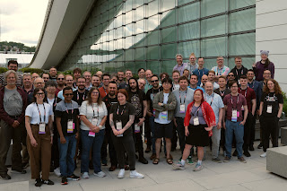

The Python Language Summit 2025 occurred on May 14th in Pittsburgh, Pennsylvania. Core developers and special guests from around the world gathered in one room for an entire day of presentations and discussions about the future of the Python programming language.

The summit was organized by Emily Morehouse and Łukasz Langa, and blog posts were written by Seth Larson. Thanks to Marie Nordin, the Community Communications Manager at the Python Software Foundation, for reviewing and editing the blog posts.

This year’s set of presentations was heavily themed towards the new "free-threading" work, featuring multiple discussions about contention, concurrency, and governance.

<table align="center" cellpadding="0" cellspacing="0"><tbody><tr><td></td></tr><tr><td>Attendees of the Python Language Summit 2025</td></tr></tbody></table>

  

Please enjoy the blog posts about each topic below:

  

-   [How can we make breaking changes less painful?](https://pyfound.blogspot.com/2025/06/python-language-summit-2025-how-can-we-make-breaking-changes-less-painful.html): talk by Itamar Oren
    

-   [An Uncontentious Talk about Contention](https://pyfound.blogspot.com/2025/06/python-language-summit-2025-uncontentious-talk-about-contention.html): talk by Mark Shannon
    
-   [State of Free-Threaded Python](https://pyfound.blogspot.com/2025/06/python-language-summit-2025-state-of-free-threaded-python.html): talk by Matt Page
    
-   [Fearless Concurrency](https://pyfound.blogspot.com/2025/06/python-language-summit-2025-fearless-concurrency.html): talk by Matthew Parkinson, Tobias Wrigstad, and Fridtjof Stoldt
    
-   [Challenges of the Steering Council](https://pyfound.blogspot.com/2025/06/python-language-summit-2025-challenges-of-the-steering-council.html): talk by Eric Snow
    
-   [Updates from the Python Docs Editorial Board](https://pyfound.blogspot.com/2025/06/python-language-summit-2025-docs-editorial-board.html): talk by Mariatta
    
-   [PEP 772 - Packaging Governance Process](https://pyfound.blogspot.com/2025/06/python-language-summit-2025-packaging-governance-process.html): talk by Barry Warsaw and Pradyun Gedam
    
-   [Python on Mobile - Next Steps](https://pyfound.blogspot.com/2025/06/python-language-summit-2025-python-on-mobile.html): talk by Russell Keith-Magee
    
-   [What do Python core developers want from Rust?](https://pyfound.blogspot.com/2025/06/python-language-summit-2025-what-do-core-developers-want-from-rust.html): talk by David Hewitt
    
-   [Upstreaming the Pyodide JS FFI](https://pyfound.blogspot.com/2025/06/python-language-summit-upstreaming-the-pyodide-js-ffi.html): talk by Hood Chatham
    
-   [Lightning Talks](https://pyfound.blogspot.com/2025/06/python-language-summit-2025-lightning-talks.html): talks by Martin DeMello, Mark Shannon, Noah Kim, Gregory Smith, Guido van Rossum, Pablo Galindo Salgado, and Lysandros Nikolaou
