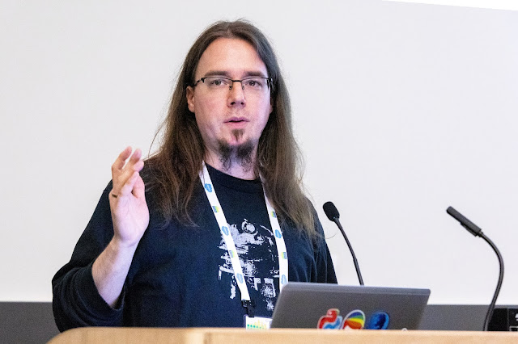
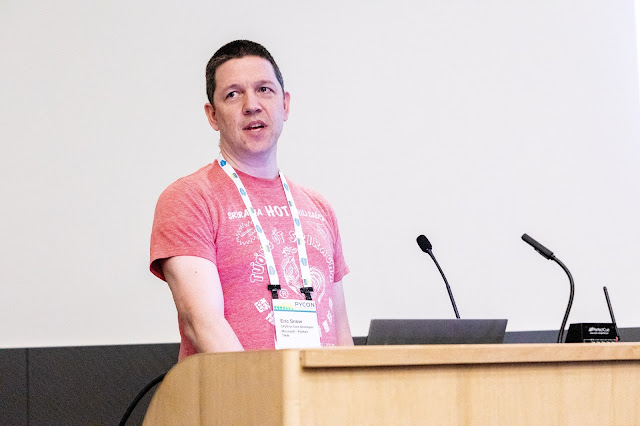
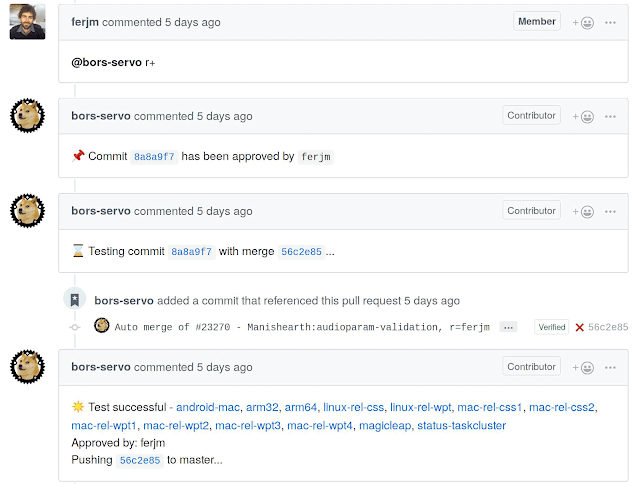
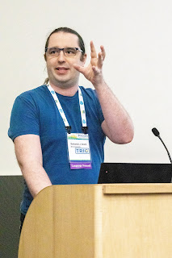
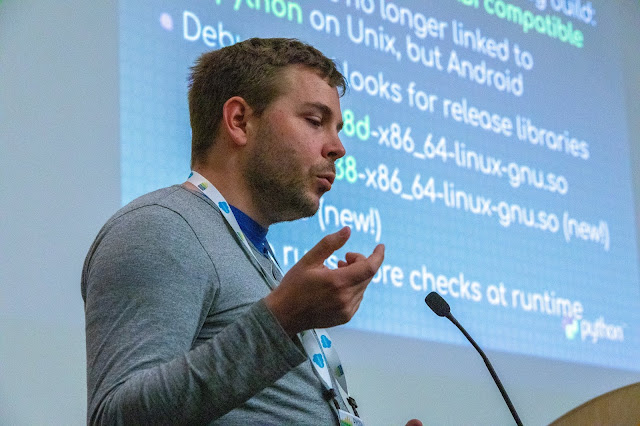

The Summit concluded with a second round of lightning talks, which speakers had signed up for that day. These talks were therefore more off-the-cuff than the morning's talks, and several of them were direct responses to earlier presentations. [**Read more 2019 Python Language Summit coverage**](https://pyfound.blogspot.com/2019/05/the-2019-python-language-summit.html)**.**

## Christian Heimes

# SSL Module Updates

  
 Python’s ssl module depends on OpenSSL. On Linux, Python uses the system OpenSSL, but on Mac and Windows it ships its own. Christian Heimes explained to the Language Summit that Python 3.7 must upgrade its included version of OpenSSL to 1.1.1 to receive long-term support, but he warned that this change might cause unexpected issues for Python programmers on Mac and Windows. Heimes wants to deprecate support for TLS 1.1 as soon as possible. Recent Linux distributions and browsers already prohibit the old protocol for security reasons. In Python 3.8 he plans to document that TLS 1.1 “may work”, depending on the underlying OpenSSL version, and in Python 3.9 it will be explicitly banned. Larry Hastings asked whether this change could be spread over two Python releases, in the way that most features are first deprecated and then removed. Heimes replied that OpenSSL itself is moving this quickly. Python has poor support for the root certificate authority files included in the operating system. On Linux and BSD, `ssl.create_default_context()` uses the root CAs correctly. On Windows, according to Heimes, root CAs are partly broken despite “a hack I added a couple years ago that does not work for technical reasons.” And on macOS there is no support without installing the `certifi` package. Heimes proposed to rely more on the operating system: on Mac and Windows in particular, the interpreter should ask the OS to verify certificates against its known CAs, instead of asking OpenSSL. It has been several years since Heimes and Cory Benfield began drafting [PEP 543](https://www.python.org/dev/peps/pep-0543/). This PEP would decouple Python’s API from the specifics of the OpenSSL library, so it could use OS-provided TLS libraries on macOS, Windows, and elsewhere. Heimes told the Language Summit that he and Paul Kehrer would work on PEP 543 during the post-PyCon sprints.

## Larry Hastings

# Let’s Argue About Clinic

  
 [Argument Clinic](https://docs.python.org/3/howto/clinic.html) is a tool used in the implementation of CPython to generate argument-parsing code for C functions that are used from Python; i.e., “builtin” functions. (It is named for [a Monty Python sketch](https://en.wikipedia.org/wiki/Argument_Clinic).) Since its original intent was to create C functions that handle their arguments like Python functions do, it only handles Python-like function signatures. Larry Hastings addressed the Language Summit to ask whether Argument Clinic ought to be extended to handle argument parsing more generally, including function signatures that would not be possible in pure Python. For example, some builtin functions have parameters with a default value of NULL, which is representable in C but not in Python. Hastings said he had observed developers wanting to use Argument Clinic for all builtin functions because it is convenient to use and generates fast code.

## Eric Snow

# The C API

  
  
One of the reasons for CPython’s success is its powerful C API, which permits C extensions to interact with the interpreter at a low level for the sake of performance or flexibility. But, according to Eric Snow, the C API has become a hindrance to progress because it is so tightly coupled to CPython’s implementation details. He identified several problems with the current CPython implementation, such as the GIL, but said, “we can't go very far fixing those problems without breaking the C API.” One solution is to split the C API into four categories. The CPython header files would be split into four directories to make it more obvious to core developers and extension authors which category each type or function belongs to:

-   “internal” — “Do not touch!”  
    
-   “private” — “Use at your own risk!”  
    
-   “unstable” — “Go for it (but rebuild your extension each Python release)!”  
    
-   “stable” — “Worry-free!”  
    

There are a number of other solutions proposed or in progress:  

-   It might be possible to [use CFFI in place of the C API](https://mail.python.org/archives/list/capi-sig@python.org/thread/ZV3IQWW7XL6MHZAJARHW62WNZDCX3A4M/) to achieve a “better C API”, or [to use Cython](https://mail.python.org/archives/list/capi-sig@python.org/thread/NSREULQDHSJ6SZTOY5YVSNX4U4AYJOI6/).  
    
-   Victor Stinner has [a longstanding project to improve the C API](https://pythoncapi.readthedocs.io/roadmap.html) by removing bad features and providing a second-generation API that is less coupled to CPython internals.  
    
-   Steve Dower has [a higher-level proposal to describe what an ideal C API would look like](https://mail.python.org/archives/list/capi-sig@python.org/thread/B2VDVLABM4RQ4ATEJXFZYWEGTBZPUBKW/), if Python could ever get there. Snow said, “Really great proposal, I think we should continue with that one.”  
    
-   Petr Viktorin spoke earlier in the day about [isolating subinterpreters](http://pyfound.blogspot.com/2019/05/petr-viktorin-extension-modules-and.html), and Snow has proposed to enable parallelism by [giving each subinterpreter its own GIL](https://github.com/ericsnowcurrently/multi-core-python).  
    
-   PEP 432 will [restructure CPython’s initialization and finalization sequence](https://www.python.org/dev/peps/pep-0432/).  
    

Snow finished by inviting interested people to join him on the [C API special interest group mailing list](https://mail.python.org/mailman3/lists/capi-sig.python.org/).

## Steve Dower

# Python in the Windows Store

  
  
When a Windows user types `python` in the command shell on a clean system, the shell typically responds, “python is not recognized as an internal or external command”. After [the May Windows update this will change](https://mail.python.org/pipermail/python-dev/2019-May/157586.html): Typing `python` in the shell will now open the Microsoft Store and offer to install Python. When Steve Dower showed the install screen to the Language Summit the audience broke into applause.  
**screenshot** The package is owned by the Python core developers; Microsoft’s contribution was to add the `python` command stub that opens the install page. Compared to the installer that users can download from python.org, said Dower, “the Microsoft Store is a more controlled environment.” Its distribution of Python is easier to install and upgrade, at the cost of some inconsistencies with the full Python install. “It's not going to work for everyone.” Advanced developers and those who want multiple versions of Python will prefer to install it themselves, but the Microsoft Store will satisfy programmers who simply need Python available. “Everyone with a Windows machine in any of the tutorial rooms right now should probably be using this,” he said. It had not been possible to install Python so conveniently on Windows, until recent changes to the Microsoft Store. For example, Store apps were originally prohibited from accessing their current working directory, but apps are now permitted virtually the same permissions as regular programs. Carol Willing asked whether the Store version of Python could be used for reproducing data science results. “There are a number of situations where I would say don't use this package,” responded Dower. Since the Microsoft Store will automatically update its version of Python whenever there is a new release, data scientists who care about reproducibility should install Python themselves.

## Nathaniel Smith

# Bors: How Rust Handles Buildbots and Merge Workflow

## *(Or: One way to solve Pablo’s problems)*

  
In response to [Pablo Galindo Salgado’s earlier talk](https://pyfound.blogspot.com/2019/05/pablo-galindo-salgado-nights-watch-is.html) about the pain caused by test failures, Nathaniel Smith whipped up a talk about the Rust language’s test system. The Rust community observes what they call the [Not Rocket Science Rule](https://graydon2.dreamwidth.org/1597.html): “Automatically maintain a repository of code that always passes all the tests.” Although it is obvious that all projects ought to adhere to this rule, most fail to, including Python. How does Rust achieve it? When a Rust developer approves a pull request, the “bors” bot tests it and, if the tests pass, merges the pull request to master.   
This seems quite elementary, as Smith acknowledged. But there are two unusual details of the bors system that enforce the Not Rocket Science Rule. The first is that bors tests pull requests in strict sequence. It finds the next approved pull request, merges it together with master, tests that version of the code, and if the tests pass bors makes that version the new master, otherwise it rejects the pull request. Then, bors moves to the next pull request in the queue. Compared to the typical system of testing pull requests *before* merging, bors’s algorithm tests the version of the code that will actually be published.  The second way the Rust community enforces the Not Rocket Science Rule is by requiring the bors process for all pull requests. “They do this for everything,” said Smith. “This is how you merge. There's no green button.” Taken together, bors’s algorithm and the workflow requirement ensure that Rust always passes its tests on master. Smith described some conveniences that improve the Rust developer experience. First, bors can be triggered on a pull request before approving it, as a spot check to see whether the code passes the test suite as-is. Second, since bors must test pull requests one at a time, it has an optimization to prevent it from falling behind. It can jump ahead in the queue, merging a large batch of pull requests together and testing the result. If they pass, they can all be merged; otherwise, bors bisects the batch to find the faulty change, alerts its author, and merges all the pull requests before it. The Rust project currently uses a successor to bors called [Homu](https://github.com/servo/homu), written in Python. [There are several other implementations](https://forum.bors.tech/t/other-apps-that-implement-the-nrsrose/51), including [bors-ng](https://bors.tech/), which is available as a public service for any GitHub repository.

## Victor Stinner

# Status of stable API and stable ABI in Python 3.8

  
  
Python 3.8 will improve the long-term stability of the C API and ABI for extension authors. Some of the details are settled, but Victor Stinner’s presentation to the Language Summit showed there are still many unanswered questions. As Eric Snow had mentioned, C header files in Python 3.8 will be split into directories for the public stable APIs, the unstable CPython-specific API, and the internal API. Afterwards there will be less risk of exposing an internal detail in the public API by mistake, since it will be obvious whenever a pull request changes a public header. CPython’s internal API headers were not installed by “make install” in the past, but it could be useful for a debugger or other low-level tool to inspect the interpreter’s internal data structures. Thus, in Python 3.8 the internal headers will be installed in a special subdirectory. In the course of Stinner’s regular work at RedHat he often debugs problems with customers’ third-party C extension modules. A debug build of the extension module might not be available, but Stinner could gather some useful information by loading the extension module with a debug build of Python. Today, this is impossible: debug builds of Python only work with debug builds of extension modules and vice versa. [The debug build of Python 3.8, however, will be ABI compatible with the release build](https://lists.gt.net/python/dev/1418042), so the same extension modules will work with both. Another motivation for updating the C API is isolation of subinterperters. Stinner referred to Petr Viktorin’s talk about removing process-wide global state for the sake of proper isolation, and possibly giving each subinterpreter its own GIL. Attaining a clean, stable API and ABI may require breaking the current one; the core developers’ discussion focused on how much to break backwards compatibility and what techniques might minimize the impact on extension authors. The shape of Python 3.8’s C API and ABI are not yet settled. When Steve Dower asked whether Stinner was proposing a new stable ABI, Stinner answered, “I’m not sure what I’m proposing.”

## Yarko Tymciurak

# Cognitive Encapsulation

## *The Anchor of Working Together*

  
  
Tymciurak began his lightning talk by complimenting the Language Summit participants. “In terms of communication skills, you do such a great job that I'm shocked sometimes.” The factors that contribute to collaboration, he said, begin with a diversity of skills. [As Victor Stinner had mentioned in his mentorship talk](https://pyfound.blogspot.com/2019/05/python-core-developer-mentorship.html), a team with mixed skill sets and skill levels has advantages over a team of homogenous experts. Members of high-performing teams are also enthusiastic about common goals, they are personally committed to their teammates, and they show strong interpersonal skills. Tymciurak credited Guido van Rossum for establishing the importance of teamwork from the beginning. Nevertheless, he said, “sometimes things may go off track.” The cause of irreconcilable disagreements or emotional blowups are not always obvious, but Tymciurak claimed that to him, “it's immediately obvious and really simple to fix.” Cognitive encapsulation is the awareness that one’s experience of reality is not reality itself. “It’s your own mental model,” said Tymciurak. When we communicate, if explicitly share with others what we think, see, or hear, then we are respecting cognitive encapsulation. As Tymciurak describes it, “That’s being aware that my thoughts are my own.” On the other hand, if we assume that others already agree with us, or we represent our personal experience as if it is the only possible experience for the whole group, then encapsulation is violated and we are likely to cause conflict. As an example of cognitive encapsulation at work, Tymciurak contrasted two types of communication. One is transactional. Someone asks, “Where’s the meeting?” You answer by saying which room it is in. Another type is control communication. If an instructor commands students to “turn to page 47,” then control communication is appropriate and the students will accept it. But when a team member uses control communication without the team’s acceptance, conflict arises. Tymciurak said, “When you tell someone else what to do, you're breaking the encapsulation. Be careful. There's times when it's appropriate. But be aware of when it's not.” Another key practice that preserves cognitive encapsulation is to truly listen. Especially when the speaker is a junior teammate, it is crucial to be able to listen without agreeing, disagreeing, or correcting. Tymciurak described the outcome of a team that works together this way. Individuals know that they understand each others’ views, and they can advocate for their own views, speaking from their own experience. “Then you can speak with authority and power. And that's part of the magic of encapsulation.”
