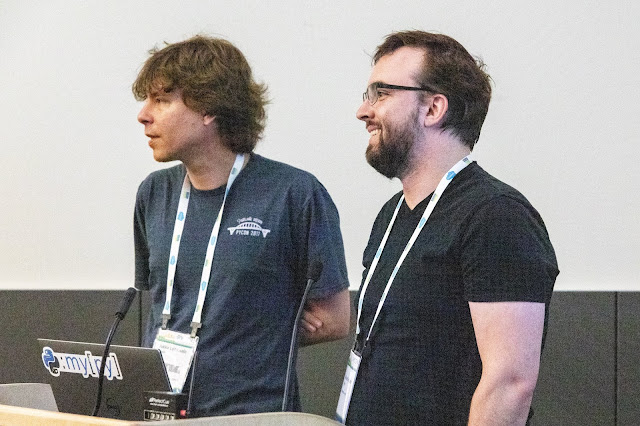
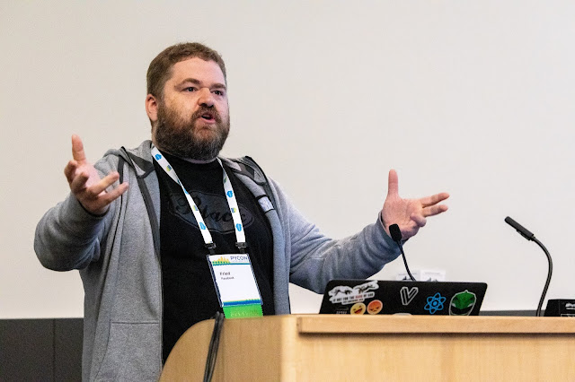
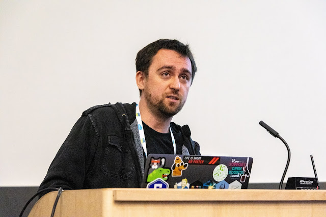

The Summit began with six pre-selected lightning talks, with little time for discussion of each. Five of them are summarized here. An upcoming article will cover Pablo Galindo Salgado's lightning talk on improvements in Python's test infrastructure. **[Read more 2019 Python Language Summit coverage](https://pyfound.blogspot.com/2019/05/the-2019-python-language-summit.html).**

### Jukka Lehtosalo

## Writing Standard Library C Modules In Python

  
  
Jukka Lehtosalo described his work with Michael Sullivan on an experimental compiler called mypyc. The Python standard library, Lehtosalo said, contains the modules that most programmers use by default, so it should be fast. The main optimization technique has historically been to write C extensions. So far, 90 standard library modules are partly or entirely written in C, often for the sake of speed, totaling 200,000 lines of C code in the standard library. But C is hard to write and error prone, and requires specialized skills. “C is kind of becoming a dinosaur,” he said, provoking laughter from the core developers. As an alternative, Lehtosalo proposes “writing C extensions in Python.” The mypyc compiler reads PEP 484 annotated type-checked Python, and transforms it into C extension modules that run between 2 and 20 times faster than pure Python. Some of Python’s more dynamic features such as monkeypatching are prohibited, and other features are not yet supported, but the project is improving rapidly. The project has a similar goal to Cython’s: to transform Python into C, which is then compiled into extension modules. Compared to Cython, however, mypyc supports a wider range of PEP 484 types such as unions and generics. In Lehtosalo and Sullivan’s experiments it offers a greater performance improvement. They propose further experimentation, testing how well mypyc translates certain performance-sensitive standard library modules, such as `algorithms`, `random`, or `asyncio`. The translated modules could be published on PyPI first, rather than replacing the standard library modules right away. If the test goes well, mypyc would offer “C-like performance with the convenience of Python.” Core developer Brett Cannon suggested an experiment using some module, such as `datetime`, that is already implemented in both Python and C. The Python version could be translated with mypyc and then pitted against the handwritten C version.

### Matthias Bussonnier

## Async REPL And async-exec

  
  
Python’s interactive shell makes it easy for beginners to learn Python, and for all Python programmers to experiment as they develop. However, async Python code is practically unusable with the shell. The `await` keyword must be used within a coroutine, so a programmer who wants the result of an a waitable object must define a coroutine and run an event loop method to execute it. Matthias Bussonnier presented his work, which integrates `async` and `await` into the alternative IPython shell. IPython permits the `await` keyword at the top level, so a user can get the results of coroutines or other awaitables in the shell without defining a coroutine:  

In \[1\]: from asyncio import sleep

In \[2\]: await sleep(1)

In \[3\]: from aiohttp import ClientSession

In \[4\]: s = ClientSession()

In \[5\]: response = await s.get('https://api.github.com')

IPython supports asyncio and other async frameworks such as trio. In the future, a plugin system will allow any `async`/`await`\-based framework to be usable in the shell.  
Bussonnier argued that some of his ideas should be adopted by core Python. If asynchronous coding were convenient in the shell, it would be useful for educators, and it would remove what he considers the misconception that async is hard. Best of all, Python would get ahead of Javascript. However, to support `async` and `await` in the shell currently requires some unsatisfying hacks. There are subtle issues with local versus global variables, background tasks, and docstrings. Bussonnier has filed [issue 34616, implement "Async exec"](https://bugs.python.org/issue34616), to make full async support in the shell possible. **Update:** After the Language Summit, Bussonnier and Yury Selivanov updated the Python compiler to permit `await`, `async for`, and `async with` as top-level syntax in the shell when executed like `python -m asyncio`:

-   [https://github.com/python/cpython/pull/13148](https://github.com/python/cpython/pull/13148)  
    
-   [https://github.com/python/cpython/pull/13472](https://github.com/python/cpython/pull/13472)  
    
-   [https://github.com/python/cpython/pull/13484](https://github.com/python/cpython/pull/13484)  
    

  

### Jason Fried

## Asyncio And The Case For Recursion

  
  
A typical asyncio application has a single call to `run_until_complete()` near the top level of the application, which runs the asyncio event loop for the entire application. All code beneath this level must assume that the loop is running. Facebook engineer Jason Fried presented to the Language Summit a scenario in which this application structure fails. Consider an async application that contains a mix of async code and blocking calls that are tolerably fast. Deep within the call stack of one of these blocking calls, a developer sees an opportunity for concurrency, so she adds some async code and executes it with `run_until_complete()`. This call raises “RuntimeError: This event loop is already running.” As Fried explained, any call to `run_until_complete()` in a call chain under async def has this result, but due to modularization and unittest mocking in Facebook’s Python architecture, this error can first arise late in the development cycle. How should this problem be avoided? The asyncio philosophy is to avoid mixture by converting all blocking code to asynchronous coroutines, but converting a huge codebase all at once is intractable. “It's a harder problem than moving from Python 2 to 3,” he said, “because at least I can go gradually from Python 2 to 3.” Fried suggested a solution for incrementally converting a large application, and to allow developers to add asyncio calls anywhere “without fear.” He proposed that the asyncio event loop allow recursive calls to `run_until_complete()`. If the loop is already running, this call will continue running existing tasks along with the new task passed in. Library authors could freely use asyncio without caring whether their consumers also use asyncio or not. “Yeah sure it's ugly,” he conceded, “but it does allow you to slowly asyncio-ify a distinct code base.” Thomas Wouters objected that this proposal would violate many correctness properties guaranteed by the current loop logic. Amber Brown concurred. She explained that Twisted’s loop prohibits reentrance to ensure that timeouts work correctly. One of the core tenets of asynchronous programming is that all tasks must cooperate. There is no good solution, she said, for mixing blocking and async code.

### Mark Shannon

## Optimising CPython, Or Not

  
  
“Every few years someone comes along with some exciting new potential for speeding up CPython,” began Mark Shannon, “and a year later everyone's forgotten about it.” Some of these optimizations are worth pursuing, however. We can identify promising optimizations with a heuristic. First, Shannon advised the audience to think in terms of time, not speed. Do not measure the number of operations Python can execute in a period; instead, measure the amount of time it requires to finish a whole task and divide the total time into chunks. As an example, Shannon described a recent proposal on the python-dev mailing list for implementing a register-based virtual machine, which would store local variables in fixed slots, rather than on a stack as the Python VM does today. How much time could such a change save? Shannon walked the audience through his thought process, first estimating the cost of the Python interpreter’s stack manipulation and guessing how much cheaper a register-based VM would be. Shannon estimates that up to 50 percent of Python’s runtime is “interpretive overhead,” and a register-based VM might reduce that significantly, so it is worth trying. However, only an experiment can measure the actual benefit. Shannon compared the register-based VM to another optimization, “superinstructions.” The technique is to find a common sequence of bytecodes, such as the two bytecodes to load None onto the stack and then return it, and combine them together into a new bytecode that executes the whole sequence. Superinstructions reduce interpretive overhead by spending less time in the main loop moving from one bytecode to the next. Shannon suspects this technique would beat the register-based optimization. In conclusion, Shannon advised the audience that the next time another [Unladen Swallow](https://www.python.org/dev/peps/pep-3146/) or similar project appears, to determine first which part of the interpreter it optimizes. If the optimization targets a part of the interpreter that represents less than 90% of the total runtime, said Shannon, “it’s pretty much doomed to fail.”

### Łukasz Langa

## Black under github.com/python

  
  
The past year has been marked by controversy in the Python community, but consensus is forming on the most unexpected topic: code formatting. Łukasz Langa’s [Black](https://github.com/python/black/) code formatter is only a year old, but it has been adopted by pytest, attrs, tox, Django, Twisted, and numerous other major Python projects. The core developers are enthusiastic about Black, too: When Langa introduced himself as its author, the room broke into applause. Langa proposed moving black from his personal repository to the Python organization on GitHub. He said, “My goal for this is to provide a suitable default for users who don't have any preexisting strong opinions on the matter.” Some core developers dissented, arguing that since Black is already so successful, there is no need to move it. Gregory Smith said it is not the core team’s role to bless one code formatter over others; he regrets that opinionated tools like mypy are in the official organization and he opposes adding more. Guido van Rossum suggested moving it to the [Python Code Quality Authority](https://github.com/PyCQA) organization; Langa responded that beginners haven’t heard of that organization and moving Black there would have no effect. **Update:** Despite some objections at the Language Summit, Black is now in the official Python organization on GitHub.
