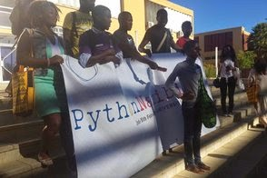

The second PSF sponsored African conference I want to tell you about is Python Namibia (only a mere 3500 kilometers or 2175 miles south of Cameroon). The conference, the first ever held in Namibia, was held Feb 2 – 5, 2015 at the University of Namibia in the city of Windhoek. The PSF provided funds at the level of "Gold Sponsorship" that were used to subsidize travel for international attendees and to purchase a banner.  Photo credit to python-namibia.org According to an email to the PSF from organizer [Daniele Procida](http://python-namibia.org/person/daniele-procida/), “. . . the event was a success, with 65 attendees for the four days, and was met with huge enthusiasm by our Namibian hosts. I hope to be back in Namibia next year for an even bigger event, organised by the newly-established Python community there.” The official website [Python Namibia](http://python-namibia.org/news/close/) provides additional information and thanks to the conference's additional sponsors: Cardiff University in Wales (through its Phoenix Project), The University of Namibia, and the Django/Python web agency, Divio AG in Zürich. One of the attendees was the PSF's good friend, the geologist [Carl Trachte](http://python-namibia.org/news/carl-trachte/), who sums up his reasons for attending PyCons all around the world as: *The neat thing about country/regional conferences is that you more frequently get to talk to developers or tech professionals from that place who don’t always frequent conferences outside their area. Seeing how Python (and digital technology in general) is being used in Sub-Saharan Africa (for the establishment of a wireless network, for example), learning what the average work day is like for a Pythonista in these parts of the world - those are things you really can’t get without being there.* The four days of talks, workshops, coding, collaboration and interaction engendered such enthusiasm and interest that on the last day a group of the participants self-organized to form [“PyName, the Python Namibia Association”](http://www.namibian.com.na/index_print.php?id=23479).  Photo Credit to python-namibia.org We certainly look forward to more exciting projects and events coming out of this group.
