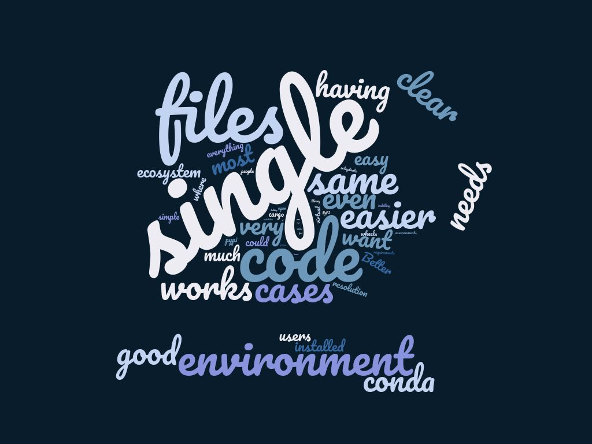

As the Python Packaging Project Manager, my work has mostly concentrated on [improving user experience on PyPI](https://wiki.python.org/psf/PackagingWG#PyPI_Organization_Account). As the Python Packaging ecosystem grows from strength to strength, one of the initiatives I have undertaken is to define a cohesive strategy for Python Packaging.

  

My Mission

  

Python Packaging is a diverse landscape dotted with many tools that cater to generic and niche user requirements. As a community, something that is poorly understood is where the community wants to be in 5 years. Understanding where we want to be is important to allow us to identify key goals for the future and how we will reach them, and to ensure we place users at the heart of everything we do. By defining key deliverables driven by community consensus, securing funding becomes easier as we can demonstrate that the community vision will drive innovation and enable better user experience and adoption of Packaging tools.

  

User Survey

  

In order to understand what end users are looking for when they use Packaging tools, [Nicole Harris and I worked](https://discuss.python.org/t/rfc-survey-to-help-define-a-python-packaging-vision-and-strategy/15658) [with the community to finalize the survey questions](https://discuss.python.org/t/rfc-survey-to-help-define-a-python-packaging-vision-and-strategy/15658). [Nicole developed the final set of survey questions](https://discuss.python.org/t/your-feedback-required-python-packaging-user-survey/18070). The survey results are summarized in [this document](https://drive.google.com/file/d/1U5d5SiXLVkzDpS0i1dJIA4Hu5Qg704T9/view).

  

From the survey responses, it was clear that while Packaging tools were improving with time, most users found the landscape too complex to navigate. Based on the survey responses, the strategy discussion was condensed to these topics-

1.  Development of a single Packaging tool or a more unified experience
    
2.  Better support for Packaging users
    
3.  Phasing out legacy systems
    
4.  Supporting each other in the community
    
5.  Encouraging long-term contribution
    

This post will summarize the discussion around a single Packaging tool. The other four topics will be the subject of future posts on [Discuss](https://discuss.python.org/c/packaging/14).  
One tool to rule them all?  
An overwhelming majority of users recommended a more unified experience when using Packaging tools. The word cloud below shows the frequency of suggestions for the open-ended question- “If you could improve only one area of Python packaging, what would it be?”  

To take this discussion further, I invited [maintainers and contributors of any Packaging tool](https://discuss.python.org/t/python-packaging-strategy-discussion-part-1/22420) to answer this question:

  

“Can we reduce the number of tools and bring about some form of unification? Can we do anything else to reduce the complexity?”

  

After an interesting and lively discussion, we still do not have a clear consensus of what a solution should look like, but we do have a way forward.

  

Since we are at the beginning of this conversation, we don’t know what unification means yet. As [Pradyun Gedam suggested](https://discuss.python.org/t/python-packaging-strategy-discussion-part-1/22420/16), there are many options as to what it could look like-

  

1.  Unification of PyPI/conda models
    
2.  Unification of the consumer-facing tooling
    
3.  Unification of the publisher-facing tooling
    
4.  Unification of the workflow setups/tooling
    
5.  Unification/Consistency in the deployment processes
    
6.  Unification/Consistency in “Python” installation/management experience
    
7.  Unification of the interface of tools
    

Based on these criteria, there is (some) consensus in driving forward unification of workflow setups/tooling and unification of interface of tools.

  

The next major question was, if we do go ahead with unification of specific elements, which elements of Packaging would offer the best solution. To provide a unified UI/UX for end users, some of the solutions that were suggested were

1.  Reusable libraries
    
2.  Expanding pip to include more functionalities
    
3.  Recommending existing tools such as hatch, poetry etc.
    

This discussion also raised a few interesting concerns. Understandably, there is concern over the time and effort that volunteers have devoted in developing tools and whether all this effort will come to naught if we recommend a specific tool. As the discussion continues, there is a large question over the part that PyPA plays and whether PyPA would be willing to take a stand on recommending a specific tool. One concern that keeps coming up is that historically there has been poor communication between PyPA, Packaging tools and end users and if anything will change this time.

The way forward

In order to flesh out the details of the actual solution, I recommend the following steps:

1.  Identify the tasks that a unified solution has to accomplish
    
2.  Identify the best way to deliver the solution. This could be a new tool, expanding an existing tool or developing standards/libraries.
    
3.  Submit PEPs to ensure community governance and consensus
    
4.  Ensure there is buy-in from end users for proposed solution(s)
    
5.  Define development roadmaps, milestones, key deliverables and timeline
    
6.  Generate funding to support development
    
7.  Develop and deliver
    
8.  Communicate, communicate, communicate
    

This will be a long and intensive process. But the time and effort invested in this project will be worth it as it will result in innovation and better user experience.

We will be discussing four more big questions over the next three months that will be used to help us plan the future of Packaging at Python. As we continue the strategy discussions, I invite everyone to participate in the discussion threads on [Discuss](https://discuss.python.org/c/packaging/14).

  

We are grateful to Bloomberg for generously providing the funding for this role and making this valuable work possible.
