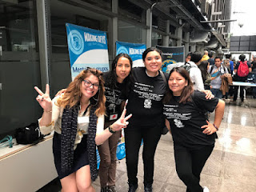
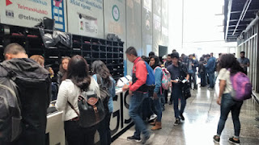
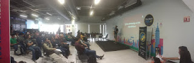
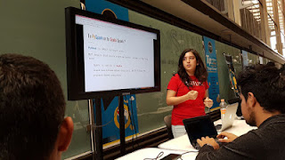
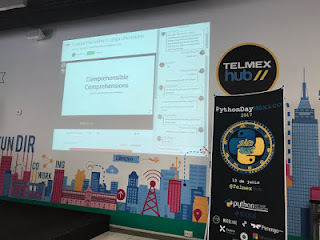

It has been three years since I first learned about PyCon. I watched some workshops and talks and I was amazed by how inviting, open and inclusive the community was. In fact, that was one of the key aspects that inspired me to learn Python, use it, help build the Python community here in Mexico.  

Fast forward to the beginning of this year: I was contacted by the organizer of LinuxChix in Mexico, who is also member of PyLadies, with the idea of organizing a PythonDay in Mexico. This first PythonDay, she suggested, had the purpose of bringing a PyCon to Mexico. We eventually found another woman who shared the same ideal and we set about working to bring the Mexican Python community to an event that, hopefully, inspired them to be better Pythonistas the same way the first PyCon i witnessed did to me.  

We first wondered how big of a community we had in Mexico. Despite being involved with Python for three years I barely knew the people or meet ups, apart from PyLadies, in Mexico devoted to the language. We figured that with Mexico being a country of 130 million there was large chance there would be a sizable population interested in Python. Along the way we discovered that the Python community in Mexico is not only vast, but also scattered across the nation. These reasons only encouraged us more to organize a PythonDay, it would be a great starting point to bring together the community.  

## Who came to PythonDay Mexico

We selected June 10, 2017 as the day for the first PythonDay Mexico. People from all over the country came to meet their fellow Pythonistas and listen to the amazing talks we selected for this year.

  
  

Initially we expected about 160 people, but we could not have been farther off! Over 400 people registered for the event and in its peak, approximately 300 Pythonistas were in attendance. We were glad to learn that 30% of the attendees in the event were women, which is not a high number, but in comparison to the roughly 15% of women in technology it gives hope to learn that many women are interested in programming.  

Attendees traveled up to 1270 miles to attend PythonDay Mexico. In terms of geography there were attendees from Sinaloa, Jalisco, Hidalgo, Nuevo Leon, Puebla, Mexico City and Yucatan and every one of them was excited to hear the talks and workshops as well as to meet other Python lovers.  

During the event we did not have any incident or complaint; everybody followed and honored the Code of Conduct lending to a greatly collaborative. Honestly we could not have asked for a better audience. But then again, Python communities all over the world are like this, awesome.

  

## A Global Selection of Python Speakers

PythonDay Mexico had an amazingly diverse set of speakers. We had people from Paraguay, India, USA, Italy, Germany and Mexico. Even if our speakers could not be physically present, they made efforts to actually engage and interact with the audience in their remote presentations. Many of our remote speakers are a part of the Python Software Foundation Board of Directors like Naomi Ceder, Trey Hunner. Board member Lorena Mesa gave her talk in person.  

Topics covered by the talks and workshops included data science, machine learning (e.g. deep learning), CPython, Python core development, Python in web development, Python extensions in other languages (Rust, Go), Testing, building bots with Python and getting Python ready for production. The range of topics permitted a bit of something for everyone.  
  
  
  

We at PythonDay want to thank everyone that helped make this possible. The organizers spent many months talking, planning, getting funds and convincing people that Mexico is a great place for Python. The PSF was a major player in the making of this event, given that not only were they one of our major sponsors but were also a wonderful source of speakers, advice and even promotion of the event. Of course the speakers and volunteers were also a huge part of the success of this event. Finally, the event would not have been possible without the attendees, without them the event would only have been a bunch of speakers and swag.  

What’s next?  
  

Our mission after PythonDay Mexico is to bring a PyCon to Mexico and to keep connecting all the people interested in Python within Mexico with programming and events. For PyConMx we are actively seeking volunteers and organizers, if you'd like to help us or learn more you can contact us at [pythonday.mx@gmail.com](mailto:pythonday.mx@gmail.com) or [mx@pyladies.com](mailto:mx@pyladies.com), we really hope to hear from you!
