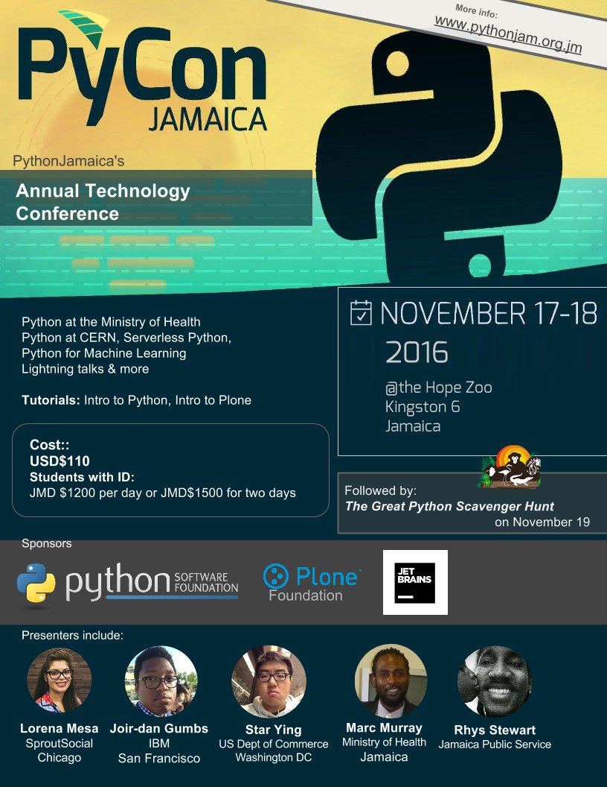
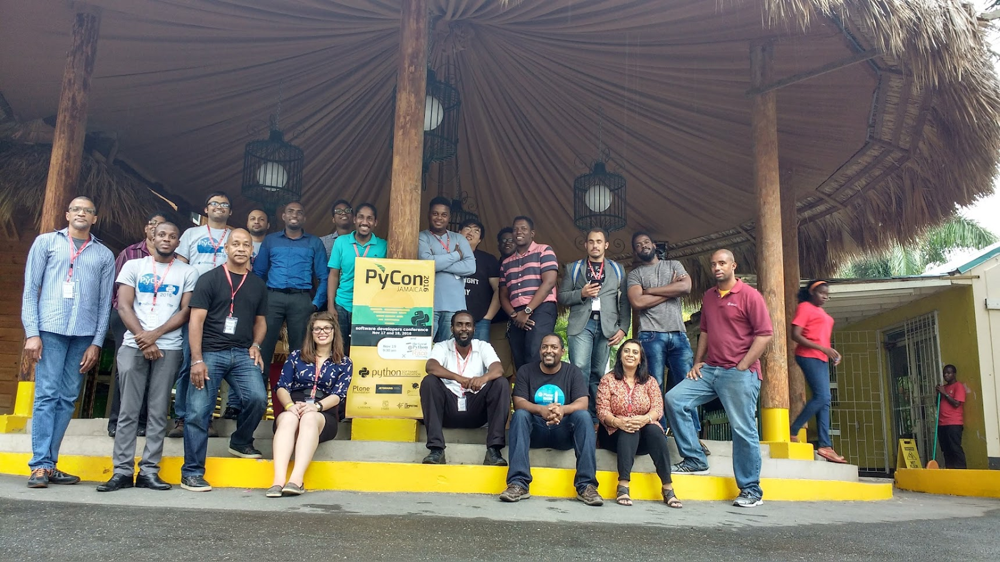

This past November marked the first [PyCon Jamaica](https://www.pythonjam.org.jm/conference-2016/schedule). Held in the capital, Kingston, the conference began on November 17th with a day of tutorials followed by a single track of talks on November 18th. I attended both as a representative of the Python Software Foundation, which sponsored the conference, and as a speaker.  

## Python in Kingston’s Higher Education

  

Kingston, home to approximately 33% of Jamaicans, boasts several institutions of higher learning including the Caribbean Maritime Institute and the Mona campus of the University of the West Indies. PyCon Jamaica kicked off with tutorials at the University of the West Indies. Most of the tutorials focused on introductory topics (e.g. Introduction to Plone). Participants came from a wide range of backgrounds including mechanical engineers or undergraduates with a marketing concentration. Interestingly I was informed Python isn’t a part of the standard computer science offering at the university yet it has become a language of considerable interest in many of Kingston’s professional sectors.  

[David Bain](https://twitter.com/pigeonflight), organizer of PyCon Jamaica and the local [Python Jamaica](https://twitter.com/PythonJamaica) user group, explained that he thinks the interest in Python has risen as students have become increasingly exposed to web technologies. Bain added that PyCon Jamaica is a way to help demonstrate to students and professionals the various applications Python has. "Jamaica wants to be seen as a viable source for local and North American nearshore developer talent, our event signals that software development talent is here," Bain explained.  

## Modernizing the Public Sector with Python

  

Conference talks were held at the Hope Zoo, a facility housing vast botanical gardens, a zoo, and a community center. There were three international speakers, [Joir-dan Gumbs](https://twitter.com/jagumbs) of IBM, [Star Ying](https://twitter.com/star_is_here) of the US Dept of Commerce, and myself, alongside several local speakers. The tutorials had been more student-centric, but the conference catered to those using Python in the Jamaican public sector.  

A common theme from local speakers highlighted how Python has helped local professionals modernize outdated practices. Marc Murray of the Jamaican Ministry of Health described how he has used Python throughout his career of fifteen-plus years to automate processes and enable better data collection and data sharing. More than one speaker acknowledged that struggle of institutional knowledge silos in the local government. With Python, though, these knowledge silos have started to be disrupted. Agencies are able to share the same data sets with greater ease and promote transparency.

> [#PyConJamaica2016](https://twitter.com/hashtag/PyConJamaica2016?src=hash): Challenges [#Python](https://twitter.com/hashtag/Python?src=hash) answers in gov't - information silos, use to inc info access, speed, remove redundancy [@PythonJamaica](https://twitter.com/PythonJamaica) — Lorena Mesa (@loooorenanicole) [November 18, 2016](https://twitter.com/loooorenanicole/status/799707097625722880)

  

Python's data-processing power was the star in a talk by student [Dominic Mills](https://www.youtube.com/watch?v=mLZtMGJF--8). Mills recently completed an internship at CERN, where he built a Django prototype for debugging hardware in future experiments. Crucial to this project was not only the collection of data via Celery but the capacity to analyze it. Mills used bokeh for real time analysis of the sensor data, permitting monitoring and alarms to be raised if unfavorable conditions were found.  

Collectively the speakers at PyCon Jamaica reflect how Jamaican programmers are embracing Python for data collection and analysis in a variety of specialties. Python’s open source packages and rich community support seemed to be its biggest selling points. Speaker Joir-dan Gumbs commented that, “the best part for me was the presentations of how Python is enhancing the lives of Jamaicans, as well as the networking.”  

  
I’m excited to see what PyCon Jamaica 2017 will hold. Already the conference is rich in data science and data visualization content. After all, if PyCon Jamaica 2016 included an appearance from the Hope Zoo’s [own python](https://twitter.com/loooorenanicole/status/799749120089092097) what will we see next? Perhaps two pythons, and of course many more Jamaican Pythonistas.
