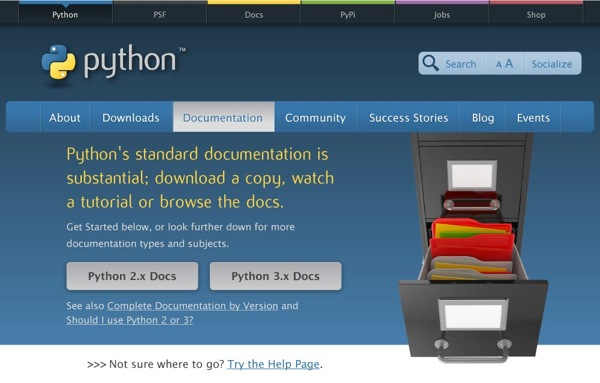
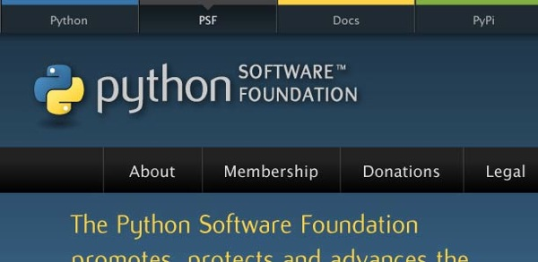
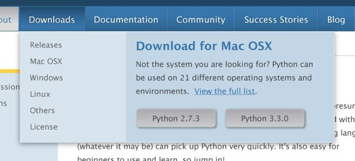

It is with great pride that on behalf of the Python Software Foundation and the community as a whole, I am pleased to announce that the official [Python.org](http://www.python.org/) website, sub-sites, and back-end architecture are getting a total makeover.

### Introduction

Python has grown significantly in the last few years, both in terms of audience and the amount of topical information about it. This abundance of information has outgrown the current website’s taxonomy and fundamental design. The key goal of the redesign project is to update Python’s official web presence with an eye towards better organizing the information we have today, and expect to add in the future. The end result aims to help our audience find the information they need whether it’s official information like downloads and documentation, or resources from our vibrant community. Although the current implementation of the Python website has served its purpose over the years, the time has come for the site to progress and complement the growth and maturity of the language itself as well as the vibrancy of the community.

### There’s a lot we want to achieve

-   Modern design and experience
-   Concise and intuitive navigation
-   Showcase the simplicity and elegance of the language
-   Attract and convert potential Python users and Python Software Foundation sponsors
-   Represent our vibrant, active community
-   Make it easy for a wide range of contributors to add content
-   Enhance the visibility of the PSF and its sponsors
-   Provide examples of success stories
-   Enhance the visibility of alternate implementations
-   Stable and scalable infrastructure

The redesign involves some tall tasks. From the fresh and modern UI/UX to the online **and** offline content editing features, no aspect of the project is to be taken lightly, or even incrementally. Such approaches have stalled and ultimately failed in the past, and rapidly outstrip the free time our community of volunteers can dedicate to the project.

### The Process

This is a process that started **over** two years ago with the drafting of the of the Request For Proposals. [This year we issued it publicly](http://pythonorg-redesign.readthedocs.org/en/latest/), and since that time the psf-redesign team grew to include Nick Coghlan, Doug Hellmann, Idan Gazit, Steve Holden, Brian Curtin, Andrew Kuchling, Issac Kelly, Katie Cunningham, Noah Kantrowitz and others. The team received seven bids in total - all of them which included strong points and compelling stories. The team deliberated, ranked, discussed, and asked questions of the bidders, working through the bids for several months. We were constantly impressed by the high quality, well thought out, professional work that the community members submitted to us. After the review period came to a close, we had a single bid which ranked higher than any of the others, based on experience, references, and overall quality of the proposal. They'll be working with the second highest rated bid, which contained UI/UX and IA that absolutely floored the reviewers. The first bid, submitted by a joint effort between [Project Evolution](http://www.projectevolution.com/) and [Revolution Systems](http://www.revsys.com/), was the overall highest ranked bid. The team was unanimous in our recommendation to proceed forward with this bid based on the credentials of the team, quality of the proposal, and their deep understanding of how to work with volunteer organizations, oversight and the community as a whole. This bid provides a clear project management and accountability system as well as detailing how they wish to work with the community as a whole to achieve the project goals. Second, we had the [Divio.ch](https://www.divio.ch/) team bid. The IA/UX/UI work which they poured over 120 hours into as a company impressed us a great deal. We were quite literally floored by the amount of thought, planning, and work invested in the visual and IA aspects of the Divio bid. Together with Project Evolution and Revolution Systems leading the project, and the stellar Divio team consulting on the visual/IA aspects of the project, the redesign team and the board is sure that we will be able to deliver a next generation experience. The architecture being developed will achieve all of the goals we set forth when we went down the path of drafting the redesign RFP. On September 26th, the Python Software Foundation's board of directors unanimously approved the combined bids:  

> RESOLVED, that the Python Software Foundation accept the Python.org site redesign proposal set forth by Project Evolution / Revolution Systems and Divio with a budget not to exceed $70,000 in total without further board approval.

### Overview of the Accepted Bids

The redesign project will completed by the three teams, Project Evolution, RevSys, and Divio, with a division of labor using the best aspects of each team. The project plan and the back end will be handled by members of Project Evolution and RevSys. Members of Project Evolution will handle the front end work, incorporating the guidance of the Divio team. The accepted bids from the three entities can be found below:  

-   [Project Evolution and Revolution Systems Bid](http://redesign.python.org/assets/Python-proposal-Sept2012-cleaned.pdf)
-   [Divio Bid](http://redesign.python.org/assets/divio_python_presentation.pdf)

#### Project Evolution

Project Evolution (PE) is a design driven development team founded in 1999 with clients ranging from school districts to Fortune 1000 fashion conglomerates with international holdings. The 12-person team includes creative leads, front-end and back-end developers, and associated support staff all committed to open-source technology.  

#### Revolution Systems

Revolution Systems, LLC., based in Lawrence, Kansas, was formed in 2002 by Frank Wiles to help businesses benefit from open source software. While many large organizations use open source software internally (sometimes without their knowledge), he realized that many organizations did not know how to properly take advantage of this revolutionary type of software.  

#### Divio

Divio, a web agency located in Zürich, Switzerland, builds web applications and is specialised in the areas of design and development. For production, Divio uses the Django web framework and is heavily involved in the development of the successful open source projects django CMS and django SHOP. The company relies on the agile SCRUM-methodology for its projects.

### Screenshots, Maybe?

As if the bids and the prospect of the project were not enough to get you excited, I thought I might share some tidbits from the current mockups we're working through:  
  
  

### In Closing

I am sincerely proud, as both a Python community member and PSF director, to have been part of this process. The entire review team, every single submitted bid, and the Foundation's board works tirelessly for a great deal of time pulling together what is already turning out to be an impressive and surprising redesign. The design will work on mobile devices. It will follow all of the guidelines of the RFP, support accessibility requirements, and much much more.  
Most of all, it will showcase our language and global community like it has never has been before. Jesse Noller ([person post on this](http://jessenoller.com/2012/11/28/the-great-python-org-redesign/)), Director Python Software Foundation, on behalf of the entire team.
