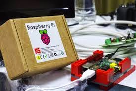

For those of you not familiar with the Raspberry Pi Foundation, this UK based educational charity provides fun projects and opportunities for bringing coding literacy to students in the UK and to learners all over the world. This blog previously featured two of their projects, [Astro Pi](http://pyfound.blogspot.com/2015/02/raspbery-pis-in-space-astropi.html) and [Unicef’s Pi4Learning](http://pyfound.blogspot.com/2015/03/unicef-pi4learning.html). There are many more, including *Piper* which uses the game, *Minecraft*, to teach electronics to kids, or the use of Raspberry Pis on weather balloons to observe and record (from the UK) today’s solar eclipse, or *Picademy*, which teaches programming skills to teachers (for these projects and many more, see [RPF Blog](http://www.raspberrypi.org/blog/)). The one thing these widely-varied projects have in common is that they all rely on the high-performing, incredibly affordable, versatile, and fun to use *Raspberry Pi*! First produced for sale by the RP Foundation in 2011, the device has become hugely popular, with over 5 million in use around the world. And it just got even better! The new Raspberry Pi 2 went on sale in February 2015. The reviews have begun pouring in, and the consensus is that it’s truly great! Still selling for a mere $35 USD, still the size of a credit card, and of course still pre-loaded with Python (along with Scratch, Wolfram Mathematica, and much more), the new Raspberry Pi features increased speed and functionality over the B and B+ models. With 900MHz, quad-core ARM Cortex-A7 CPU, and 1 full GB of RAM (over model B+’s 512 MB), it’s been benchmarked at speeds of 6 to almost 10 times faster than the first B model (see [Tao of MAC](http://taoofmac.com/space/blog/2015/02/07/1200), [PC World](http://www.pcworld.com/article/2886260/raspberry-pi-2-review-the-revolutionary-35-micro-pc-supercharged.html)). Its 4-core processor can run all ARM GNU/Linux distributions and the new Pi is fully compatible with the earlier models. In addition, Windows is poised to release a version 10 that will work with the Pi, thus increasing its already broad appeal and versatility (see [Raspberry Pi 2](http://www.raspberrypi.org/products/raspberry-pi-2-model-b/)).  photo credit: da.wikipedia.org, under CC license Features it retains from the previous Model B+ include 4 USB ports, HDMI, Ethernet, Micro SD, Broadcom VideoCore IV Graphics, and Sound Card outputs via HDMI and 3.5mm analogue output (see [PC Pro](http://www.pcpro.co.uk/components/1000356/raspberry-pi-2-review-the-pi-you-didnt-know-you-wanted)). Currently the ties between the PSF and the RPF are strong, with many Pythonistas using the Raspberry Pi and many Raspberry Pi projects being done in Python. We hope more people will take a look at this remarkable tool and use it to teach Python, spread programming skills, and put computing power in the hands of anyone who wants it. *I would love to hear from readers. Please send feedback, comments, or blog ideas to me at [msushi@gnosis.cx](mailto:msushi@gnosis.cx).*
