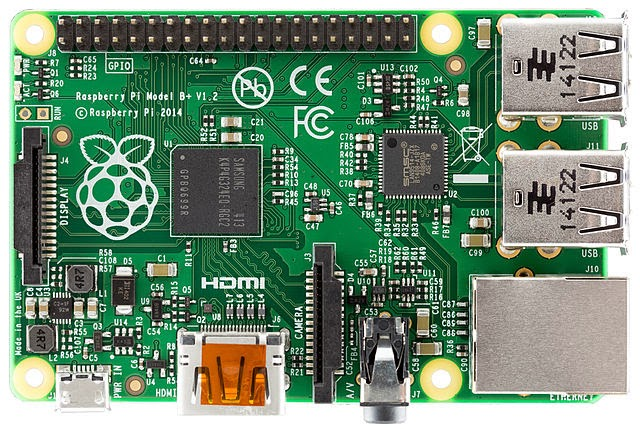

*Personal Note: In 2013, I attended my first PyCon in Santa Clara, CA. At the time, I was a complete novice at programming, but interested both because my partner had been a Python geek for a long time and because I was embarking on a new career as a freelance tutor, writer, and educator, and wanted to learn about the educational potential of the open source tech movement. At the end of the conference, the announcement of a surprise gift to be given to each attendee was met with the kind of enthusiastic, almost frenzied joy I have only seen previously at rock concerts when an unexpected superstar steps onto the stage to accompany a lesser known headliner (I would give an example here, but it would certainly date me).* At the 2013 PyCon, each attendee got a [Raspberry Pi](http://en.wikipedia.org/wiki/Raspberry_Pi)—a tiny, adaptable, extremely affordable ($25-$35 USD), yet very powerful, single-board computer that would prove to be a catalyst for the spread of computer literacy to young and young-at-heart people worldwide.  Image credit: "Raspberry Pi B+ top" by Lucasbosch - Own work. Licensed under CC BY-SA 3.0 via Wikimedia Commons The [Raspberry Pi Foundation](http://en.wikipedia.org/wiki/Raspberry_Pi_Foundation) created the first marketable device in 2011. Their mission, "to promote the study of computer science and related topics, especially at school level, and to put the fun back into learning computing” makes them a natural ally of the PSF. According to PSF Director, Marc-André Lemburg, “The PSF board thinks it's a great idea to get the PSF and the RPF working together more closely, since we share similar goals and there's a large overlap in communities, especially on the education and young coders side.” Furthermore, Raspberry Pis have been used to teach coding primarily in Scratch and Python, and they are rapidly gaining in popularity. Currently, over 4.5 million Raspberry Pis have been produced and shipped. One of the most imaginative and exciting of the RPF's educational programs currently underway in the UK is a competition that will allow UK primary and secondary school students a chance to do real scientific research in space. For the competition, teams of students will devise experiments and/or create software for Raspberry Pis that will be deployed aboard the International Space Station by British European Space Agency Astronaut,Tim Peake. The data collected will be downloaded to the students conducting the winning experiments. The RPF's and the UK's commitment to teaching computing skills is further reflected in their providing teaching resources to aid students in creating their contest submissions. These resources will be further linked to current teaching curricula in order to enhance education in STEM fields. Funding and collaboration are coming not only from educational institutions like the [UK Space Agency](https://www.gov.uk/government/organisations/uk-space-agency), [UKspace](http://www.ukspace.org/), [ESERO-UK](http://www.esero.org.uk/) and [ESA](http://www.esa.int/ESA), but also from UK industry. For more details, see [AstroPi](http://www.raspberrypi.org/astro-pi/). Stay tuned for a future post on another education project involving Raspberry Pi: UNICEF's Learning Initiative, as well as some info on the newly released, quad-core, Raspberry Pi 2.
