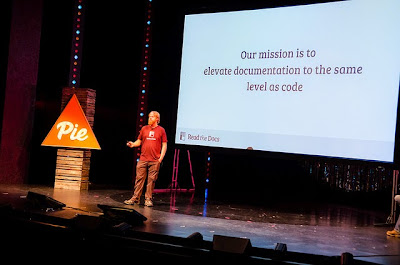

Today's post, like the [previous one](http://pyfound.blogspot.com/2015/05/psf-funds-development-armin-rigos-cffi.html), features a development project that the PSF has been delighted to fund once again this year. On April 28, 2015, the PSF Board unanimously approved the following resolution:

> `RESOLVED, that the Python Software Foundation grant` $8,000 to Read the Docs, Inc. for developmental work.

####   

## What is RTD?

Looking for somewhere to host your open source project’s documentation in a way that will make it readily available, easy to find, fully searchable for your users, and exportable in PDF format, while at the same time offering you ease of use and the ability to add content as your project develops? Then, you’ll want to check out *Read the Docs*, the world’s largest documentation website for open source projects. [Read the Docs](https://readthedocs.org/)

> … hosts documentation, making it fully searchable and easy to find. You can import your docs using any major version control system, including Mercurial, Git, Subversion, and Bazaar. We support webhooks so your docs get built when you commit code. There’s also support for versioning so you can build docs from tags and branches of your code in your repository.

## RTD’s History

  
RTD was created in 2010 by Eric Holscher, Charles Leifer, and Bobby Grace for the 2010 Django Dash. Eric tells the interesting story at [Djangocon](http://pyvideo.org/video/101/djangocon-2011--the-story-and-tech-of-read-the-docs). A Django Dash is a coding contest that allows 48 hours for development and implementation of a project. Eric and his team considered what to do and decided that, since current documentation hosting was less than satisfactory, they could be of most help to the community by creating a web-based doc hosting solution. They agreed that [Sphinx](http://sphinx-doc.org/) was the best document tool for Python, so they went with that. According to Eric, 2011 was the year that saw RTD go … from a hobby project, into something projects depended on. At that point, they were hosting documentation for Celery, Fabric, Nose, py.test, Virtualenv, Pip, Django CMS, Django, Grapelli/Floppyforms/Sentry, mod\_wsgi. Currently, they are hosting what Eric describes as a decent part of the Python ecosystem, including SQL Academy, Pyramid, Requests, Minecraft Overviewer, and many others. They have over 50 contributors, 7500 users, and get over 15,000,000 pageviews a month. The code for RTD is on GitHub and its documentation can be found on the site. Rackspace provides free hosting. A full list of features is available on the site.  
 Photo Credit: Aaron Hockley, October 2014 Creative Commons license 2.00

## Use of PSF Grant

The PSF award was part of a fundraising drive that opened at PyCon 2015 and brought in $24,000 USD from 157 contributions since then (see the [RTD Blog](http://blog.readthedocs.com/fundraising-wrapup/)). Corporate sponsors included Twilio, Sentry, DreamHost, and Lincoln Loop; with service sponsorships from Elastic Search, MaxCDN, and Gandi. This funding will support RTD for 3 months of development work on the path toward sustainability as an open source project. More specifically, the funds will allow RTD to hire 2 part-time paid positions: Community Developer and Operations Developer (see RTD [Blogpost](http://blog.readthedocs.com/read-the-docs-is-hiring/) for details and how to apply). Furthermore, RTD intends to document its use of PSF grant money; how development time is spent and how funds are allocated will be posted on RTD’s public [Trello board](https://trello.com/b/tF04aNrT/read-the-docs-public). If you’d like to help, you can contribute to RTD at [Gratipay](https://gratipay.com/) and you can follow them on [Twitter](https://twitter.com/readthedocs). *I would love to hear from readers. Please send feedback, comments, or blog ideas to me at [msushi@gnosis.cx](mailto:msushi@gnosis.cx).*
