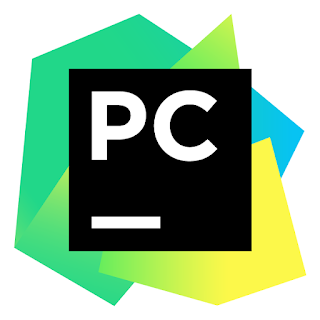
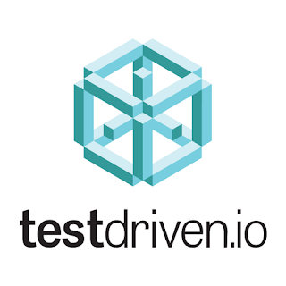

The Python Software Foundation launched its [end-of-the-year fundraiser](https://www.python.org/psf/donations/2020-q42020-drive/) on December 1st and the response has been overwhelming 💙💛. Even in this difficult time, our community has come together to help the PSF in its efforts to support Python development and to grow a diverse and international community of Python programmers.

In 2019, the strategic plan for the PSF shifted towards supporting CPython sustainability. With lower expected income from PyCon US for two years, we need donation and sponsorship support to make these plans a reality.

As of Dec 17th, our fundraiser has generated over $52,000 in donations and there are still almost 2 weeks to go. If you haven't yet [donated](https://www.python.org/psf/donations/2020-q42020-drive/), there are several ways you can help:

-   You can purchase a product/service from any of the below companies and part of the proceeds will go to the PSF. Click on the infographics below to see the offers.
-   Donate directly to the PSF! No purchase is necessary to participate in the fundraiser. You can [donate directly here](https://psfmember.org/civicrm/contribute/transact?reset=1&id=31) so that 100% of your donation goes to the PSF.
-   A number of individuals are offering to match donations to the PSF, see [matcher.pyfound.org](http://matcher.pyfound.org) for more information.

If you have already donated, thank you from the bottom of our hearts. If [donating](https://psfmember.org/civicrm/contribute/transact?reset=1&id=31) is not an option, helping to spread the word about the fundraiser would be greatly appreciated.

    
   

