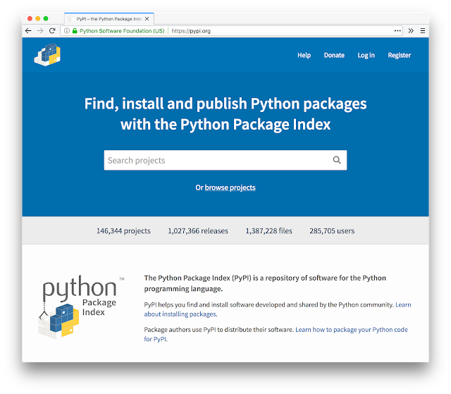

In April this year a new version of the [Python Package Index](https://pypi.org/) (PyPI) was released, an effort made possible by a [generous award from the Mozilla Open Source Support program](http://pyfound.blogspot.com/2017/11/the-psf-awarded-moss-grant-pypi.html). A major change in PyPI is the new user interface - something that had not seen any sizeable updates for over ten years. Understandably there have been questions about what’s next for the new UI, which as the designer of [Warehouse](https://github.com/pypa/warehouse) (the project powering PyPI), I would like to address.  
  

## The new design

  
PyPI’s new design is a reflection of the Python community - modern, welcoming and inclusive. The design emphasises inclusion by providing extensive help documentation, user friendly interfaces, accessible font sizes and a high-contrast color scheme. The entire site works across all resolutions, meaning that you can now use PyPI on any device. These features are no accident, as the goal of the redesign is to make PyPI a success for as many users as possible. This a big challenge as over 15 million people from 236 different countries visit PyPI.org each year (Aug 2017 - July 2018). While the new design is informed by [usability standards](https://whoisnicoleharris.com/2018/05/17/warehouse-accessibility.html) and user experience best practices, it’s now time to take PyPI to the next level: informing design improvements by engaging in community research and user testing.

## Next steps

  
The first area we are looking to improve is the project's detail page ([view example](https://pypi.org/project/pip/)), which is - as the name suggests - the page where the details of a particular project can be viewed. This is by far the most visited page type on PyPI. In July 2018 alone, 76.59% of page visits were to a project detail page, or 3,594,956 visits from a total page visit count of 4,693,561. The majority of users arrive on these pages direct from Google or other sources, bypassing the PyPI home and search pages. Given these numbers, even a small improvement in the efficiency of this page would return great results for the community. The question is: how should we decide what to change? What one user might think of an improvement, others may consider a regression.

## Conducting user research

  
In an effort to better understand what our users want from the aforementioned page, we ran a design research exercise ([full writeup](https://whoisnicoleharris.com/2018/07/22/pypi-user-research.html)) asking Python community members to rank the importance of different pieces of information on the page. 1,926 people participated in the exercise. These were the results:  

!function(e,t,n,s){var i="InfogramEmbeds",o=e.getElementsByTagName(t)\[0\],d=/^http:/.test(e.location)?"http:":"https:";if(/^\\/{2}/.test(s)&&(s=d+s),window\[i\]&&window\[i\].initialized)window\[i\].process&&window\[i\].process();else if(!e.getElementById(n)){var a=e.createElement(t);a.async=1,a.id=n,a.src=s,o.parentNode.insertBefore(a,o)}}(document,"script","infogram-async","https://e.infogram.com/js/dist/embed-loader-min.js");  
["Buy a Feature" - PyPI research](https://infogram.com/aafb06e8-4bc6-4e49-8bbe-9e2525b18ddf)  
[Infogram](https://infogram.com/)  
From this research, we can ascertain that many users highly value the project description, information about the required version of Python, and links to the project online. In contrast, few users value the [trove classifiers](https://pypi.org/classifiers/), list of maintainers, or instructions on how to see statistics about the project. Such insights are essential in driving the redesign in a way that prioritises important information for the largest number of users.

## Running user tests

  
In conjunction with this research we are also establishing a user testing program, where PyPI users will give their feedback to the team via a remote video call; answering specific usage questions or completing certain tasks on the site. Our goal is to run these sessions with a diverse group of users, accounting for the different people, places and ways that Python is used, while establishing major “pain points” with the current design. From this, we can open issues in the issue tracker to address problems, [as has happened before](https://github.com/pypa/warehouse/issues?utf8=%E2%9C%93&q=is%3Aissue+label%3A%22raised+in+user+testing%22+) with previous rounds of user tests conducted on the project management interfaces. User tests can also be used to test new design concepts, compare the performance between old design vs new proposals, and ascertain if the proposed design solutions are truely performant.

## Help us help PyPI!

  
So - how can you help us take PyPI to the next level? If you’d like to participate in user tests, please [register your interest](https://t.co/rkBRinecDx). Depending on your profile and availability, we will be in touch to organise a testing session. If you have a background in design/research or are interested in facilitating user tests, please contact me on [nicole@pypi.org](mailto:nicole@pypi.org). All help is welcome! We appreciate new contributors to the Warehouse project, with [reserved issues for new contributors](https://github.com/pypa/warehouse/issues?q=is%3Aissue+label%3A%22good+first+issue%22) and love [donations to the Python Packaging Working Group](https://psfmember.org/civicrm/contribute/transact?reset=1&id=13) as these help us build a more sustainable model for Python packaging. Finally, if you are interested in participating in future rounds of user research, please follow [PyPI on Twitter](https://twitter.com/pypi) or keep an eye on PyPI.org for future announcements!
