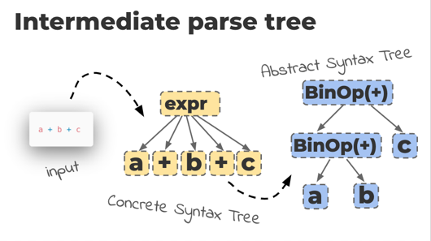

  
Since its start, Python’s grammar has been [LL(1)](https://en.wikipedia.org/wiki/LL_parser): it needs only a left-to-right parser that looks one token ahead to resolve ambiguities. The standard CPython parser is [produced by a simple custom parser generator](https://devguide.python.org/compiler/). There are some costs to this simplicity, however. First, the [official Python grammar file](https://docs.python.org/3/reference/grammar.html) does not capture the language exactly. There are invalid constructs allowed by the grammar, for example, this assignment expression (using the new walrus operator):  

\[x for x in y\] := \[1, 2, 3\]

This expression is illegal, because the left side of the walrus operator must be a name, not an arbitrary sub-expression like `[x for x in y]`. Python’s LL(1) parser is not powerful enough to enforce this rule, though, so it must be enforced after parsing by special-case logic that runs while transforming the parse tree into the abstract syntax tree (AST). Worse, there is Python code that we would like to write but cannot, because it can’t be parsed. Parenthesized with-statements look reasonable [but they’re currently prohibited](https://bugs.python.org/issue12782):  

with (
    open("a\_really\_long\_foo") as foo,
    open("a\_really\_long\_baz") as baz,
    open("a\_really\_long\_bar") as bar
):
    ...

[Read more 2020 Python Language Summit coverage](https://pyfound.blogspot.com/2020/04/the-2020-python-language-summit.html).  

* * *

Guido van Rossum, Pablo Galindo, and Lysandros Nikolaou wrote a new Python parser to excise these warts, and [proposed PEP 617](https://www.python.org/dev/peps/pep-0617/) to adopt it in CPython. The new parser is written in a more powerful style called a [parsing expression grammar](https://en.wikipedia.org/wiki/Parsing_expression_grammar) (PEG), so the project is named “PEGEN”. When a PEG parser reads the beginning of a token sequence that could match several grammar rules, the parser tries each of those rules, from left to right, until one succeeds. For example, given a set of rules:  

rule: A | B | C

The parser first tries to apply rule A to its input sequence. If A succeeds, the parser ignores B and C. Otherwise, the parser moves on and tries to apply rule B, and so on. Unlike an LL(1) parser, a PEG parser can look ahead as far as necessary to disambiguate a sequence. The grammar is deterministic: in cases where multiple rules match, the leftmost wins. Some sequences would require exponential time to find the matching rule; to prevent this, most PEG parsers (including the new Python parser) implement the “packrat” method to cache intermediate results. A packrat parser can process any input in linear time, but spends some memory on its cache. PEGEN’s grammar is far more legible than the old one’s, and the grammar exactly matches all legal Python programs. CPython’s old parser progresses in stages: the tokenizer feeds the LL(1) parser, which produces a concrete syntax tree (CST), which is transformed into the AST. The CST stage is necessary because the parser does not support left recursion. Consider this expression:  

a + b + c

The old parser’s CST is too flat, as the presenters showed in this slide:

  
In real life, the expression will be evaluated at runtime by first adding *a* to *b*, then adding *c*. Unfortunately the CST does not encode this nested evaluation, so the LL(1) parser must transform the program a second time to turn the CST into an AST in the properly nested form, which can then generate bytecode. PEGEN, on the other hand, directly generates the AST. Depending on the program, PEGEN may use more or less memory: what it spends on the packrat method, it may save by skipping the CST. Emily Morehouse tested PEGEN against the old parser by verifying they produce the same AST for every module in the standard library and the top 3800 PyPI packages. (PEGEN parses the standard library slightly faster than the old parser, but uses 10% more memory.) Once Python has a non-LL(1) parser, its syntax may grow more grammatically complex; Victor Stinner asked if third-party Python parsers (such as linters and IDEs) might have difficulty. Van Rossum felt certain they could adopt more powerful parsers themselves, if necessary. The authors plan to switch CPython to the new parser cautiously. In Python 3.9 alpha 6 the new parser will be opt-in; it will become the default in beta 1 and in the official 3.9 release, with the old parser still available by a command line switch. As soon as the new parser is enabled, parenthesized with-statements will be allowed! In Python 3.10 the old parser will be deleted. PEP 617 must still be approved, however, and the new code needs a final review. The proposal met no opposition; in fact, several in the audience asked whether it could become the default sooner.
