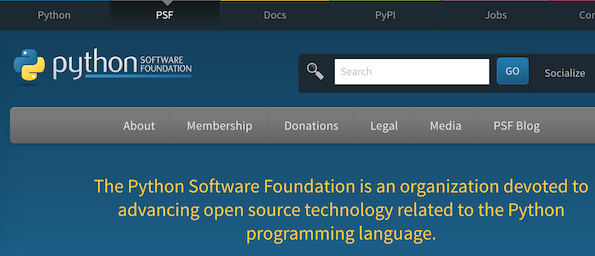

*The mission of the Python Software Foundation is to promote, protect, and advance the Python programming language, and to support and facilitate the growth of a diverse and international community of Python programmers.* It’s that time of year again! The PSF annual election for its 2015 Board of Directors is currently seeking candidates.  
  
But what exactly, you may ask, does the PSF Board do? Well, it turns out that the fulfillment of the above-quoted mission statement requires that they do quite a bit. Basically, the directors manage all the business of the PSF. This includes appointing the PSF’s officers; holding and protecting Python’s intellectual property rights and licenses (the open source stack of licenses on the source code, all logos and trademarks); managing the budget and allocating funds; organizing and managing the annual PyCon North America (through the esteemed PyCon team); maintaining the PSF's legal status as a non-profit corporation (with all appropriate legal documents, such as articles of incorporation, bylaws, etc.); managing and maintaining the *[python.org](http://python.org/)* website and related resources; fundraising and obtaining sponsors; public relations; education and outreach; and membership management and services (and probably some other categories that I forgot). There are 11 total seats available; Directors are elected annually for a term of one year. Directors need not be residents of the US, and they are not compensated for their work. See [PSF ByLaws](https://www.python.org/psf/bylaws/) for more complete info. If you or someone you know would like to run, i.e., do all of that extremely important work for free—although you will bask in glamor (glamour, if you’re British), glory, and gratitude, here’s the wiki for nominations: [PSF Director Nominations](https://wiki.python.org/moin/PythonSoftwareFoundation/BoardCandidates2015). At the moment, no deadlines have been set; I will provide that info as soon as it’s available. Additional relevant info can be found at: [PSF home page](http://www.python.org/psf/), [PSF membership FAQ](http://www.python.org/psf/membership/), and [PSF members' wiki](http://wiki.python.org/psf/). *I would love to hear from readers. Please send feedback, comments, or blog ideas to me at [msushi@gnosis.cx](mailto:msushi@gnosis.cx).*
