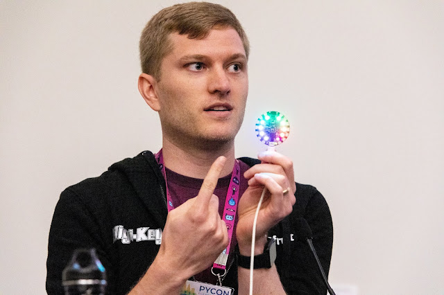
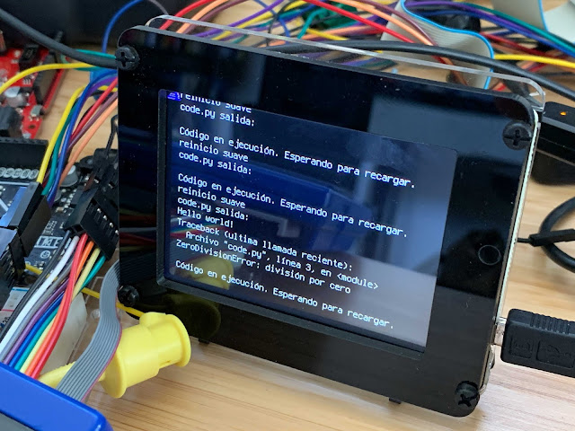
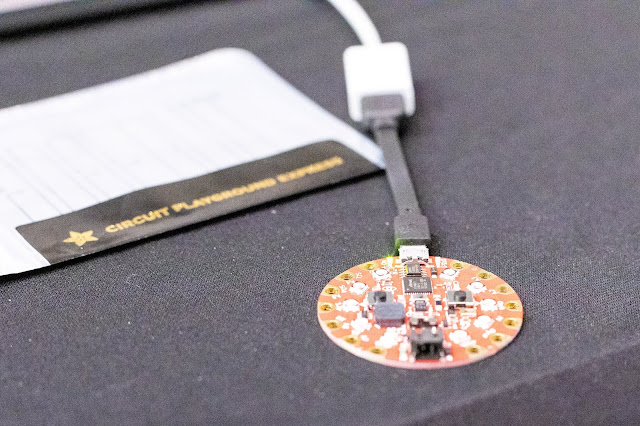

 Scott Shawcroft is a freelance software engineer working full time for Adafruit, an open source hardware company that manufactures electronics that are easy to assemble and program. Shawcroft leads development of CircuitPython, a Python interpreter for small devices. The presentation began with a demo of Adafruit’s Circuit Playground Express, a two-inch-wide circular board with a microcontroller, ten RGB lights, a USB port, and other components. Shawcroft connected the board to his laptop with a USB cable and it appeared as a regular USB drive with a source file called code.py. He edited the source file on his laptop to dim the brightness of the board’s lights. When he saved the file, the board automatically reloaded the code and the lights dimmed. “So that's super quick,” said Shawcroft. “I just did the demo in three minutes.” [Read more 2019 Python Language Summit coverage](https://pyfound.blogspot.com/2019/05/the-2019-python-language-summit.html).

# CircuitPython Is Optimized For Learning Electronics

The history of CircuitPython begins with MicroPython, a Python interpreter written from scratch for embedded systems by [Damien George](http://pyfound.blogspot.com/2016/03/genuinely-nice-chap-damien-george.html) starting in 2013. Three years later, Adafruit hired Shawcroft to port MicroPython to the SAMD21 chip they use on many of their boards. Shawcroft’s top priority was serial and USB support for Adafruit’s boards, and then to implement communication with a variety of sensors. “The more hardware you can support externally,” he said, “the more projects people can build.” As Shawcroft worked with MicroPython’s hardware APIs, he found them ill-fitting for Adafruit’s goals. MicroPython customizes its hardware APIs for each chip family to provide speed and flexibility for hardware experts. Adafruit’s audience, however, is first-time coders. Shawcroft said, “Our goal is to focus on the first five minutes someone has ever coded.” To build a Python for Adafruit’s needs, Shawcroft forked MicroPython and created a new project, CircuitPython. In his Language Summit talk, he emphasized it is a “friendly fork”: both projects are MIT-licensed and share improvements in both directions. In contrast to MicroPython’s hardware APIs that vary by chip, CircuitPython has one hardware API, allowing Adafruit to write one set of libraries for them all. MicroPython has a distinct standard library that differs from CPython’s: for example, its time functions are in a module named `utime` with a different feature set from the standard `time` module. It also ships modules with features not found in CPython’s standard library, such as advanced filesystem management features. In CircuitPython, Shawcroft removed the nonstandard features and modules. This change helps new coders ramp smoothly from CircuitPython on a microcontroller to CPython on a full-size computer, and it makes Adafruit’s libraries reusable on CPython itself. Another motive for forking was to create a separate community for CircuitPython. In the original MicroPython project’s community, Shawcroft said, “There are great folks, and there's some not-so-great folks.” The CircuitPython community welcomes beginners, publishes documentation suitable for them, and maintains standards of conduct that are safe for minors. Audience members were curious about CircuitPython’s support for Python 3.8 and beyond. When Damien George began MicroPython he targeted Python 3.4 compliance, which CircuitPython inherits. Shawcroft said that MicroPython has added some newer Python features, and decisions about more language features rest with Damien George.

# Minimal Barrier To Entry

  
*Photo courtesy of Adafruit.* Shawcroft aims to remove all roadblocks for beginners to be productive with CircuitPython. As he demonstrated, CircuitPython auto-reloads and runs code when the user saves it; there are two more user experience improvements in the latest release. First, serial output is shown on a connected display, so a program like `print("hello world")` will have visible output even before the coder learns how to control LEDs or other observable effects. Second, error messages are now translated into nine languages, and Shawcroft encourages anyone with language skills to contribute more. Guido van Rossum and A. Jesse Jiryu Davis were excited to see these translations and suggested contributing them to CPython. Shawcroft noted that the existing translations are MIT-licensed and can be ported; however, the translations do not cover all the messages yet, and CircuitPython cannot show messages in non-Latin characters such as Chinese. Chinese fonts are several megabytes of characters, so the size alone presents an unsolved problem. Later this year, Shawcroft will add Bluetooth support for coders to connect their phone or tablet to an Adafruit board and enjoy the same quick edit-refresh cycle there. Touchscreens will require a different sort of code editor, perhaps more like [EduBlocks](https://edublocks.org/). Despite the challenges, Shawcroft echoed [Russell Keith-Magee’s insistence on the value of mobile platforms](http://pyfound.blogspot.com/2019/05/russell-keith-magee-python-on-other.html): “My nieces, they have tablets and phones. They do not have laptops.” Shawcroft’s sole request for the core developers was to keep new language features simple, with few special cases. First, because each new CPython feature must be reimplemented in MicroPython and CircuitPython, and special cases make this work thorny. Second, because complex logic translates into large code size, and the space for code on microcontrollers is minuscule. 
