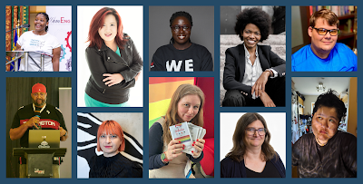
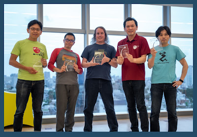

Do you know someone in the Python community who inspires you and whose contributions to the Python community are outstanding? Other than saying thank you (definitely do this too!), you can also nominate them to receive recognition given by the PSF. In this blog post, we will explain what each of the awards are and how they differ. We hope this will encourage you to nominate your favorite inspirational community member to receive an award!

## [PSF Community Service Awards](https://python.org/community/awards/psf-awards/#introduction)

  

The most straightforward way to acknowledge someone’s volunteer effort serving the Python community is to nominate them for the PSF Community Service Awards (CSA). The awardee will receive:

  

-   A cash award of $599 USD
    
-   Free registration at all future PyCon US events
    

  

Recipients need not be PSF members and can receive multiple awards if they have continuous outstanding contributions. Other than individuals, there are also [small organizational groups (e.g. PyCon JP Association 2021)](https://python.domainunion.de/community/awards/psf-awards/#december-2021) who can receive the CSA award.

  

The PSF Board reviews nominations quarterly. CSA recipients will be recognized at PyCon US every year.

#### CSA Award Winners

The PSF Community Service Awards are all about the wonderful and dedicated folks in our community, and we had to take this opportunity to show some of their faces! You can find all of the inspiring PSF CSA recipients on our [CSA webpage](https://www.python.org/community/awards/psf-awards).

  

 CSA Recipients (left to right, top): Jessica Upani, Mariatta Wijaya, Abigail Mesrenyame Dogbe, Lais Carvalho, Mason Egger

#### CSA Recipients (left to right, bottom): Kojo Idrissa, Tereza Iofciu, Jessica Greene, Carol Willing, Vicky Twomey-Lee

####   
 PyCon JP Association CSA Recipients (left to right): Takayuki Shimizukawa,  
Shunsuke Yoshida, Jonas Obrist, Manabu Terada, Takanori Suzu

## [PSF Distinguished Service Awards](https://www.python.org/community/awards/psf-distinguished-awards/#introduction)

  

As the highest award that the PSF bestows, the Distinguished Service Award is the level up of the CSA award described above. Recipients of a DSA need to have made significant, sustained, and exemplary contributions with an exceptionally positive impact on the Python community. Recognition will take the form of an award certificate plus a cash award of $5000 USD. As of the writing of this blog post, there are only 7 awardees of the DSA in history.

  

Naomi Ceder is the latest Distinguished Service Awards recipient, she received the award in 2022

## [PSF Fellow Membership](https://www.python.org/psf/fellows/)

  

Although it is also a form of recognition, the PSF Fellow Membership is different from the awards above and there’s no comparison of the level of recognition between fellowship and any of the awards above. Fellows are members who have been nominated for their extraordinary efforts and impact upon Python, the community, and the broader Python ecosystem. Fellows are nominated from the broader community and if they meet [Fellow criteria](https://www.python.org/psf/fellows/#criteria), they are elevated by a vote of the Fellows Working Group. PSF Fellows are lifetime voting members of the PSF. That means Fellows are eligible to vote in PSF elections as well as follow the membership rules and Bylaws of the PSF.

## Nominate someone!

We hope this makes the types of recognition given by the PSF clear, as well as gives you confidence in nominating folks in the Python community that you think should be recognized for a CSA, DSA, or as a PSF Fellow. We also hope that this will inspire you to become a Python community member that receives a service award!
