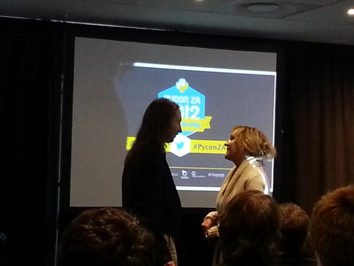

**On Friday, Python Software Foundation administrator Ewa Jodlowska presented Simon Cross with the PSF’s [Community Service Award](http://www.python.org/community/awards/psf-awards/) for the third quarter.**  
 **Photo by [Morgan Collett](https://twitter.com/morgs/status/254220542176026625/photo/1)****  
The award was presented at the first [PyCon South Africa](http://za.pycon.org/) in Cape Town, of which Simon is the lead organizer. Simon and team were able to start from the ground up and build a solid conference with a very nice [schedule](http://za.pycon.org/schedule.html), including many of the community’s best speakers. They even brought in ten sponsors to help keep the conference costs low, including the PSF. Simon is also a leader in the [Cape Town Python User Group](http://www.ctpug.org.za/), a group which often meets to discuss hot topics in the Python world. Along with talks, the group has been getting together to hack on projects they all use. In 2010 and 2011, the PSF sponsored sprints lead by Simon and crew to port [matplotlib](http://pythonsprints.com/2011/04/8/matplotlib-python-3-thanks-cape-town-group/) and [Genshi](http://pythonsprints.com/2010/09/17/genshi-python-3-sprint/) to Python 3. The matplotlib code was merged but not yet released by the project, and Genshi has been available on Python 3 since shortly after their sprint. Simon’s efforts also extend around the Python community, where he’s a maintainer of Genshi and contributes to PyPy, among other projects. The PSF wishes to thank Simon for his efforts with PyCon ZA and everything else he does for the Python community.**
