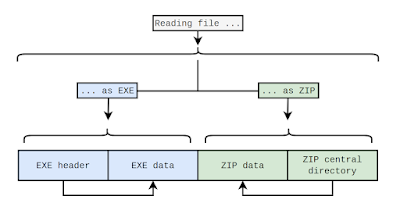

Security and integrity of the Python packaging ecosystem is critical, and the smallest unit of a packaging ecosystem is a "package". Python packages use existing archive formats like ZIP and tar to distribute Python projects to their users. Archives seem simple on the surface, but many ZIP and tar features can be abused to confuse implementations into seeing different contents of the same archive.

These vulnerabilities affect the "integrity of the ecosystem" if tools can't agree what a package contents actually are. This can cause many downstream issues, such as vulnerability or malware scanners giving different results from the package when installed on disk.

The Python Software Foundation Security Developer-in-Residence, Seth Larson, [published a new white paper](https://alpha-omega.dev/blog/slippery-zips-and-sticky-tar-pits-security-and-archives-white-paper-by-seth-larson-python-software-foundation/) with [Alpha-Omega](https://alpha-omega.dev) titled "Slippery ZIPs and Sticky tar-pits: Security & Archives" about work to remediate 10 vulnerabilities affecting common archive format implementations such as ZIP and tar for critical Python projects.

The white paper highlights how the PSF maintained [Python Package Index](https://blog.pypi.org/#preventing-zip-parser-confusion-attacks-on-python-package-installers) (PyPI) can be used to protect insecure implementations of archives preemptively, whether their vulnerability status is known or unknown, by coordinating disclosures with other packaging tools.

  

The white paper details potential future work to shore up the security of ZIP and tar implementations that are in widespread use, such as the zipfile and tarfile module in the Python standard library. The white paper also makes recommendations for packaging ecosystems regarding [reproducible builds](https://reproducible-builds.org/) of archives.

If you rely on PyPI and the Python packaging ecosystem you can directly contribute to further security work done by the PSF by:

-   **[Become a Member](https://psfmember.org/civicrm/contribute/transact/?reset=1&id=1):** When you sign up as a Supporting Member of the PSF, you become a part of the PSF. You’re eligible to vote in PSF elections, using your voice to guide our future direction, and you help us sustain what we do with your annual support.
-   **[Donate](https://psfmember.org/civicrm/contribute/transact/?reset=1&id=2):** Your donation makes it possible to continue our work supporting Python and its community, year after year.
-   **[Sponsor](https://www.python.org/sponsors/application/):** If your company uses Python and isn’t yet a sponsor, send them our [sponsorship page](https://www.python.org/sponsors/application/) or reach out to sponsors@python.org today. The PSF is ever grateful for our sponsors, past and current, and we do everything we can to make their sponsorships beneficial and rewarding.

The Security Developer-in-Residence position is sponsored by [Alpha-Omega](https://alpha-omega.dev). If you'd like to support improving Python at the ecosystem-scale contact [sponsors@python.org](mailto:sponsors@python.org) to discuss sponsoring a [Developer-in-Residence position](https://www.python.org/psf/developersinresidence/).
