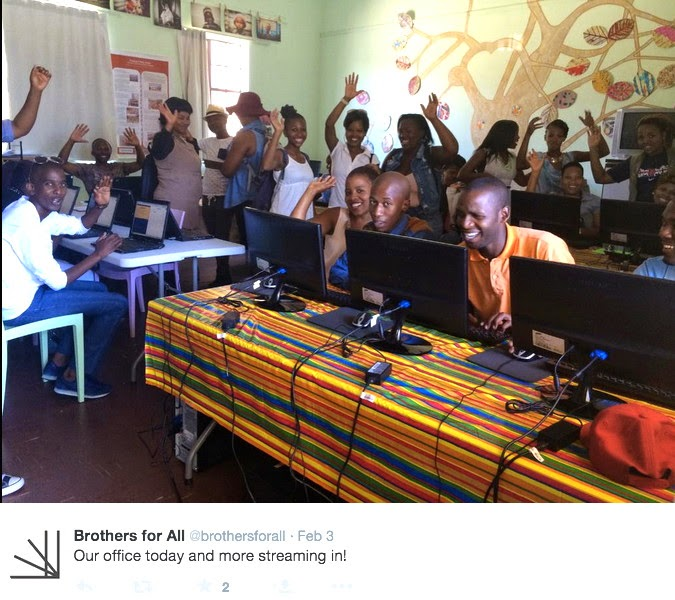

Today’s post is a follow-up to a previous post about a PSF funded project by [Hyperion Development](http://pyfound.blogspot.com/2015/03/hyperion-development-awarded-fourth-psf.html) in South Africa. The PSF has recently heard from Riaz Moola about his latest project–working with [Brothers For All](http://www.brothersforall.org/) to deliver Python courses in 42 prisons–including eight female corrections facilities–in the Western Cape. *Brothers* is run by an ex-con, Sihle Tshabalala, who taught himself to code online. When he got out of prison, he wanted to do something to slow the recidivism rate of South African ex-convicts. Not only does South Africa have the world’s eighth highest prison population, but the rate of re-offenders is over 80%. In addition, an extremely high [unemployment rate of 25%](http://www.tradingeconomics.com/south-africa/unemployment-rate) adds to the hopelessness felt by those with prison records and without marketable skills. *Brothers* began last September by opening a center in a Western Cape township area. There, ex-cons and at-risk youth come to learn coding skills, entrepreneurship, and marketable crafts.  According to Tshabalala,

> “We chose coding because it leapfrogs over the need for more conventional, expensive and time consuming job skills training… Plus there currently is a high demand in the market for such skilled labour.”

They have recently been given approval by the provincial government to take the program into 42 prisons in the Western Cape. This way, prisoners can gain skills while incarcerated so that they are ready for employment immediately upon release. The ambitious scope of this program caused *Brothers* to partner up with *Hyperion*. While *Brothers* will focus on getting the programs into the prisons and more township areas, *Hyperion* will provide course content. *Hyperion’s* main concerns at this point are logistical and for long-term sustainability. As Riaz told the PSF, there are many challenges specific to South Africa; for example, for four hours every day there is a power blackout, which obviously poses a problem for internet connectivity. In addition, South Africa has the highest data costs of any country in the world. Travel for tutors and volunteers is also very expensive. And then, of course, there’s the poverty and its inevitable expression in crime. Sadly, one of the project’s computer labs was recently burglarized, resulting in the loss of equipment. But *Brothers* also has support streams, so they are currently receiving donations to make up for the loss. In future, they plan to purchase laptops, which can be more easily secured. *Hyperion* has been able to achieve a solid team of Python instructors. With the help of the PSF and other institutions, *Hyperion* is able to pay the travel and data costs for their volunteers. This has allowed them to be very selective; their instructors must pass tests of their technological and teamwork skills. Even so, Riaz tells us, they are never at a loss for instructor applicants. The Cape Town team, led by *Hyperion* manager Sobane Motlomelo (a Master’s degree student at University of Cape Town), will be primarily responsible for handling the prison project. Sobane's team has recently accepted four new members, and Riaz is confident of their ability. This is good news for Riaz, who began *Hyperion* as an experiment when he was an undergraduate, then saw it spiral into something very large, to which he has been giving all his time. Currently he’d like to step back just a bit. Our congratulations to him on being offered a Google internship! More info on this remarkable program can be found at its [twitter page](https://twitter.com/brothersforall/) and [htxt.africa](http://www.htxt.co.za/2015/03/26/can-teaching-sa-prisoners-to-code-reduce-the-number-of-repeat-offenders/). *I would love to hear from readers. Please send feedback, comments, or blog ideas to me at [msushi@gnosis.cx](mailto:msushi@gnosis.cx).*
