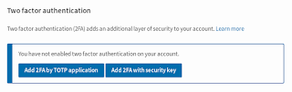
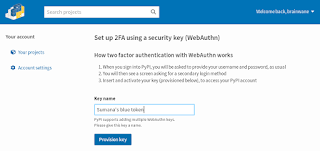
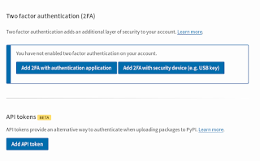

To increase the security of [PyPI](https://pypi.org/) downloads, we have added two-factor authentication (2FA) as a login security option, and API tokens for uploading packages. This is thanks to a [grant from the Open Technology Fund](https://pyfound.blogspot.com/2019/03/commencing-security-accessibility-and.html), coordinated by the [Packaging Working Group](https://wiki.python.org/psf/PackagingWG) of the [Python Software Foundation](https://www.python.org/psf-landing/). If you maintain or own a project on [the Python Package Index](https://pypi.org/), you should start using these features. [Click "help" on PyPI](https://pypi.org/help/) for instructions. (These features are also available [on Test PyPI](https://packaging.python.org/guides/using-testpypi/).) Details and plans for the future: **2FA:** [Two-factor authentication (2FA)](https://pypi.org/help/#twofa) makes your account more secure by requiring two things in order to log in: *something you know* and *something you own*. In PyPI's case, "something you know" is your username and password, while "something you own" can be [an application to generate a temporary code](https://pypi.org/help/#totp), or a [security device](https://pypi.org/help/#utfkey) (most commonly a USB key). *Why?* This will help improve the security of your PyPI user accounts, and thus reduce the risk of vandals, spammers, and thieves gaining account access. Protecting login via the website safeguards against malicious changes to project ownership, deletion of old releases, and account takeovers. PyPI's implementation of the [WebAuthn standard](https://www.w3.org/TR/webauthn/ "External link") and the [TOTP standard](https://en.wikipedia.org/wiki/Time-based_One-time_Password_algorithm "External link") mean you can use [any TOTP authentication application](https://pypi.org/help/#totp) and/or any 2FA device [that meets the FIDO standard](https://fidoalliance.org/certification/fido-certified-products/ "External link"). ([We launched WebAuthn support last year](https://blog.python.org/2019/06/pypi-now-supports-two-factor-login-via.html); this week it comes out of beta.) Go to your account settings to add a second factor.  

<table align="center" cellpadding="0" cellspacing="0"><tbody><tr><td></td></tr><tr><td>Add a second factor in your account settings.</td></tr></tbody></table>

  

<table align="center" cellpadding="0" cellspacing="0"><tbody><tr><td></td></tr><tr><td>Create a key name in the PyPI interface.</td></tr></tbody></table>

2FA only affects logging in via a web browser, and not (yet) package uploads. **API tokens:**

<table align="center" cellpadding="0" cellspacing="0"><tbody><tr><td></td></tr><tr><td>In your Account Settings, select "Add API token".</td></tr></tbody></table>

[API tokens](https://pypi.org/help/#apitoken) provide an alternative way (instead of username and password) to authenticate when **uploading packages** to PyPI. ([We launched API token support last year](https://blog.python.org/2019/07/pypi-now-supports-uploading-via-api.html); this week it comes out of beta.)

<table align="center" cellpadding="0" cellspacing="0"><tbody><tr><td></td></tr><tr><td>PyPI interface for adding an API token for package upload.</td></tr></tbody></table>

<table align="center" cellpadding="0" cellspacing="0"><tbody><tr><td></td></tr><tr><td>Immediately after creating the API token, PyPI gives the user one chance to copy it.</td></tr></tbody></table>

*Why?* These API tokens can **only** be used to upload packages to PyPI, and not to log in more generally. This makes it safer to automate package upload and store the credential in the cloud, since a thief who copies the token won't also gain the ability to delete the project, delete old releases, or add or remove collaborators. And, since the token is a long character string (with 32 bytes of entropy and a service identifier) that PyPI has securely generated on the server side, we vastly reduce the potential for credential reuse on other sites and for a bad actor to guess the token. You can create a token for an entire PyPI user account, in which case, the token will work for all projects associated with that account. Alternatively, you can limit a token's scope to a specific project. That way, if a token is compromised, you can just revoke and recreate that token, instead of having to change your password in lots of automated processes.  

<table align="center" cellpadding="0" cellspacing="0"><tbody><tr><td></td></tr><tr><td>PyPI token management interface</td></tr></tbody></table>

  
Go to your account settings to add an API token. **Future:** In the future, PyPI will set and enforce a policy requiring users with two-factor authentication enabled to use API tokens to upload (rather than just their password, without a second factor). We do not yet know when we will make this policy change. When we do, [we'll announce it](https://pypi.org/help/#upcoming-changes). **Thanks:** Thanks to the Open Technology Fund for [funding this work](https://www.opentech.fund/results/supported-projects/pypi-improvements/). More donor-funded work is in progress on pip and PyPI, via [the PSF's Packaging Working Group](https://wiki.python.org/psf/PackagingWG). Please sign up for the [PyPI Announcement Mailing List](https://mail.python.org/mailman3/lists/pypi-announce.python.org/) for future updates.
