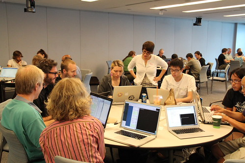

Happy New Year from the Python Software Foundation! 2013 was a busy year for our global community, in almost [200 user groups](https://wiki.python.org/moin/LocalUserGroups), dozens of [regional conferences](http://www.pycon.org/), and countless open source projects, sprints, online fora, and outreach events. Please help us continue to invest in and support the community in 2014 with a donation. There are 2 main ways to help:  

1.  [Donate as an individual](http://python.org/psf/donations/)
2.  [Donate as an organization](http://www.python.org/psf/sponsorship/)

The [Python Software Foundation](http://www.python.org/psf/) is a 501(c)(3) non-profit. For US taxpayers, contributions to the PSF are tax-deductible. Your employer may also match your donations! **What will your money support?**

<table align="center" cellpadding="0" cellspacing="0"><tbody><tr><td></td></tr><tr><td>Group debugging at a PSF-sponsored Boston Python workshop</td></tr></tbody></table>

The PSF sponsors conferences and community events across the globe, including in 2013 alone: SciPy, PyCon Canada, PyOhio, PyCon Ireland, PyData Boston, PythonBrasil, Kiwi PyCon, PyCon Argentina, PyConDE, RuPy, PyConUK, PyDay Ecuador, PyConZA, and the first ever PyTennessee...whew! We provide fiscal sponsorship, cover hosting costs, and sponsor workshop for user groups. We invest in the next generation of Python programmers by supporting events like [Teen Tech Camp](http://juliaelman.com/blog/2013/07/31/durham-teen-tech-camp-press-release/) and [Raspberry Pi programming in classrooms](http://www.toranbillups.com/blog/archive/2013/06/30/Teaching-python-to-fifth-graders/). With support from the PSF's Outreach and Education program, [Ada Camp](http://sf.adacamp.org/) came to San Francisco, scientists learned [Software Carpentry](http://software-carpentry.org/), [librarians learned Python](http://litablog.org/2013/07/introduction-to-python-at-ala-annual-or-awesome-true-ala2013py/) at the ALA Annual Conference, and introductory workshops were run by user groups around the world. The PSF [Grants program](http://www.python.org/psf/grants/) enables experimental development on projects like PyPy, and the [Sprints program](http://pythonsprints.com/) supports development on your favorite open source Python projects. We enforce Python's trademarks, protect Python's intellectual property, keep PyPI running, and are bringing you the [next version of python.org](http://preview.python.org/). Help us do all this and more in 2014 and [donate today](http://python.org/psf/donations/).
