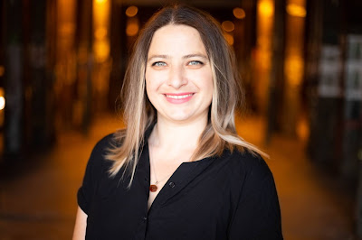
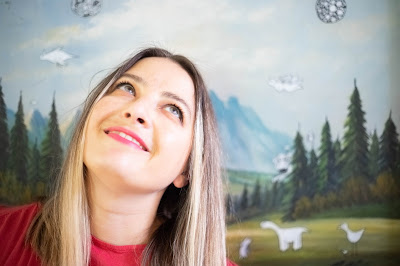

  

Tereza Iofciu, Data Science coach, PyLadies Hamburg organizer, and PSF Code of Conduct working group member has been awarded the Python Software Foundation 2021 Q1 community service award.

> RESOLVED, that the Python Software Foundation award the Q1 2021 Community Service Award to Tereza Iofciu. Tereza is a PSF Code of Conduct WG member and has done a wonderful job helping, participating, and driving the Code of Conduct WG discussions. Tereza formed and continues to help organize the PyLadies event in 2021. Tereza is also a member of the newly formed PSF Diversity & Inclusion WG.

We interviewed Tereza to learn more about her inspiration and work with the Python community. Georgi Ker, a close associate of Tereza also speaks about Tereza.

### The Origin Story

Can you tell us about your origin story? Like how you got into tech?

  

I got into tech quite traditionally, I studied Computer Science in Bucharest, Romania, but I chose that not for a particular love for Informatik. I was good at Math and Physics in high school but I couldn't study those as I didn't want to become a teacher, seeing how teachers were treated in school.

In the year 2000, Computer Science seemed like a thing for the future.

After that I kind of went with the flow, and the flow got me to Germany and doing a Ph.D. in Information Retrieval as the field of Data Science was emerging.

  

After that, I worked as a Data Scientist, Data Engineer, Product Management, Leadership, and now I am teaching (ha! the irony) Data science at the [Neuefische Bootcamp](https://www.neuefische.de/en).

  

### Involvement with the Python Community and Inspiration

  

What was your earliest involvement with the Python community?

I would say in 2018 I saw on Twitter a friend of mine posting she was looking for a new job where diversity was part of the culture.

Through her, I discovered the PyLadies Berlin meetups and I realized that I was missing such a community in Hamburg. We had lots of meetups in the city (things used to still be in-person back then), but most were talks and networking, and not so much about teaching and learning.

It took a while to set it up but then I started the PyLadies Hamburg that year, which I wrote about [here](https://medium.com/womeninai/how-i-started-pyladies-hamburg-ece47e531310).  

You have been a volunteer coordinator and organizer of PyLadies Hamburg. You are also a member of the PSF Code of Conduct WG, and the Diversity & Inclusion WG. This is amazing. What drives and inspires you into volunteering your time and resources in the Python Community?

I often felt that a normal day job doesn't fulfill all my needs, one gets paid for work and it is hard for companies to be consistent in providing other goals. Business is business and in the end, things come down to profit.

So one rarely gets the opportunity to be surrounded at work by like-minded people all the time.

I have volunteered in other organizations, but I found that the PyLadies does attract people who, while they are active in it, are very passionate and inspiring about making tech accessible to more than the majority. So in the end PyLadies was also a refuge and an energy top-up.

It is like finding your village in the world!

Tech companies in Germany are still very behind with diversity.. and changing that needs all the help it can get, women and people from underrepresented groups need a space where they can learn and grow and get inspired without invisible glass ceilings.

  

How has your involvement within the Python community helped your career?

Being involved helped my career in several ways - I've discovered that I learn better when I teach, that is I cannot be bothered to learn a new thing when it is just for the sake of me learning it.

This ultimately led to me believing I would succeed in my current role, and thus I took the opportunity.

We've organized a lot of events - meetups, full-day workshops (IoT workshop at PyCon DE 2019), and conferences like Python Pizza Hamburg in 2019 and 2020, and International Women's Day PyLadies over 3 timezones.

One learns a lot from organizing and it can also be lots of fun. Also, I have been in a leadership role since 2019, and part of the job is to inspire people to get out of their comfort zone, present their work, organize workshops, do meetups and this is something that I was already practicing within the community.

And the network, being around inspiring people is inspiring, and in the end, one is part of an inspiration loop - people also come back with stories on how their life got better with PyLadies.

###   

### Impact of Covid in the Python Community

  

How has Covid affected your work with the Python community and what steps are you taking to push the community forward during this trying time?

We moved pretty quickly to remote events, nobody really felt like being responsible for spreading covid and now there is the remote everywhere.

Aside from the fatigue of the pandemic, going remote has greatly made the events accessible to more people, people from other cities, countries, or people who have to take care of other people and wouldn't have been able to travel to a meetup.

We had this year’s workshops with speakers from the US and Canada. This would have not been possible previously.

On the PyLadies Hamburg side, we try to keep to the rhythm of monthly events.

And the International Women's Day event became a three timezone event quite randomly, I posted about organizing one event in Hamburg and looking for speakers among the PyLadies organizers, then Lorena Mesa from Chicago saw it and asked if she could do a joint one in Chicago and then I asked her if she knows anyone on the other side of the globe for symmetry, and she said Georgi Ker in Bangkok who said: "of course."

This year I also attended for the first time PyCon US and I was part of the panel presenting the Diversity & Inclusion Workgroup, and we were geographically spread all over the world.

  

### Georgi Ker Speaks on Tereza Iofciu's Impact

Georgi Ker, who had the opportunity of working together with Tereza and Lorena Mesa in organizing the online International Women’s Day 2021 event, speaks on Tereza’s impact.

> Tereza is everywhere! I don't even know where to start. She was the one who initiated organizing the PyLadies IWD - International Women's Day - event in different time zones. Making the event accessible for more people. Apart from involvement in the Interim Global Council, she is also one of the PyLadies moderators to ensure that PyLadies stays as a safe environment for everyone. Tereza is like the guardian of PyLadies and PSF protecting the gates of the Python community caring for people.

We at the Python Software Foundation wish to once again congratulate and celebrate Tereza Iofciu for her amazing contributions to PyLadies and the wider Python community.
