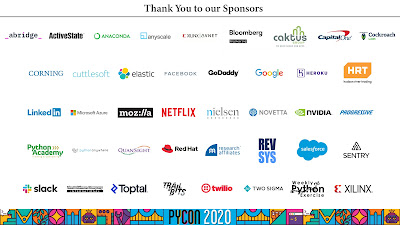

PyCon 2020 in Pittsburgh, PA [was cancelled](https://pycon.blogspot.com/2020/03/pycon-us-2020-in-pittsburgh.html) due to COVID-19 and that impacted the PSF's finances. [Our blog from March 31st](http://pyfound.blogspot.com/2020/03/psfs-projected-2020-financial-outcome.html) estimated that the PSF would need to use $627,000 of its financial reserve to get through 2020.  
  
Since the time we cancelled PyCon 2020, the PSF staff and PyCon volunteers have been working on PyCon 2020 Online, which is launching April 15 ([subscribe here](https://us.pycon.org/2020/online/) to get the content launch emails)!  
  
During our planning process, we have seen an overwhelming amount of support from sponsors and registrants.  
  
Over 40 sponsors have agreed to participate in PyCon 2020 Online and 418 individuals donated and/or converted their registration fees to donations.

## Thank you individual donors!

Thank you to the individuals that donated to the PSF as they registered for PyCon. Thank you to those that converted part or all of their PyCon registration fees into PSF donations. Thank you to the messages and tweets of support. Our hearts are full and our eyes are teary from the tremendous generosity we have seen.    

##   
Thank you sponsors!

Thank you to the sponsors that are participating in PyCon 2020 Online. Thank you to the organizations that stepped up from the beginning to stand by PyCon regardless. Thank you to the sponsors that checked-in on our staff throughout the process as well. Seeing those emails and being on calls with you all lifted our spirits in a very stressful time. Every video we put online will have this slide inserted because none of this could be possible with out these organizations:

<table align="center" cellpadding="0" cellspacing="0"><tbody><tr><td></td></tr><tr><td></td></tr></tbody></table>

## Update on financial impact

Thanks to generosity of individual and corporate donors and decreasing PyCon 2020 expenses, we estimate that the PSF will now only need $141,713 from its financial reserve to get through 2020. That is 77% better than what we initially anticipated!  
  
  
In the coming month, the PSF will reassess its strategic goals for the coming year. Even though we will have to reevaluate taking on new projects, our team is going to work diligently to get the PSF back on track!
