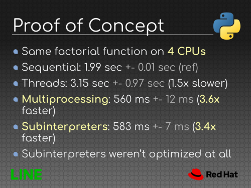

[Victor Stinner](https://twitter.com/VictorStinner) and [Dong-hee Na](https://twitter.com/dongheena92) gave a presentation at the [2021 Python Language Summit](https://pyfound.blogspot.com/2021/05/the-2021-python-language-summit.html) about running multiple Python interpreters in parallel in the same process.

## Use Cases  

Victor Stinner started by explaining why we would need to make the changes that they're discussing. One use case would be if you wanted to embed Python and extend the features of your application, like Vim, Blender, LibreOffice, and pybind11. Another use case is subinterpreters. For example, to handle HTTP requests, there is Apache mod\_wsgi, which uses subinterpreters. There are also plugins for WeeChat, which is an IRC client written in C.  

### Embedding Python

One of the current issues with embedding Python is that it doesn't explicitly release memory at exit. If you use a tool to track memory leaks, such as Valgrind, then you can see a lot of memory leaks when you exit Python.

Python makes the assumption that the process is done as soon as you exit, so you wouldn't need to release memory. But that doesn't work for embedded Python because applications can survive after calling Py\_Finalize(), so you have to modify Py\_Finalize() to release all memory allocations done by Python. Doing that is even more important for Py\_EndInterpreter(), which is used to exit the subinterpreter.

### Running Multiple Interpreters in Parallel

The idea is to run one interpreter per thread and one thread per CPU, so you use as many interpreters as you have CPUs to distribute the workload. It's similar to multiprocessing use cases, such as distributing machine learning.

### Why Do We Need a Single Process?

There are multiple advantages to using a single process. Not only can it be more convenient, but it can also be more efficient for some uses cases. Admin tools are designed for handling a single process rather than multiple. Some APIs don't work with cross-processes since they are designed for single processes. On Windows, creating a thread is faster than creating a process. In addition, macOS decided to ban fork(), so multiprocessing uses spawn by default and is slower.

### No Shared Object

The issue with running multiple interpreters is that all CPUs have access to the same memory. There is concurrent access on the refcnt object. One way to make sure that the code is correct is to put a lock on the reference counter or use an atomic operation, but that can create a performance bottleneck. One solution would be to not share any objects between interpreters, even if they're immutable objects.

### What Drawbacks Do Subinterpreters Have?

If you have a crash, like a segfault, then all subinterpreters will be killed. You need to make sure that all imported extensions support subinterpreters.

## C API & Extensions

Next, Dong-hee Na shared the current status of the extension modules that support heap types, module state, and multiphase initialization. In order to support multiple subinterpreters, you need to support multiphase initialization ([PEP 489](https://www.python.org/dev/peps/pep-0489/)), but first you need to convert static types to heap types and add module state. [PEP 384](https://www.python.org/dev/peps/pep-0384/) and [PEP 573](https://www.python.org/dev/peps/pep-0573/) support heap types, and we mostly use PyTypeFromSpec() and PyTypeFromModuleAndSpec() APIs. Dong-hee Na walked the summit attendees through an example with the \_abc module extension.  

## Work Done So Far

Victor Stinner outlined some of the work that has already been done. They had to deal with many things to make interpreters not share objects anymore, such as free lists, singletons, slice cache, pending calls, type attribute lookup cache, interned strings, and Unicode identifiers. They also had to deal with the states of modules because there are some C APIs that directly access states, so they needed to be per interpreter rather than per module instance.

One year ago, Victor Stinner wrote a proof of concept to check if the design for subinterpreters made sense and if they're able to scale with the number of CPUs:

  

## Work That Still Needs to Be Done

Some of the easier TODOs are:

-   Converting remaining extensions and static types
-   Making \_PyArg\_Parser per interpreter
-   Dealing with the GIL itself

Some of the more challenging TODOs are:

-   Removing static types from the public C API
-   Making None, True, and False singletons per interpreter
-   Getting the Python thread state (tstate) from a thread local storage (TLS)

There are some ideas for the future:

-   Having an API to directly share Python objects
-   Sharing data and use one Python object per interpreter with locks
-   Supporting spawning subprocesses (fork)

If you want to know more, you can play around with this yourself:

./configure --with-experimental-isolated-subinterpreters #ifdef EXPERIMENTAL\_ISOLATED\_SUBINTERPRETERS
