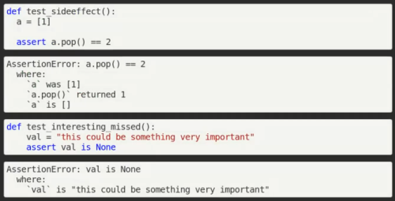

The second day of the [2021 Python Language Summit](https://pyfound.blogspot.com/2021/05/the-2021-python-language-summit.html) finished with a series of lightning talks from Ronny Pfannschmidt, Pablo Galindo, Batuhan Taskaya, Luciano Ramalho, Jason R. Coombs, Mark Shannon, and Tobias Kohn.

## Annotated Assertions: Debugging With Joy

[Ronny Pfannschmidt](https://twitter.com/ossronny) spoke about annotated assertions. He is a pytest maintainer and loves approachable debugging.

He compared assertions in unittest with assertions in pytest. He remarked that mistakes have been made in the past and are still being made today. Before pytest 2.1, pytest would reinterpret assertions, which was bad for side effects. Today, pytest deals with side effects by handling all of the variables, collecting them, and showing them to you.

Here's what he would like to see in Python:

Here's what he'd like to do:

-   Create a PEP or have a PEP sponsor
-   Open the implementation of pytest to a wider audience

## PEP 657: Fine-Grained Error Locations in Tracebacks  

[Pablo Galindo](https://twitter.com/pyblogsal) and [Batuhan](https://twitter.com/isidentical) [Taskaya](https://twitter.com/isidentical) shared their thoughts on what they want to do and what they don't want to do with [PEP 657](https://www.python.org/dev/peps/pep-0657/). The goal of this PEP is to improve the debugging experience by making the information in tracebacks more specific. It would also help with code coverage tools because it would allow expression-level coverage rather than just line-level coverage. [JEP 358](https://openjdk.java.net/jeps/358) has already accomplished something similar.  

The speakers want to:

-   Keep maintenance costs low
-   Keep the size small without overcomplicating the compiler
-   Provide an API for tools to consume
-   Provide an opt-out mechanism

They want to avoid:

-   Adding a new set of .pyc files
-   Adding a new debugging info file format
-   Having a large number of new flags to customize
-   Implementing in memory/size encoding  
    
-   Complicating the compiler too much
-   Providing more than one opt-out mechanism
-   Having manual metadata propagation

For the opt-out mechanism, there will be two ways to deactivate the feature:

1.  **Environment variable:** PYNODEBUGRANGES  
    
2.  **Command line option:** \-Xnodebugranges

## Who Speaks for Mort on python-dev?

[L](https://twitter.com/ramalhoorg)[uciano Ramalho](https://twitter.com/ramalhoorg) explained that Mort, Elvis, and Einstein are names for personas that have been used within Microsoft to understand the needs of users:

-   **Mort** is an opportunistic developer who like to create quick solutions for immediate problems. He focuses on productivity and learns as needed.
-   **Elvis** is a pragmatic programmer who likes to create long-lasting solutions. He learns while working on solutions.
-   **Einstein** is a paranoid programmer who likes to create the most efficient solution to a problem. He typically learns before working on the solution.

Users of Python can be organized into similar groups with distinct needs. Since Einsteins may not clearly understand the needs of Morts and Elvises, Luciano Ramalho suggested that it may be time to recruit core users to speak for the Python users who aren't also core developers.

## Annotations as Transforms

[Jason R. Coombs](https://twitter.com/jaraco) shared his thoughts on designating transformation functions to be applied to parameters and return values. He had originally been inspired by the simplicity and power of decorators, and his idea could in theory be applied with decorators today. However, he determined that it would be more elegant to use annotations.

Using this approach would have advantages:

-   Elegant, simple declaration of intended behavior
-   Clear separation of concerns
-   Avoiding rewriting variables in the scope
-   Easy reuse of transformations
-   Explicit type transformation

However, there would also be challenges:

-   **Compatibility:** Although older versions of Python don't have this functionality, you could implement a compatibility shim.  
    
-   **Ambiguity between types and transforms:** In order to address this concern, you could potentially:

-   Require transforming functions to be explicitly created
-   Provide a wrapping helper to specify that a type is used as a transform (e.g. -> transform(str))
-   Provide a wrapper helper or explicit types for nontransforming type declarations (e.g. Int or strict(int))

## Tiers of Execution: Making CPython Execute Efficiently

[Mark Shannon](https://github.com/markshannon) started by defining [four tiers of execution](https://github.com/markshannon/faster-cpython/blob/master/tiers.md):

-   **Tier 0:** The slowest tier, with minimal memory usage and low startup time
-   **Tier 1:** Primary interpreter, the adaptive, specializing interpreter
-   **Tier 2:** Small region, lightweight JIT  
    
-   **Tier 3:** Large region, heavyweight JIT  
    

The higher a tier, the hotter the code that it will execute. Today, CPython is at tier 0.3. It's a compromise between memory use and speed but isn't optimized for either. He said that tier 0 could be considered for Python 3.11 or later. It could:

-   Minimize startup time and memory use at the expense of execution speed
-   Support a full set of features, including sys.settrace
-   Be able to execute from a .pyc file that is mmapped and immutable

Tier 1 is planned for Python 3.11:

-   Adaptive, specializing interpreter ([PEP 659](https://www.python.org/dev/peps/pep-0659/))
-   Possible lack of support for some features, such as sys.settrace

Tiers 2 and 3 are entirely hypothetical at the moment and would involve JIT compilers. They maybe be more like LuaJIT than JVM.  
Switching between tiers can be expensive, but the goal is to make it cheaper by having the same in-memory data layout for all tiers. In order to support all of Python, we will need to switch between tiers often. Each tier should be maintained mostly independently for open-source development. The performance cost won't be high if the memory layout is designed carefully.

## Running Parallel Python Code in the Browser

[Tobias Kohn](https://tobiaskohn.ch/) has been working on [TPython](https://tpython.tobiaskohn.ch/), a new Python implementation that works in the browser. His objectives were to do multiprocessing in the browser, not block the UI, and use native JavaScript libraries.

Because JavaScript has a single thread event queue that contains even I/O and garbage collection, as long as your current thread is running, nothing else can happen while your current task is running. You can use web workers with messages in each of the web worker's event queues, but those messages won't become visible until the event queue gets to them.

You could suspend the current task and let everything in the event queue happen so that the message can be processed and then resume your task later on. To do that, you could use the bytecode in Python 3.6+ because the frame already has an index into the bytecode and captures state, to a certain extent. However, some bytecode instructions are too complex. \_add\_ can execute arbitrary Python code, fail, call \_radd\_, and execute other Python code. The standard bytecode is insufficient.

He's currently using an MPI interface for parallel processing. There is:

-   Early-stage multiprocessing support
-   A NumPy-like interface for JavaScript typed arrays
-   No blocking or freezing of the browser's UI

It runs on unmodified CPython 3.6+ bytecode.
