At the [2021 Python Language Summit](https://pyfound.blogspot.com/2021/05/the-2021-python-language-summit.html), [Zac Hatfield-Dodds](https://zhd.dev/) gave a presentation about fuzzing and testing with Python properties. This presentation tied in with the [one he gave](https://pyfound.blogspot.com/2020/05/lightning-talks-part-2.html) at the [2020 Python Language Summit](https://pyfound.blogspot.com/2020/04/the-2020-python-language-summit.html).  

## What Is Testing?

For the purposes of this talk, he defined testing as the art and science of running code and then checking if it did what it was supposed to do. He added that, although assertions, type checkers, linters, and code review are good, they are not testing.

There are two general reasons why we might have tests:

1.  **For correctness:**

1.  The goal is to validate software and determine that they are no bugs.
2.  Nondeterminism is acceptable.
3.  Finding any fault is a success.  
    

3.  **For software engineering (programming, over time, in teams):**

1.  The goal is to validate changes or detect regressions.
2.  Nondeterminism is bad.
3.  Bugs should be in only the diff.

When these two reasons for testing aren't distinguished, there can be miscommunications.

## What Is Property-Based Testing?  

There are [many types of tests](https://www.hillelwayne.com/a-bunch-of-tests/):

-   Unit tests
-   Integration tests
-   Snapshot tests
-   Parameterized tests
-   Fuzz tests
-   Property-based tests
-   Stateful model tests

The speaker then walked the summit attendees through an example to explain going from traditional unit tests through to parameterized tests and then seeing how that plays into property-based tests.

Imagine that you needed to test the sorted() builtin. With a traditional set of unit tests, you can write a bunch of cases with the expected inputs and outputs:

[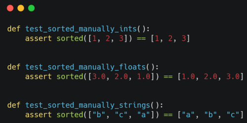](https://blogger.googleusercontent.com/img/b/R29vZ2xl/AVvXsEhY3vHpWqXh4KT5x8ylsX89guxbjO87LDb0U4hM4rqim7eIKR4KNmlpfsKxpsQWHdxol0hHF_wHMKwYaPguQyaaqrOT1DeBAALov3ZJPt-9VztMMdpGoUhbtzm8kUmbSj6V6GY/s500/test-1.png)  
If you want to avoid repeating yourself, you can write a list of inputs and outputs:

[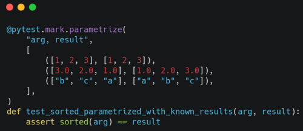](https://blogger.googleusercontent.com/img/b/R29vZ2xl/AVvXsEjp5BBuAdNGEKI5MCcWMmwdBHCmEegFg78BS3jqYmd0Ihfw410tWgtBiVEZEWdQxHZ3-duwh_2BMakt3N7gAj-cZxz4xmZSKKPBGETo-sCGfjLHLX_TSa03EJhKXu4w2WUEVII/s500/test-2.png)  
If you don't have a known good result, then you can still write tests using only the input argument. One option would be to compare to another reference implementation:

[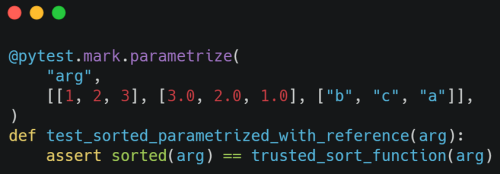](https://blogger.googleusercontent.com/img/b/R29vZ2xl/AVvXsEgMZxWYUBG25NSYt3614YU7DBMJzjZ6-kzFCvlBteNlA6fbPy88SJjusrU8nx3ZDe7Ci-m_5MxC0M9bRoh3n-ZSK4X2C7oGdPs0Ql6iey9AUJ2C_0KS6yM7PJ6ChYMDfdC5e0Q/s500/test-3.png)

However, comparing with another reference implementation might not be an option, so you could just test if the output seems to be right:

[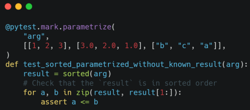](https://blogger.googleusercontent.com/img/b/R29vZ2xl/AVvXsEjjpd3xuIRIcPvKvvVAKJJa0useeuwaX93VU9eNQvEXsRPXymtEsNe5r1Y0pk5WWI0Flng1l42tL-3r75GlvhWSFhSUneHmZVol-nGyUSqeaKrMk9v3iOObCUCC0vtu2lqo9W8/s500/test-4.png)

In order to improve on this test, you might want to add another property that you can test. You could check that the length of the output is the same as the length of the input and that you have the same set of elements:

[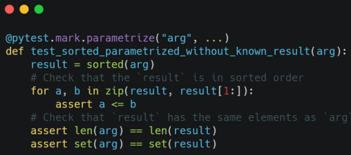](https://blogger.googleusercontent.com/img/b/R29vZ2xl/AVvXsEiKGbpjMmK6BFA83i3lb3smOUkb0F0ca-4rO0WyGLaen8idCzOju75v6-Y5h_Lydz8c2ADAiKAlRjXqZz3okUKre72tY2ZMVLnlubNG5WaA56TSGnbHUkfdjtHF6uZciIMuRkY/s500/test-5.png)

This would pass on the incorrect sorted(\[1, 2, 1\]) -> \[1, 2, 2\]. A brute-force approach using itertools.permutations() would detect that too:

[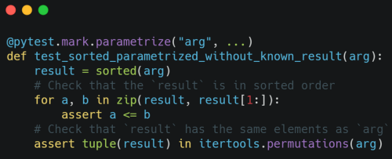](https://blogger.googleusercontent.com/img/b/R29vZ2xl/AVvXsEjAlB6pynaaFOXQC83_ElJ6X2NOY3O9EAkW0P1b0BmzDdzqV3xnterd1ogLxNMTNVlMuDAocGxvOlV7OuLBqnPDzSx7EEot00axlp1OrfQT8ddDffxB1sPIGLsBr1a1bkFSrns/s500/test-6.png)  
But the best solution is collections.Counter():  

[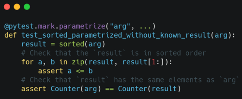](https://blogger.googleusercontent.com/img/b/R29vZ2xl/AVvXsEjkjaQzYaWZgRxaGlRD6maIwmeEe1d2-s69K8mychnhn8oZcr9o0BkN5kuafQh50dq-QW4M6kmkid50631yev6vLo9m0aes3WgJ-q6WJAeW_tzHKOrWgZVfTBGdFpTtdQGYzhw/s500/test-7.png)

This last test uses property-based testing:  

[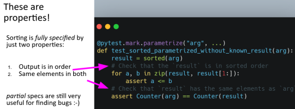](https://blogger.googleusercontent.com/img/b/R29vZ2xl/AVvXsEhYZ5NSERiTlwBJaDBSpi6jhFYxI_iNJrqWQ2BHP7SwTrlxBz-dg2pRizJyTpqWOHPNNOsbjrefQkhYRLoKCeyM9dflxhBIwbuHaoT_pKNuYvPoJTWXLxo3rbGO9v5BP4tRqoQ/s500/test-8.png) Instead of having a specific list of inputs, you could use Hypothesis: [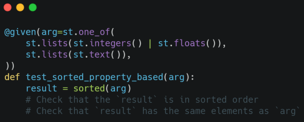](https://blogger.googleusercontent.com/img/b/R29vZ2xl/AVvXsEgZcoVo1ym2096_jiNGb7dyfpm9sH9Je8uZGqPn_FoYUY8GxgKLJ7PbrH6muiZ2qG1i6kWlExUNi50ZmcI1aV3-Oe3lhSXLbHFuEEtSsc-Ke0RYhXtV_fB2SP_oFJGgtU1WAGc/s500/test-9.png)  
That test will fail because NaN compares unequal to itself, so any list containing NaN will appear to not be in sorted order. So it could be good to have specified behavior for the ordering on NaN elements in the sorting algorithm:  

[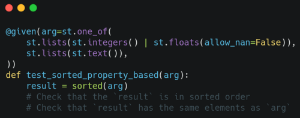](https://blogger.googleusercontent.com/img/b/R29vZ2xl/AVvXsEjQhR3C2fmOmpzIxVkHXP3vso-IipkUoCbrWX_8VG2Xzkv3nYXsVVzydnkG93m0EUZ6uWrks-_2S9aXtEbyc-PCttD6_HdS_qTIU2_dM3H4SQZjCBBmYzUNvR6pISLFIozqc_E/s500/test-10.png) He said that one of the big advantages of using something like Hypothesis rather than a list of handwritten examples is that is will raise conceptual issues that you may not have already thought through yourself.

In summary, property-based testing lets you:

-   Generate input data that you might not have thought of yourself
-   Check that the result isn't wrong, even without the right answer
-   Discover bugs in your understanding rather than just in your code

Often, you don't even need assertions in the test. Generating unusual input data is surprisingly effective. It can give you the sort of feedback you could get from real users, but you don't need to ship before getting the feedback. A common concern is that, if you have randomized testing, then are things flaky? How do you deal with determinism? Hypothesis has been working on that for years, so they have solid answers to these kinds of questions: [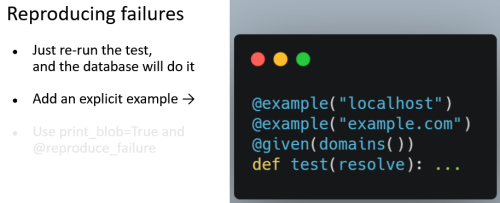](https://blogger.googleusercontent.com/img/b/R29vZ2xl/AVvXsEisjPkSl9nZdYkkkeLBQMUASuahJHONVgnXHb5UKO9710Kc_2vFYuaAQshMjpRECqv8eSelJJ088XwGJIESQeLyV2-mltQMum7V3aRJhmV62NDdBZjadAXHLL2-S5eAEIooxsM/s500/test-11.png)

If that's not enough, then you also have other options:

[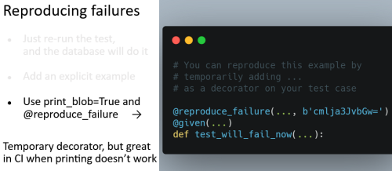](https://blogger.googleusercontent.com/img/b/R29vZ2xl/AVvXsEjleB4RKcQci4ncJAYE3RvomIKuBhVrCEkKNeSK4WD2KPZyNjfrDtv49thU_MwEhyV9cms5jZBbzk-5Fv9C-U7Rv1HGUcmad5fH3g7yOuis_BZBhQgaGeLxUhPf10F2PU78CCY/s500/test-12.png)

The Hypothesis database is a collection of files on disk that represent the various examples. Since it's a key-value store, it's easy to implement your own custom one:

[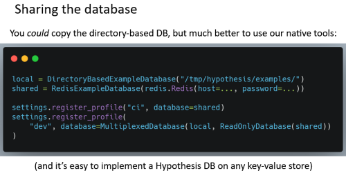](https://blogger.googleusercontent.com/img/b/R29vZ2xl/AVvXsEhJqp-whRbgtHcrNnNjMmhtztw5lQw2XftdxYE_gVNlzedAbTxP5BoXXPGVvEGCJTsyLc-kRuKz2igZBLCT1NoEsx0yMSGmroGR0gwUDIfHkgKx_CC8pa1Z5mNTHq6PuEjkp6w/s500/test-13.png)

In this example, you have a local database on disk. You can also have a shared network database on something like Redis, for example.

Coverage-guided fuzzing takes this to the next level:

[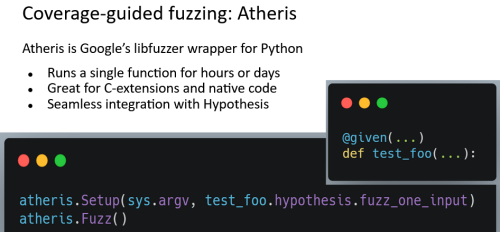](https://blogger.googleusercontent.com/img/b/R29vZ2xl/AVvXsEjrJeghoDJ4pOxAmEL2dLSg1SRe8Ko2Y3guI2bsC4lI76Oj1j8gYsIEOd637LutQh_j0EO7yxHWczHlGyM5XfnvLXgggpIG2r-moGExwq2REjVTNLhwFfwntbVmf3eKMRXtw74/s500/test-14.png)

## What's New?  

At the 2020 Python Language Summit, when he said that we would find more bugs if we used property-based testing for CPython and the standard library, the response was positive, but then not much happened. Since then, Paul Ganssle has opened a PR on CPython to add some Hypothesis tests for the zoneinfo library. Zac Hatfield-Dodds said that CPython is doing very well on unit testing and has a strong focus on regressions but that it would be quite valuable to add some of the tools that have been developed for testing for correctness.

These tools don't only find existing bugs. They're good at finding regressions where someone checked in new code with what turned out to be inadequate test coverage:

[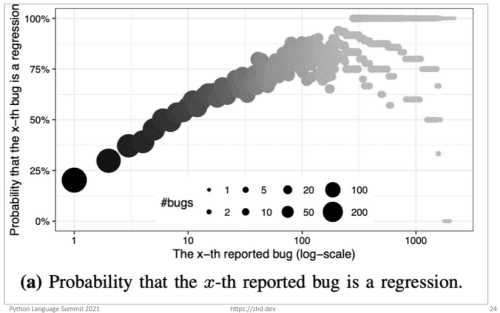](https://blogger.googleusercontent.com/img/b/R29vZ2xl/AVvXsEg5hZIEf3jAQUIXPoXXYcqNOS9L0DMCy8DVrdWepTC6kW5J_W1x9RqfipT3SLF_D2SlnkSMNsgLbv7h4LkwlvVyvnMPTKulBFOF9xA8ETWYq6ThzxP1b-hyeHZ1KqqwAUthv4I/s500/test-15.png)

There is a pace at which we find and fix bugs that were preexisting in addition to the ongoing rate of introducing new bugs that then get detected by fuzzing instead of lasting for too long:

[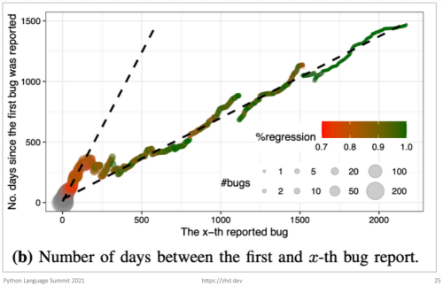](https://blogger.googleusercontent.com/img/b/R29vZ2xl/AVvXsEjOvPVnQ3L8WoTQ1RIpkh6oR_3C-ziNlj6lk0I7rBhFKqoXJHrEcj6_4OdAHXuUYnkq_QwPtNibQ6fubw7o9DnO9lUgZE__UH1LvBtU9pHlc60SrPZxzhyhOLupxeahge3p85w/s500/test-16.png)  

## What's Next?

There is a three-step plan:

1.  Merge Paul Ganssle's PR or come up with an alternative proposal to get Hypothesis into CPython's CI in order to unblock ongoing incremental work
2.  Merge some tests
3.  Run them in CI and on OSS-Fuzz

For interested parties, you can see and engage in the follow-ups to this work on the [Python Steering Council's issue tracker](https://github.com/python/steering-council/issues/65).
