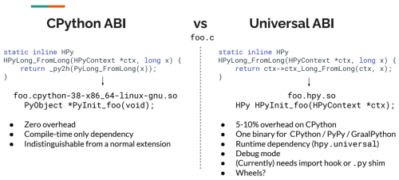
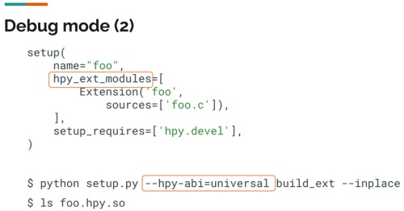
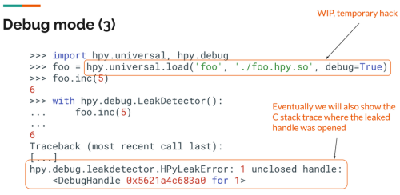

At the [2021 Python Language Summit](https://pyfound.blogspot.com/2021/05/the-2021-python-language-summit.html), [Antonio Cuni](https://twitter.com/antocuni) gave a presentation about [HPy](https://hpyproject.org/). He also gave a [presentation about HPy](https://pyfound.blogspot.com/2020/04/hpy-future-proof-way-of-extending.html) at the [2020 Python Language Summit](https://pyfound.blogspot.com/2020/04/the-2020-python-language-summit.html), so this year he shared updates on how the project has evolved since then.  

## What Is HPy?

HPy is an alternative API for writing C extensions. Although the current Python C API shows CPython implementation details, HPy hides all the implementation details that would otherwise be exposed. Antonio Cuni said that, if everyone used HPy, then it would help Python evolve in the long term.

Using HPy extensions will make it easier to support alternative implementations. HPy is designed to be GC friendly and isn't build on top of ref counting. It is also designed to have zero overhead on CPython, so you can port an existing module from the Python C API to HPy without any performance loss. In addition, it allows incremental migration, allowing you to port your existing extension one function at a time, or even one method at a time. HPy is also faster than the existing Python C API on alternative implementation such as [PyPy](https://www.pypy.org/) and [GraalPython](https://www.graalvm.org/python/).

## What's New With HPy?  

In the past year since Antonio Cuni last shared an update at a Python Language Summit, HPy has continued to make progress. It now has:

-   Support for Windows
-   Support for creating custom types in C
-   A debug mode to help you find mistakes in your C code
-   Setup tools integration to make it easier to compile HPy extensions  
    

There has also been work on a very early port of some parts of NumPy to HPy. The feedback from the NumPy team has been positive so far. Soon, the HPy team will start writing a Cython backend so that all Cython extensions will be able to automatically use HPy as well.

The HPy team has made a lot of progress with building community and getting funding. There is now a [site for HPy](https://hpyproject.org/) as well as a [blog](https://hpyproject.org/blog/), and there has been a lot of interest and involvement from the Python community. For example, someone independently started [porting Pillow](https://github.com/cklein/Pillow-hpy). Oracle, IBM, and Quansight Labs have provided some funding, but there has still been plenty of non-funded open source development, as usual.

## How Do the CPython ABI and the Universal ABI Compare?  

There are some differences between the CPython ABI and the Universal ABI:

On the Universal ABI side, there is no way to support wheels.

## How Does Debug Mode Work?

HPy's debug mode may be useful to you even if you aren't concerned about the problems that HPy is intended to solve because it can help you find common problems in your C code, such as memory leaks. Here's an example of an HPy function that takes an object and increments it by one:

HPy\_Close() isn't called on the object that was created, so you have a memory leak. If you want to compile this file into an extension, then you can use setup.py:

Now, you can load the module and debug:  

## What Does the Future Hold?

Antonio Cuni closed his presentation by asking the CPython developers at the summit if it would be possible to make HPy a semi-official API in the future, with first-class support for importing modules and distributing wheels. Some attendees suggested writing a PEP to make that happen.
