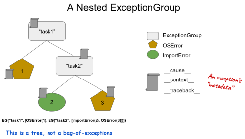
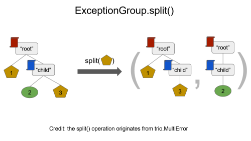
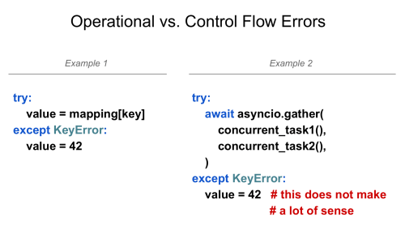
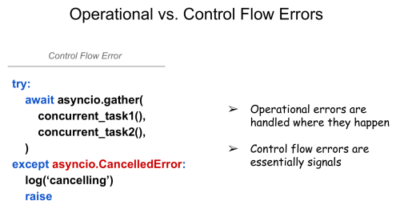
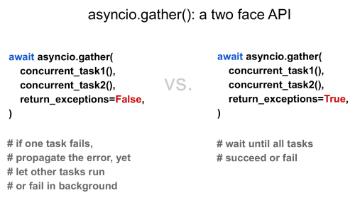
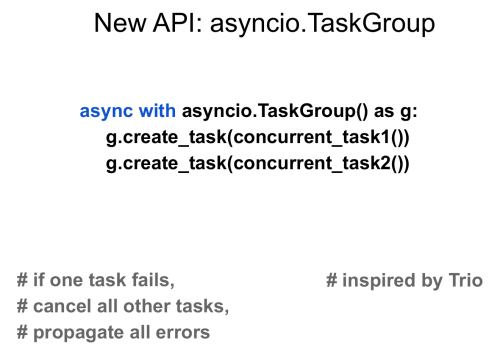

[PEP 654](https://www.python.org/dev/peps/pep-0654/) was authored by Irit Katriel, Yury Selivanov, and Guido van Rossum. This PEP is currently at the draft stage. At the [2021 Python Language Summit](https://pyfound.blogspot.com/2021/05/the-2021-python-language-summit.html), the authors shared what it is, why we need it, and which ideas they rejected.

What Is PEP 654?  

The purpose of this PEP is to help Python users handle unrelated exceptions. Right now, if you're dealing with several unrelated exceptions, you can:

-   **Raise one exception** and throw away the others, in which case you're losing exceptions  
    
-   **Return a list of exceptions** instead of raising them, in which case they become error codes rather than exceptions, so you can't handle them with exception-handling mechanisms
-   **Wrap the list of exceptions in a wrapper exception** and use it as a list of error codes, which still can't be handled with exception-handling mechanisms

PEP 654 proposes:

-   A [built-in exception type](https://www.python.org/dev/peps/pep-0654/#exceptiongroup-and-baseexceptiongroup) that wraps other exceptions
-   New syntax with [except\*](https://www.python.org/dev/peps/pep-0654/#except) to handle exception groups

Each except\* clause will be executed once, at most. Each leaf exception will be handled by one except\* clause, at most.

In the discussions about the PEP that have happened so far, there were no major objections to these ideas, but there are still disagreements about how to represent an exception group. Exception groups can be nested, and each exception has its own metadata:

Originally, the authors thought that they could make exception groups iterable, but that wasn't the best option because metadata has to be preserved. Their solution was to use a .split() operation to take a condition on a leaf and copy the metadata:  

## Why Do We Need Exception Groups and except\*?  

There are some differences between operational errors and control flow errors that you need to take into account when you're dealing with exceptions:

In *Example 1*, there is a clearly defined operation with a straightforward error. But in *Example 2*, there are concurrent tasks that could contain any number of lines of code, so you don't know what caused the KeyError. In this case, handling one KeyError could potentially be useful for logging, but it isn't helpful otherwise. But there are other exceptions that it could make more sense to handle:  

  
It's important to understand the differences between operational errors and control flow errors, as they relate to try-except statements:

-   **Operational errors** are typically handled right where they happen and work well with try-except statements.
-   **Control flow errors** are essentially signals, and the current semantics of the try-except statement doesn't handle them adequately.

Before [asyncio](https://docs.python.org/3/library/asyncio.html), it wasn't as big of a problem that there weren't advanced mechanisms to react to these kinds of control flow errors, but now it's more important that we have a better way to deal with these sorts of issues. asyncio.gather() is an unusual API because it has two entirely different operation modes controlled by one keyword argument, return\_exceptions:

  
The problem with this API is that, if an error happens, you still wait for all of the tasks to complete. In addition, you can't use try-except to handle the exceptions but instead have to unpack the results of those tasks and manually check them, which can be cumbersome.

The solution to this problem was to implement another way of controlling concurrent tasks:

If one tasks fails, then all other tasks will be cancelled. Users of asyncio have been requesting this kind of solution, but it needed a new way of dealing with exceptions and was part of the inspiration behind PEP 654.

## Which Ideas Were Rejected?

Whether or not exception groups should be iterable is still an open question. For that to work, tracebacks would need to be concatenated, with shared parts copied, which isn't very efficient. But iteration isn't usually the right approach for working with exception groups anyway. A potential compromise could be to have an iteration utility in traceback.py.

The authors considered teaching except to handle exception groups instead of adding except\*, but there would be too many backwards compatibility problems. They also thought about using an except\* clause on one exception at a time. Backwards compatibility issues wouldn't apply there, but this would essentially be iteration, which wouldn't help.
