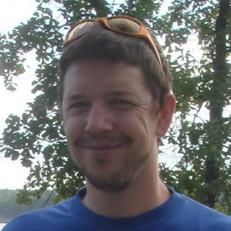

At the [2021 Python Language Summit](https://pyfound.blogspot.com/2021/05/the-2021-python-language-summit.html), [Eric Snow](https://twitter.com/ericsnowcrntly) gave a presentation about how core developers can receive guidance to help them work on improvements to the language that will bring the most benefit to the Python community.  

## What Does the Community Need?

When Eric Snow first got involved in core development over a decade ago, he liked that there was so much to learn. But he found that the organization didn't offer a lot of direction in terms of guiding volunteers to the kind of work that would have the biggest impact.

Over the years, he's thought about how he and other contributors decide what to work on and why. What directs the efforts of contributors and core developers? Contributors make decisions based on their availability, expertise, and interests. Core developers need to act as stewards for the language. There's plenty of collaboration that goes on, but everyone has their own idea of what the community needs, what would be interesting to work on, and what the Python language needs. As a result, it can be hard to see the bigger picture.

## Would a PM Help?  

Time and time again, he has asked himself what he can work on to best help the Python community. We all care about this language and the community that surrounds it, so we want to help it as much as we can. Sometimes, it's hard to get a sense of what will help the community and the language the most from our own limited, individual perspectives.

One solution could be to have a dedicated PM who can provide the direction that we've been missing. This person could be provided by the PSF or a sponsoring organization. They could compile and maintain a list of improvements that would be most beneficial to the community. They wouldn't dictate what would be worked on, but they could surface what the community needs.

There has been talk of the Steering Council providing a road map. Having a PM could help:

-   Provide a clear picture of what that road map could look like
-   Help developers and maintainers make decisions about where to spend their time as volunteers
-   Facilitate collaboration  
    

## Discussion  

Eric Snow was interested in hearing whether or not other core developers would find a PM helpful.

[Luciano Ramalho](https://twitter.com/ramalhoorg?ref_src=twsrc%5Egoogle%7Ctwcamp%5Eserp%7Ctwgr%5Eauthor) said that he was strongly in favor of having a PM who could assess the needs of the community from the perspective of the community rather than only the perspective of core developers. This idea overlaps with the questions he raised in [his lightning talk](https://pyfound.blogspot.com/2021/06/the-2021-python-language-summit.html) at this summit. He also mentioned that Go has a PM role similar to what Eric Snow was suggesting.

Other attendees discussed how this kind of role could be funded and considered how much benefit the role could bring considering that the PSF is working with limited [financial resources](https://www.python.org/psf/donations/). They also discussed the differences between a Product Manager and a Program Manager and determined that this role would be more like a Program Manager.
