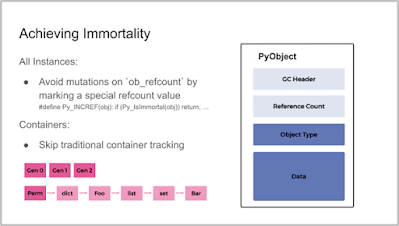

What does it mean to achieve immortality? At [the 2022 Python Language Summit](https://pyfound.blogspot.com/2022/05/the-2022-python-language-summit_01678898482.html), Eddie Elizondo, an engineer at Instagram, and Eric Snow, CPython core developer, set out to explain just that.

Only for Python objects, though. Not for humans. That will have to be another PEP.

  

* * *

## Objects in Python, as they currently stand

In Python, as is well known, [everything is an object](https://linux.die.net/diveintopython/html/getting_to_know_python/everything_is_an_object.html#d0e4665). This means that if you want to calculate even a simple sum, such as `194 + 3.14`, the Python interpreter must create two objects: one object of type `int` representing the number `194`, and another object of type `float` representing the number `3.14`.

All objects in Python maintain a [*reference count*](https://docs.python.org/3.6/c-api/intro.html#objects-types-and-reference-counts): a running total of the number of active references to that object that currently exist in the program. If the reference count of an object drops to 0, the object is eventually destroyed (through a process known as [*garbage collection*](https://devguide.python.org/garbage_collector/)). This process ensures that programmers writing Python don’t normally need to concern themselves with manually deleting an object when they’re done with it. Instead, memory is automatically freed up.

The need to keep reference counts for all objects (along with a few other mutable fields on all objects) means that there is currently no way of having a “truly immutable” object in Python.

This is a distinction that only really applies at the C level. For example, the `None` singleton cannot be mutated at runtime at the Python level:

```

>>> None.__bool__ = lambda self: True
Traceback (most recent call last):
  File "<stdin>", line 1, in <module>
AttributeError: 'NoneType' object attribute '__bool__' is read-only

```

However, at the C level, the object representing `None` is mutating constantly, as the reference count to the singleton changes constantly.

  

* * *

## Immortal objects

An “immortal object”, according to [PEP 683](https://peps.python.org/pep-0683/) (written by Elizondo/Snow), is an object marked by the runtime as being effectively immutable, even at the C level. The reference count for an immortal object will never reach 0; thus, an immortal object will never be garbage-collected, and will never die.

  

> “The fundamental improvement here is that now an object can be truly immutable.”
> 
> – Eddie Elizondo and Eric Snow, *PEP 683*

The lack of truly immutable objects in Python, PEP 683 explains, “can have a large negative impact on CPU and memory performance, especially for approaches to increasing Python’s scalability”.

  

* * *

## The benefits of immortality

At their talk at the Python Language Summit, Elizondo and Snow laid out a number of benefits that their proposed changes could bring.

Guaranteeing “true memory immutability”, Elizondo explained, “we can simplify and enable larger initiatives,” including Eric Snow’s proposal for a [per-interpreter GIL](https://pyfound.blogspot.com/2022/05/the-2022-python-language-summit-per.html), but also Sam Gross’s proposal for a version of Python that operates [without the GIL entirely](https://pyfound.blogspot.com/2022/05/the-2022-python-language-summit-python_11.html). The proposal could also unlock new optimisation techniques in the future by helping create new ways of thinking about problems in the CPython code base.

  

[](https://blogger.googleusercontent.com/img/b/R29vZ2xl/AVvXsEhUczmNuNdBhbIdRAeODp2yjmHK-_mcpMWNRI8WTjIXx_1tkgvMgZNGdgEHNr3KGVJTACb0vFLSlZ-U5I8YLXytAFz3tymHxwMYIBDeLzIOY_7F0MjND1qXalKF8xMy5t7-34LOJq1wBxKb9ojSgsa3qXYCeFbB48gtLkv_fOC8xnrv4NY/s607/Achieving%20immortality.png)

  

* * *

## The costs

A naive implementation of immortal objects is costly, resulting in performance regeressions of around 6%. This is mainly due to adding a new branch of code to the logic keeping track of an object’s reference count.

With mitigations, however, Elizondo and Snow explained that the performance regression could be reduced to around 2%. The question they posed to the assembled developers in the audience was whether this was an “acceptable” performance regression – and, if not, what would be?

  

* * *

## Reception

The proposal was greeted with a mix of curious interest and healthy scepticism. There was agreement that certain aspects of the proposal would reach wide support among the community, and consensus that a performance regression of 1-2% would be acceptable if clear benefits could be shown. However, there was also concern that parts of the proposal would change semantics in a backwards-incompatible way.

Pablo Galindo Salgado, Release Manager for Python 3.10/3.11 and CPython Core Developer, worried that all the benefits laid out by the speakers were only *potential* benefits, and asked for more specifics. He pointed out that changing the semantics of reference-counting would be likely to break an awful lot of projects, given that popular third-party libraries such as [`numpy`](https://numpy.org), for example, use C extensions which continuously check reference counts.

Thomas Wouters, CPython Core Developer and Steering Council Member, concurred, saying that it probably “wasn’t possible” to make these changes without changing the [stable ABI](https://docs.python.org/3/c-api/stable.html#stable-application-binary-interface). Kevin Modzelewski, a maintainer of [Pyston](https://www.pyston.org/), a performance-oriented fork of Python 3.8, noted that Pyston had had immortal objects for a while – but Pyston had never made any promise to support the stable ABI, freeing the project of that constraint.
