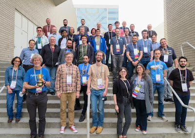

Every year, just before the start of PyCon US, around 30 core developers, triagers, and special guests gather for the Python Language Summit: an all-day event of talks where the future direction of Python is discussed. The summit in 2022 was the first in-person summit since 2019, due to disruption caused by the coronavirus pandemic in 2020-21.

This year's summit was covered by Alex Waygood.

  

<table align="center" cellpadding="0" cellspacing="0"><tbody><tr><td></td></tr><tr><td><i>This year's Language Summit attendees</i></td></tr></tbody></table>

  

* * *

-   **[Python without the GIL](https://pyfound.blogspot.com/2022/05/the-2022-python-language-summit-python_11.html)**: A talk by Sam Gross
-   **[Reaching a per-interpreter GIL](https://pyfound.blogspot.com/2022/05/the-2022-python-language-summit-per.html)**: A talk by Eric Snow
-   **[The "Faster CPython" project: 3.12 and beyond](https://pyfound.blogspot.com/2022/05/the-2022-python-language-summit_2.html)**: A talk by Mark Shannon
-   **[WebAssembly: Python in the browser and beyond](https://pyfound.blogspot.com/2022/05/the-2022-python-language-summit-python.html)**: A talk by Christian Heimes
-   **[F-strings in the grammar](https://pyfound.blogspot.com/2022/05/the-2022-python-language-summit-f.html):** A talk by Pablo Galindo Salgado
-   **[Cinder Async Optimisations](https://pyfound.blogspot.com/2022/05/the-2022-python-language-summit_60.html)**: A talk by Itamar Ostricher
-   **[The issue and PR backlog](https://pyfound.blogspot.com/2022/05/the-2022-python-language-summit-dealing.html)**: A talk by Irit Katriel
-   **[The path forward for immortal objects](https://pyfound.blogspot.com/2022/05/the-2022-python-language-summit_11.html)**: A talk by Eddie Elizondo and Eric Snow
-   **[Lightning talks](https://pyfound.blogspot.com/2022/05/the-2022-python-language-summit.html)**, featuring short presentations by Carl Meyer, Thomas Wouters, Kevin Modzelewski, Samuel Colvin and Larry Hastings
