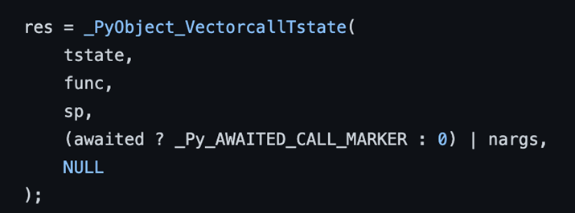
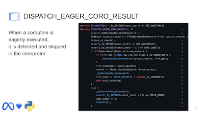

In May 2021, the team at Instagram made waves in the world of Python by open-sourcing [Cinder, a performance-oriented fork of CPython](https://github.com/facebookincubator/cinder).

Cinder is a version of CPython 3.8 with a ton of optimisations added to improve speed across a wide range of metrics, including “eager evaluation of coroutines”, a [just-in-time compiler](https://engineering.fb.com/2022/05/02/open-source/cinder-jits-instagram/), and an “experimental bytecode compiler” that makes use of [PEP 484](https://peps.python.org/pep-0484/) [type annotations](https://docs.python.org/3/library/typing.html).

Now, the engineers behind Cinder are looking to upstream many of these changes so that CPython itself can benefit from these optimisations. At [the 2022 Python Language Summit](https://pyfound.blogspot.com/2022/05/the-2022-python-language-summit_01678898482.html), Itamar Ostricher, an engineer at Instagram, presented on Cinder’s optimisations relating to async tasks and coroutines.

  

* * *

## Asyncio refresher

Consider the following (contrived) example. Here, we have a function, `IO_bound_function`, which is dependent on some kind of external input in order to finish what it’s doing (for example, this might be a web request, or an attempt to read from a file, etc.). We also have another function, `important_other_task`, which we want to be run in the same event loop as `IO_bound_function`

```

import asyncio

async def IO_bound_function():
    """This function could finish immediately... or not!"""
    # Body of this function here

async def important_other_task():
    await asyncio.sleep(5)
    print('Task done!')

async def main():
    await asyncio.gather(
        IO_bound_function(),
        important_other_task()
    )
    print("All done!")

if __name__ == "__main__":
    asyncio.run(main)    

```

`IO_bound_function` could take a long time to complete – but it could also complete immediately. In an asynchronous programming paradigm, we want to ensure that if it takes a long time to complete, the function doesn’t hold up the rest of the program. Instead, `IO_bound_function` will yield execution to the other thing scheduled in the event loop, `important_other_task`, letting this coroutine take control of execution for a period.

So far so good – but what if `IO_bound_function` finishes what it’s doing immediately? In that eventuality, we’re creating a coroutine object for no reason at all, since the coroutine will never have to suspend execution and will never have to reclaim control of the event loop at any future point in time.

  

* * *

## [Call me maybe?](https://www.youtube.com/watch?v=fWNaR-rxAic)

The team at Instagram saw this as an optimisation opportunity. At the “heart” of many of their async-specific improvements, Itamar explained, is an extension to Python’s [vectorcall protocol](https://docs.python.org/3/c-api/call.html#the-vectorcall-protocol): a new `_Py_AWAITED_CALL_MARKER` flag, which enables a callee to know that a call is being awaited by a caller.

  



  

The addition of this flag means that [awaitables](https://docs.python.org/3/glossary.html#term-awaitable) can sometimes be *eagerly evaluated*, and coroutine objects often do not need to be constructed at all.

  

[](https://blogger.googleusercontent.com/img/a/AVvXsEhAcfwuy6nDewCEqg0CVeiNrntoJtCMbdd8jc_SA1HMpI4IoFuiqb-cM4l1gmrKU5F8r3z4lkp50iDJ_P-2OJgDgQV1QGqEPSCif43BSlKPl_SST00pm7ApSLGvP4iC7WiV82V5FJ8JjcRuluJW-pZfCQ-9kuQxoue4yU5uXAmSmrPZPFc)

Ostricher reported that Instagram had seen performance gains of around 5% in their async-heavy workloads as a result of this optimisation.

  

* * *

## Pending questions

Significant questions remain about whether these optimisations can be merged into the `main` branch of CPython, however. Firstly, exact performance numbers are hard to come by: the benchmark Ostricher presented does not isolate Cinder’s async-specific optimisations.

More important might be the issue of *fairness*. If some awaitables in an event loop are eagerly evaluated, this might change the effective priorities in an event loop, potentially creating backwards-incompatible changes with CPython’s current behaviour.

Lastly, there are open questions about whether this conflicts with a big change to `asyncio` that has just been made in Python 3.11: the introduction of *[task groups](https://github.com/python/cpython/issues/90908)*. Task groups – a concept similar to [“nurseries”](https://vorpus.org/blog/notes-on-structured-concurrency-or-go-statement-considered-harmful/) in *[Trio](https://trio.readthedocs.io/en/stable/)*, a popular third-party async framework – are a [major evolution](https://realpython.com/python311-exception-groups/#asynchronous-task-groups-in-python-311) in `asyncio`’s API. But “it’s not completely clear how the Cinder optimisations might apply to Task Groups,” Ostricher noted.

Ostricher’s talk was well received by the audience, but it was agreed that discussion with the maintainers of other async frameworks such as *Trio* was essential in order to move forward. Guido van Rossum, creator of Python, opined that he could “get over the fairness issue”. The issue of compatibility with task groups, however, may prove more complicated.

Given the newness of task groups in `asyncio`, there remains a high degree of uncertainty as to how this feature will be used by end users. Without knowing the potential use cases, it is hard to comment on whether and how optimisations can be made in this area.
