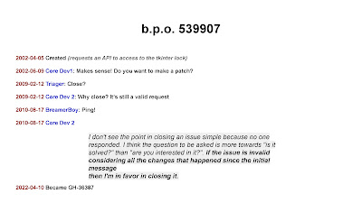

> “Any noise annoys an oyster, but a noisy noise annoys an oyster most.”
> 
> – Tongue twister, *author unknown*

As the Python programming language continues to grow in popularity, so too does the accumulation of issues and pull requests (“PRs”) on the CPython GitHub repository. At time of writing (morning of 7th May, 2022), the total stands at 7,027 [open issues](https://github.com/python/cpython/issues), and 1,471 [pull requests](https://github.com/python/cpython/pulls). At [the 2022 Python Language Summit](https://pyfound.blogspot.com/2022/05/the-2022-python-language-summit_01678898482.html), CPython Core Developer Irit Katriel gave a talk on possible ways forward for dealing with the backlog.

  

* * *

Historically, there has been reluctance among CPython’s team of core developers to close issues or PRs that may be of dubious worth. BPO-539907 was presented to the audience as an issue that had remained open on the issue tracker for over 20 years. The example is an extreme one, but represents a pattern that anybody who has scrolled through the CPython issue tracker will surely have seen before:

  

Anyone with experience in triaging issue trackers in open source will know that it is not always easy to close an issue. People on the internet do not always take kindly to being told that something they believe to be a bug is, in fact, intended behaviour.

Low-quality feature requests can be even harder to tackle, and can be broadly split into three buckets. The first bucket holds feature requests that simply make no sense, or else would have actively harmful impacts – these can be fairly easily closed. The second bucket holds feature requests that would add maintenance costs, but would realistically add little value to end users. These can often lead to tiresome back-and-forths – something one person may see as a large problem in a piece of software may, ultimately, cause few problems for the majority of users.

The feature requests that can linger on an issue tracker for twenty years, however, are usually those in the third bucket: features that everybody can agree might be nice if, in an ideal world, they were implemented – but that nobody, ultimately, has the time or motivation to work on.

  

* * *

Katriel’s contention is that leaving an issue open on the tracker for 20 years serves no one and that, instead, we should think harder about what an issue tracker is actually *for*.

If the proposed `tkinter` lock from BPO-539907 is ever implemented, Katriel, argues, “it’s not because of the twenty-year-old issue – it’s because somebody will discover the need for it.” Rather than only closing issues that have obvious defects, we should flip the script, and become far more willing to close issues if they serve no obvious purpose. Issues should only be kept *open* if they serve an obvious purpose in helping further CPython’s development. Instead of asking “Why should we close this?”, we should instead ask, “Why should we keep this open?”

Citing a [recent blog post](https://sundaylettersfromsam.substack.com/p/bonus-post-noisy-monitors?s=r) by Sam Schillace, Katriel argues that not only do issues such as BPO-539907 (newly renamed as GH-36387, for those keeping tabs) serve little purpose – they also do active harm to the CPython project. Schillace argues that the problem of the “noisy monitor” – a term he uses for any kind of feedback system where it becomes impossible to tell the signal from the noise – is “one of the most pernicious, and common, patterns that engineering teams fall prey to”. Leaving low-quality issues on a tracker, Shillace argues, wastes the time of developers and triagers, and “obscures both newer quality issues as well as the overall drift of the product.”

  

> “It’s far better… to keep the tool clean for the things that matter.”
> 
> – Sam Schillace, *Noisy Monitors*

* * *

No one has done more work than Katriel over the past few years to keep the issue tracker healthy, and her presentation was well received by the audience of core devs and triagers. The question of where now to proceed, however, is harder to tackle.

Pablo Galindo Salgado, an expert on CPython’s PEG parser, and the chief architect behind the “Better error messages” project in recent years, noted that he received “many, many issues” relating to possible changes to the parser and improvements to error messages. “Every time you close an issue,” he said, “People demand an explanation.” Arguing that maintainer time is “the most valuable resource” in open-source software, Salgado said that the easiest option was often just to leave it open.

However, hard though it may be to close an issue, ignoring open issues for an extended period of time also does a disservice to contributors. Itamar Ostricher – not a CPython core developer, but an experienced software engineer who has worked for many years at Meta – said that the contributor experience was “often confusing”. “Is this an issue where a PR would be accepted if I wrote one? Does a core dev want to work on it?” Ostricher asked. Or is it just a bad idea?

Ned Deily, release manager for Python 3.6 and 3.7, agreed, and argued that CPython needed to become more consistent in how core devs treat issues and PRs. Some modules, like `tkinter`, have been “ownerless” for a long time, Deily argued. This can create a chicken-and-egg problem. If a module has no maintainer, the solution is to add more maintainers. But a contributor can only become a maintainer if they demonstrate their worth through a series of merged PRs. And if a module has no active maintainer, there may be no core devs who feel they have sufficient expertise to review and merge a PR relating to the unmaintained module. So the contributor can never become a core developer (as their PRs will never be merged), and the module will never gain a new maintainer.

  

* * *

## Where now?

Various solutions were proposed to improve the situation. Katriel thought it would be good to introduce a new “Accepted” label, that could be added by a triager or a core developer. The idea is that the presence of the label signifies that the core developer team is not waiting for any further information from the issue filer: the bug report (or feature request) has been acknowledged as valid.

Many attendees noted that the problem was in many ways a social problem rather than a technical problem: the core development team needed a fundamental change in mindset if they were to seriously tackle the issue backlog. Senthil Kumaran argued that we should “err on the side of closing things”. Jelle Zijlstra similarly argued that we needed to reach a place where it was understood to be “okay” to close a feature request that had been open for many years with no activity.

There was also, however, interest in improving workflow automation. Christian Heimes discussed the difficulty of closing an issue or PR if you are a core developer with English as a second language. Crafting the nuances of a rejection notice so that it is polite but also clear can be a challenging task. Ideas around automated messages from bots or canned responses were discussed.

  

* * *

The enormity of the task at hand is clear. Unfortunately, there is probably not one easy fix that will solve the problem.

Things are already moving in a better direction, however, in many respects. Łukasz Langa, CPython’s [Developer-In-Residence](https://pyfound.blogspot.com/2021/07/ukasz-langa-is-inaugural-cpython.html), has been having a huge impact in stabilising the number of open issues. The CPython triage team, a group of volunteers helping the core developers maintain CPython, [has also been significantly expanded](https://discuss.python.org/t/six-new-triagers/) in recent months, increasing the workforce available to triage and close issues and PRs.

[PEP 594](https://peps.python.org/pep-0594/), deprecating several standard-library modules that have been effectively unmaintained for many years, also led to a large number of issues and PRs being closed in recent months. And the transition to GitHub issues itself, which only took place a few weeks ago, appears to have imbued the triage team with a new sense of energy.

Discussion continues on Discourse about further potential ways forward:

-   [Proposal: canned explanations for issue/PR closure decisions (Language Summit follow up)](https://discuss.python.org/t/proposal-canned-explanations-for-issue-pr-closure-decisions-language-summit-follow-up/)
-   [Gaps in maintenance coverage (Language Summit follow up)](https://discuss.python.org/t/gaps-in-maintenance-coverage-language-summit-follow-up/)
-   [Triaging/reviewing/fixing issues and PRs](https://discuss.python.org/t/triaging-reviewing-fixing-issues-and-prs/)
