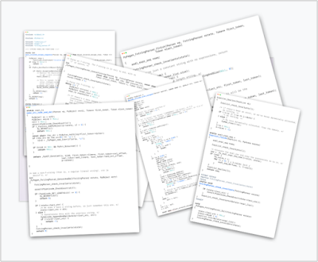
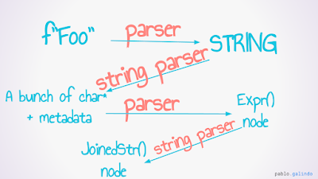

[Formatted string literals](https://realpython.com/python-f-strings/), known as “f-strings” for short, were first introduced in Python 3.6 via [PEP 498](https://peps.python.org/pep-0498/). Since then, they’ve swiftly become one of the most popular features of modern Python.

At [the 2022 Python Language Summit](https://pyfound.blogspot.com/2022/05/the-2022-python-language-summit_01678898482.html), Pablo Galindo Salgado presented on exciting new possibilities for improving the implementation of f-strings by incorporating f-string parsing into the grammar of Python itself.

  

* * *

## F-strings: the current situation

Here’s the f-string we all know and love:

```

f"Interpolating an arbitrary expression into a string: {1 + 1}."

```

At runtime, the expression between the braces will be evaluated (the result’s `2`, for those wondering). `str()` will then be called on the result of the evaluated expression, and the result of *that* will then be interpolated into the string at the desired place.

The following diagram summarises the code behind this runtime magic:

  

[](https://blogger.googleusercontent.com/img/b/R29vZ2xl/AVvXsEj-qmK_xOXbhlof7e04ZTSpKQcOoIe4ZYuFTwQzt2t10lEzZrbhkLpuc6nrTlN6hlGBm9724wQj6swRxPSG0ZrleuJbn8UNsepWvdJ3gg2rFWo-dNJMvkPGqkCyDWR6f398kkaHCbW9uxFOF9X5_HAgKJsMWPBnru27a1U5UYCNa5FUS3I/s683/Picture2.png)  

That’s right: the current implementation for f-strings relies on “around 1,400 lines of manually written parser code in C”. This is *entirely separate* to the parsing logic that exists elsewhere for deconstructing all other Python code.

According to Salgado, while this code has now been extensively battle-tested, it is still ridden with tiny bugs. The complexity of the code here also makes it very difficult to make changes to the code without introducing *new* bugs, which in turn makes it hard to work on improving error messages – a [major goal of Salgado’s](https://docs.python.org/3/whatsnew/3.10.html#better-error-messages) over recent years.

  

> “The technical term for this is *not ideal*”
> 
> – Pablo Galindo Salgado, on the current state of f-string parsing

  

* * *

## What the `f`?

How do we know that an f-string is an f-string? “As humans,” Salgado noted, we know an f-string is an f-string “because the string starts with `f`”.

Sadly, CPython’s parser is not yet quite as smart. The parser, currently, does not have the wherewithal to distinguish f-strings from other strings. Instead, when parsing f-strings, the interpreter does the following dance:

  

[](https://blogger.googleusercontent.com/img/b/R29vZ2xl/AVvXsEgXpT-JsqSaT0MGYiFotckz1KWs7EWo7wPSdtb-4iQjhPdDjN5ZPyuRGAvHtNe4Cg8LBNWFqsdnyEOkN6wgDYeQW3zKcbCDCNjgWZwQn_9q4wYANNsON598m93z4oUUDjG_sKOOanjTWaqfk-9TDjVFQ_x2jagKOSkynDBu6PowJLVRl68/s960/Memray%20lightning%20talk.png)

  

Since Python 3.9, however, CPython is equipped with a [shiny new PEG parser](https://peps.python.org/pep-0617/), which can be taught all sorts of advanced and complicated things. Salgado now proposes to move f-string parsing logic from the dedicated C file into CPython’s formal grammar, enabling f-string parsing to happen at the same time as the parsing for the rest of a Python file.

Salgado, along with others who are working on the project with him, is currently working on fixing “89876787698 tiny error message differences”, explaining, “This is the hard part. We need feedback – we need to know if it’s actually worth doing at this point.”

Eric V. Smith, the creator of f-strings, and a member of the audience for the talk, is a strong supporter of the project. Smith explained that the original design had been chosen due to a desire to make life simple for code editor tools such as [IDEs](https://www.redhat.com/en/topics/middleware/what-is-ide), which might have struggled to parse f-strings if this design had been chosen initially. But he had been "surprised", he said, at how well Salgado's proposal had been received among the authors of these tools when he had recently sought feedback on it.

Smith plans to continue gathering feedback from IDE maintainers over the coming months.

  

* * *

## Potential benefits

As well as simplifying the code and making it more maintainable, moving f-string parsing into the grammar holds a number of exciting (and/or horrifying) possibilities. For example, this is just about the maximum level of f-string nesting you can currently achieve in Python:

```

f"""a{f'''b{f"c{f'd {1+2=}'}"}'''}"""

```

But with f-strings in the grammar… the possibilities are endless.

On a more serious note, Salgado noted that the following is a common source of frustration for Python developers:

```

>>> my_list_of_strings = ['a', 'b', 'c']
>>> f'Here is a list: {"\n".join(my_list_of_strings)}'
  File "<stdin>", line 1
    f'Here is a list: {"\n".join(my_list_of_strings)}'
                                                      ^
SyntaxError: f-string expression part cannot include a backslash

```

But by having f-strings as part of the grammar, there would no longer be any need for this restriction.

##   

* * *

## Reception

The proposal was extremely enthusiastically received. “It would be *huge* if we could get syntax errors pointing to the correct place like with normal Python code,” commented Eric Snow.

> I’m all for it.  
> – Guido van Rossum, Core Developer and creator of Python

> We are all in agreement. You should just do it.  
> – Thomas Wouters, Core Developer and Steering Council member

> You can spend the next ten minutes implementing it.  
> – Łukasz Langa, Core Developer and CPython Developer-in-Residence
