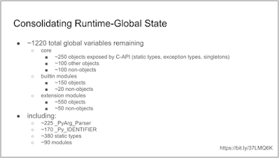

“Hopefully,” the speaker began, “This is the *last time* I give a talk on this subject.”

“My name is Eric Snow, I’ve been a core developer since 2012, and I’ve been working towards a per-interpreter GIL since 2014.”

  

* * *

In 1997, the `PyInterpreterState` struct [was added to CPython](https://github.com/python/cpython/commit/a027efa5bfa7911b5c4b522b6a0698749a6f2e4a), allowing multiple Python interpreters to be run simultaneously within a single process. “For the longest time,” Snow noted, speaking at [the 2022 Python Language Summit](https://pyfound.blogspot.com/2022/05/the-2022-python-language-summit_01678898482.html), this functionality was little used and little understood. In recent years, however, awareness and adoption of the idea has been spreading.

  

  

Multiple interpreters, however, cannot yet be run in true isolation from each other when run inside the same process. Part of this is due to the [GIL (“Global Interpreter Lock”)](https://realpython.com/python-gil/), a core feature of CPython that is the building block for much of the language. The obvious solution to this problem is to have a *per-interpreter GIL*: a separate lock for each interpreter spawned within the process.

With a per-interpreter GIL, Snow explained, CPython will be able to achieve true multicore parallelism for code running in different interpreters.

A per-interpreter GIL, however, is no small task. “In general, any mutable state shared between multiple interpreters must be guarded by a lock,” Snow explained. Ultimately, what this means is that the amount of state shared between multiple interpreters must be brought down to an absolute minimum if the GIL is to become per-interpreter. As of 2017, there were still several thousand global variables; now, after a huge amount of work (and [several](https://peps.python.org/pep-0554/) [PEPs](https://peps.python.org/pep-0684/)), this has been reduced to around 1200 remaining globals.

  

> “Basically, we can’t share objects between interpreters”
> 
> – Eric Snow

* * *

## Troubles on the horizon

The reception to Snow’s talk was positive, but a number of concerns were raised by audience members.

One potential worry is the fact that any C-extension module that wishes to be compatible with sub-interpreters will have to make changes to their design. Snow is happy to work on fixing these for the standard library, but there’s concern that end users of Python may put pressure on third-party library maintainers to provide support for multiple interpreters. Nobody wishes to place an undue burden on maintainers who are already giving up their time for free; subinterpreter support should remain an optional feature for third-party libraries.

Larry Hastings, a core developer in the audience for the talk, asked Snow what exactly the benefits of subinterpreters were compared to the existing `[multiprocessing](https://docs.python.org/3/library/multiprocessing.html)` [module](https://docs.python.org/3/library/multiprocessing.html) (allowing interpreters to be spawned in parallel processes), if sharing objects between the different interpreters would pose so many difficulties. Subinterpreters, Snow explained, hold significant speed benefits over `multiprocessing` in many respects.

Hastings also queried how well the idea of a per-interpreter GIL would interact with Sam Gross’s proposal for a version of CPython that [removed the GIL entirely](https://pyfound.blogspot.com/2022/05/the-2022-python-language-summit-python_11.html). Snow replied that there was minimal friction between the two projects. “They’re not mutually exclusive,” he explained. Almost all the work required for a per-interpreter GIL “is stuff that’s a good idea to do anyway. It’s already making CPython faster by consolidating memory”.
