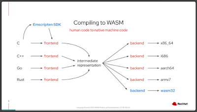
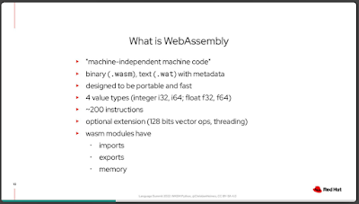
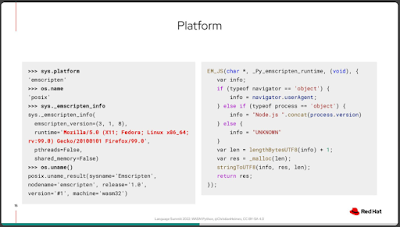
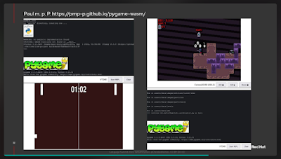
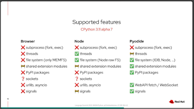

Python can be run on many platforms: Linux, Windows, Apple Macs, microcomputers, and even Android devices. But it’s a widely known fact that, if you want code to run in a browser, Python is simply no good – you’ll just have to turn to JavaScript.

Now, however, that may be about to change. Over the course of the last two years, and following over 60 CPython pull requests (many attached to GitHub issue [#84461](https://github.com/python/cpython/issues/84461)), Core Developer Christian Heimes and contributor Ethan Smith have achieved a state where the CPython `main` branch can now be compiled to [WebAssembly](https://webassembly.org). This opens up the possibility of being able to run arbitrary Python programs clientside inside your web browser of choice.

At [the 2022 Python Language Summit](https://pyfound.blogspot.com/2022/05/the-2022-python-language-summit_01678898482.html), Heimes gave a talk updating the attendees of the progress he’s made so far, and where the project hopes to go next.

  

* * *

## WebAssembly basics

WebAssembly (or “WASM”, for short), Heimes explained, is a low-level [assembly](https://en.wikipedia.org/wiki/Assembly_language)\-like language that can be as fast as native [machine code](https://en.wikipedia.org/wiki/Machine_code). Unlike your usual machine code, however, WebAssembly is independent from the machine it is running on. Instead, the core principle of WebAssembly is that it can be run *anywhere*, and can be run in a completely isolated environment. This leads to it being a language that is extremely fast, extremely portable, and provides minimal security risks – perfect for running clientside in a web browser.

  

 

After much work, CPython now cross-compiles to WebAssembly using [emscripten](https://emscripten.org/) through the `--with-emscripten-target=browser` flag. The CPython test suite now also passes on emscripten builds, and work is going towards adding a buildbot to CPython’s fleet of automatic robot testers, to ensure this work does not regress in the future.

Users who want to try out Python in the browser can try it out at [https://repl.ethanhs.me/](https://repl.ethanhs.me/). The work opens up exciting possibilities of being able to run PyGame clientside and adding Jupyter bindings.

  

 

* * *

## Support status

It should be noted that cross-compiling to WebAssembly is still highly experimental, and not yet officially supported by CPython. Several important modules in the Python standard library are not currently included in the bundled package produced when `--with-emscripten-target=browser` is specified, leading to a number of tests needing to be skipped in order for the test suite to pass.

  

  

  

Nonetheless, the future’s bright. Only a few days after Heimes’s talk, Peter Wang, CEO at Anaconda, announced the launch of [*PyScript*](https://anaconda.cloud/pyscript-python-in-the-browser) in a [PyCon keynote address](https://anaconda.cloud/pyscript-pycon2022-peter-wang-keynote). PyScript is a tool that allows Python to be called from within HTML, and to call JavaScript libraries from inside Python code – potentially enabling a website to be written entirely in Python.

PyScript is currently built on top of [*Pyodide*](https://pyodide.org/en/stable/), a third-party project bringing Python to the browser, on which work began before Heimes started his work on the CPython `main` branch. With Heimes’s modifications to Python 3.11, this effort will only become easier.
