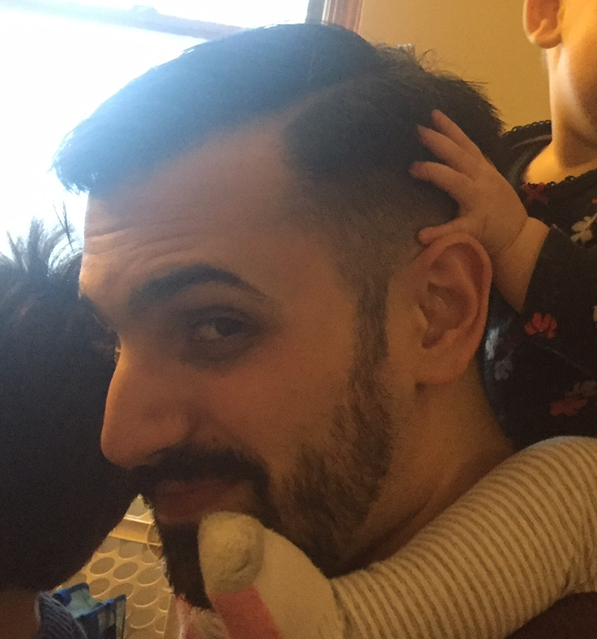

The Python Software Foundation depends on its board of directors in order to function. Board members are elected every year by [PSF voting members](https://www.python.org/psf/membership/#who-is-allowed-to-vote) in a process run internally by non-board members. Ian Cordasco has been the PSF’s Election Administrator since 2015, volunteering his efforts for this important role. Cordasco is also a valuable member of the Python community, frequently mentoring newer coders and supporting their Python endeavors. For these reasons, the PSF is delighted to award the 2017 QA Community Service award to Ian Cordasco:  

RESOLVED that the Python Software Foundation award the 2017 Q1 Community Service Award to Ian Cordasco for his contributions to PSF elections and active mentoring of women in Python community.  

PSF Elections  

Cordasco began as the PSF’s Election Administrator during a time of turmoil. “The first year I ran the election was something of a nightmare,” he recalls. Due to unforeseen circumstances, the previous Election Administrator stepped down on short notice and was unavailable to relaunch the election efforts. “Many people did not get ballots via email as they should. Some people were accidentally excluded from the voting rolls. Further, there was a lot of confusion because I stepped in at the last minute.” Without the aid of documentation and prior experience, Ian threw himself into the cause. The PSF has since reviewed, solidified, and documented the [election procedures](http://pyfound.blogspot.com/2015/05/new-board-election-important-please-read.html).  

Since his dramatic start as Elections Administrator, Cordasco’s work with PSF elections has been much smoother. Mark Mangoba, PSF’s IT Manager, works closely with Cordasco during the election process. Mangoba notes, “Ian is a great volunteer. He does an excellent job with the elections, assuring that all votes are accounted for and that there is no fraud or issues of any kind.” Cordasco has also gotten creative with how he manages elections. For example, to reduce bias, he uses Python code to break ties and to randomize the order in which candidates appear to voters. Additionally, those that work with Cordasco describe him as an enjoyable collaborator. Mangoba explains, “Ian is energetic and thoughtful. His passion and enthusiasm for the PSF shows through, he’s always available to help and answer questions.”  

Mentoring  

Cordasco has a history of going out of his way to support and encourage female developers. When [Carol Willing](https://twitter.com/WillingCarol), a developer for the Jupyter project, wanted to work on the Requests library, she got in touch with Cordasco. “We worked together on the project and my first commit to the Requests library got accepted!” Cordasco later wrote a fantastic post about it on his [blog](http://www.coglib.com/~icordasc/blog/2014/11/sending-json-in-requests.html).  

Cordasco has also found newer coders to mentor at Python events, such as [Anna Ossowski](https://twitter.com/OssAnna16). “I met Ian at PyTennessee 2015, a day before I was scheduled to give my very first ever conference talk. Ian’s encouragement and support helped me a lot and it’s thanks to him and Carol \[Willing\] that I had the confidence to go up on stage and deliver my talk.” But his support didn’t stop there, Ossowski goes on to say, “every week he would reserve an hour for me where we would program together, he would answer questions, and just generally help me with any programming issues I experienced. Ian helped me get the [PyLadies Remote website](http://remote.pyladies.com/index.html) up and running, something I would have never managed without his help.”  

[Adrienne Lowe](https://twitter.com/adriennefriend), a developer at Emma, has also enjoyed Cordasco’s support and encouragement. She recalls, “He models the kind of developer that we all want to be in terms of being encouraging and open.” She continues, “he sets himself apart by being genuine, welcoming, and happy to explain anything from simple things to more complex concepts, all in an ego-less way.”  

The Python community as a whole is very lucky to count Cordasco as its member, and we hope he continues to help others contribute and achieve their goals.  

<table align="center" cellpadding="0" cellspacing="0"><tbody><tr><td></td></tr><tr><td>CSA 2017 Q1 Winner Ian Cordasco</td></tr></tbody></table>

  

In his free time, you can find Cordasco blogging on [his website](http://www.coglib.com/~icordasc/), riding his bike, or reading books.
