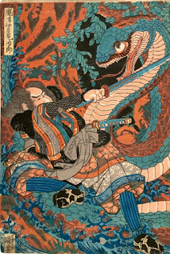

When Tim Peters started working on Python, his first advice for Guido van Rossum was that programmers want to add ints and floats. From the beginning, Python had both kinds of numbers, just like today, but adding them together then required a cumbersome type-cast. Peters argued that Python should implicitly convert ints to floats, like most other languages, for programmers' sake: "That is a very common operation for anyone who works with floating point numbers," Van Rossum recalls him saying, "so you’ve got to do it this way." Ever since, Peters has pushed the language in this direction. He insists that Python should be a practical language that caters to the needs of programmers, and he has a knack for guiding design debates to achieve this goal. In recognition of his contributions, the PSF presented Tim Peters with [the 2017 Distinguished Service Award](https://www.python.org/community/awards/psf-distinguished-awards/#id1).  **A Realist Algorithm** "Timsort is Tim's grand opus," says Van Rossum. The algorithm is not only the standard sort for Python; when Java developer Joshua Bloch saw its merit for sorting real-world data, he incorporated it into the Java standard library as well. The genius of Timsort is to recognize how data naturally occurs in everyday programs: it's less likely to be randomly ordered than to be partly ordered, or ordered in reverse. Programmers usually throw such data at a sorting function anyway, and a theoretically elegant algorithm like Quicksort won't recognize the shortcuts it could take to save work. [Timsort is designed to recognize such opportunities](https://en.wikipedia.org/wiki/Timsort) and deploy efficient tricks for them. Timsort is optimized for the world not as we imagine it, but as it is. This realism is characteristic of the Python language as a whole. It flows from Van Rossum's taste in design, which Peters [distilled into a poem in 1999](https://mail.python.org/pipermail/python-list/1999-June/001951.html). **The Zen of Python** It's only 19 lines. But this short list of precepts has influenced the language and the programs written in it profoundly. It is a shared literature for Python programmers, in the same way that most English speakers know certain lines of Shakespeare. Python's designers quote the Zen of Python in PEP debates, and programmers reviewing code in their own Python projects use the Zen to support their opinions. Guido van Rossum says, "You can use it to motivate a design choice, but it’s not scripture. It can’t be the only reason to choose a particular design. You still have to put your thinking cap on." Just like the Zen Buddhist sayings that inspired it, Peters's text isn't dogma. Indeed, for every commandment the Zen of Python hands down, there is also a joke or a contradiction to remind us to take it lightly. Core developer Carol Willing summarizes the Zen of Python's message like this: "We're going to meet constraints in a way that makes good common sense first, so you can maintain the code and people can understand the code." It's this commonsense approach that makes Python a joy to use. Willing began coding on a mainframe at Bell Labs when she was in fifth grade in 1976; in all her years as a programmer the most enjoyable have been her years with Python. She says, "Every day I get to use it makes me feel like a kid again." Now, when she teaches Project Jupyter interns each summer, one of her first instructions is to type "[import this](https://www.wefearchange.org/2010/06/import-this-and-zen-of-python.html)". Willing extends Python's Zen to its community, too. She says that "Beautiful is better than ugly" is a good guide for talking with our colleagues. "There’s an ugly way of saying things, and a more respectful, nicer way of saying things. Maybe we should err on the side of being respectful and nice."  **A Happy Medium** In Guido van Rossum's estimation, Peters's biggest contribution to the community has been his years of answering questions and guiding debates on the Python mailing list, writing each message precisely and cheerfully. PSF director Thomas Wouters agrees: "Tim is just never flustered. He always takes it in good humor and it definitely has an effect on everyone else, as well." Even an experienced developer like Carol Willing says that when she sees a post from Peters on a topic she knows, she'll take the time to read it for new insights or new ways of explaining. In design debates, Peters invented a notion of "channeling Guido" to free Van Rossum from the overflow of emails. He claimed to act like a spirit medium speaking with Van Rossum's voice, but this understates Peters's influence. "He was a mentor for me," says Van Rossum. "He combines incredible technical skills with insight into what the person he's communicating with is missing or needs to see, with a patient way of explaining. He showed me that style of communicating which I strive for but can't always do." Recently, in the wake of [contentious debate](https://lwn.net/Articles/757713/) over the ":=" operator, Guido van Rossum resigned as BDFL. Tim Peters, too, is less active on Python mailing lists than before. The Python community can no longer rely on one individual and his channeler for guidance. As Brett Cannon [wrote](https://mail.python.org/pipermail/python-committers/2018-July/005671.html), "a key asset that Guido has provided for us as a BDFL is consistency in design/taste." As a summary of Van Rossum's thinking, the Zen of Python is now more important than ever.  

* * *

Images: Utagawa Kuniyoshi (1797-1861), 108 Heroes of the Popular Suikoden.
