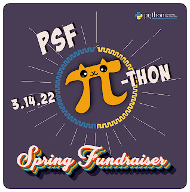

Happy Pi Day, 𝛑thonistas! 2022 has been a year with some special dates, and we wanted to honor one more. We are feeling celebratory and excited here at the PSF, having made it through 2020 and 2021 by the strength of our community. We confronted obstacles, comforted each other, found successes, and created fun together. So we are kicking off our Spring Fundraiser on a light and nerdy note, by celebrating our favorite Greek letter and mathematical constant.

[Donate to the PSF today](https://psfmember.org/civicrm/contribute/transact?reset=1&id=37), in whatever multiple of pi you choose, and you will receive one-of-a-kind digital 𝛑SF swag as a thank you!

Contributing to the PSF is a great way to show your love for Python. Your donation allows the PSF to continue to host [PyCon US](http://us.pycon.org) and provide scholarships, tutorials, sprints, and more; to send [grants](https://www.python.org/psf/grants/) to Python events and projects around the world; to [support](https://www.python.org/psf/fiscal-sponsorees/) great Python projects and events like [PyLadies](https://pyladies.com/) and [PyCascades](https://2022.pycascades.com/); to host and maintain [PyPI.org](http://pypi.org); and to support the advancement of the Python language. Your gifts help keep the PSF stable and sustainable, so we can support the Python ecosystem to thrive in the long term.

Some highlights of what the PSF has been able to do with our community in the last year:

-   We celebrated Python’s 30th and the PSF’s 20th Anniversary!
-   Over 2500 Pythonistas came together to make our virtual [PyCon US 2021](https://us.pycon.org/2021/highlights/) a huge success.
-   We sent grants to 129 groups in 41 countries (on every continent except Antarctica!) to hold virtual events and connect.
-   We supported 13 Python community groups and projects as fiscal sponsorees.
-   We hosted PyPI.org for millions of users.
-   .We brought on Shamika Mohanan as Packaging Project Manager, to work on [the future of PyPI](https://pyfound.blogspot.com/2021/12/pypi-user-feedback-summary.html).
-   [Łukasz Langa](https://lukasz.langa.pl/a072a74b-19d7-41ff-a294-e6b1319fdb6e/) became the PSF’s inaugural Developer in Residence to establish a full-time core developer role.

Show your love for our Python community and contribute to the Spring Fundraiser by May 3rd to get your slice of the pi! We aren’t setting a specific target this year, because honestly it’s been really hard to predict what will be possible for people in general—we aren’t going to pretend anything is easy to forecast right now! But we’d love for as many of you to participate as you can and bring us all a little extra hap-pi-ness.

Like 𝛑, our appreciation for the Python community and your support can only be expressed as an approximation—it is greater than words can say. And like our gratitude, 𝛑’s digits are infinite. We are sincerely thankful for every single contribution: We couldn’t do this without you, and we feel very lucky to share a community with you.

We are wishing you all a very happy Pi Day!

  
ΠS: Don’t forget to [register for PyCon US](https://us.pycon.org/2022/attend/information/)! April 27-May 3rd, 2022, in Salt Lake City, Utah and online!

ΠΠS: Yes, we will also celebrate the alternate date system Pi Day, July 22nd :)
