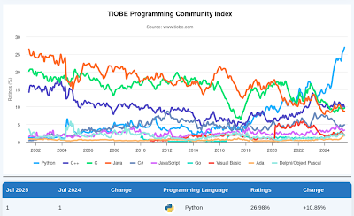
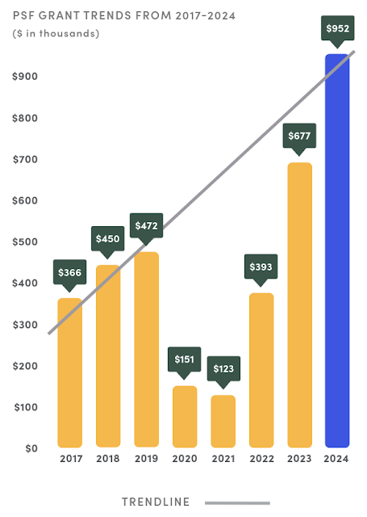

### **TL;DR:**

Effective August 1st, 2025, the PSF is temporarily pausing our Grants Program after reaching our 2025 grant budget cap earlier than expected. We know how important this program is to many in our community and making this decision was difficult. This is a necessary step to protect both the future of the program and the short- and long-term sustainability of the PSF. (If this moves you immediately to donate to the PSF, we welcome your contributions via [our donations page](https://www.python.org/psf/donations/)).

### The PSF Grants Program is paused

As [we shared in December 2024](https://pyfound.blogspot.com/2024/12/psf-grants-program-charter-updates-tldr.html) (specifically, [part 3](https://pyfound.blogspot.com/2024/12/12psf-grants-program-charter-updates-part-3.html)), the PSF implemented changes to the Grants Program in March 2025 in an effort to ensure the sustainability of the program and the foundation. PSF Staff have been checking in quarterly on our award expenditure, and at the end of Q1, we were on track. When PSF Staff reviewed approved grant awards at the end of Q2, however, we had granted close to 80% of the 2025 grant budget. The grant applications received so far through July exceed the budget ceiling. What does this mean? **The PSF Board has voted to implement a pause, effective August 1st, 2025, on the PSF Grants Program.** The PSF Board and Staff explored our options thoroughly before coming to this tough, and frankly painful, decision as we deeply understand how important the grants program is to the Python community. Everyone at the PSF is constantly amazed and impressed with the creativity, drive, and ingenuity of the Python community. Supporting the community’s success with our Grants Program is at the heart of our mission—and it brings so much joy to the PSF Board, our small but mighty team of staff, and the wonderful folks in our Work Groups. We are heartbroken to have to pause that work and we know this will be challenging and create more difficult decisions in turn for the many community groups that had planned to apply for the grants program. We will be distributing the small amount of remaining funds in the 2025 PSF Grants Program budget. To honor the time and energy spent on applications already submitted and in the spirit of equity, **any applications that were received before August 1st, 2025 will be granted a uniform percentage of the award amount for which they are eligible.** If you have a grant application in the system, you will receive an email from us soon with more information. Please send any urgent inquiries to grants@python.org. The PSF aims to be as transparent as possible, and we want to have two-way conversations with the community about this change. We are holding an additional [PSF Grants Program Office Hour](https://pyfound.blogspot.com/2024/02/introducing-psf-grants-office-hours.html) in August on the [PSF Discord](https://discord.gg/7rthGF3BBe). We welcome folks to join both or either session:  

-   August 13th, 8-9 pm UTC
-   August 19th, 1-2 pm UTC

We also welcome your feedback, particularly how we can support you during this pause, via email to grants@python.org or on the [thread we’ve started on discuss.python.org](https://discuss.python.org/t/the-psf-has-paused-our-grants-program/101288).  

### How we got here

Since announcing Grants program changes in December 2024, grant requests have grown about 40% over last year. It’s wonderful to see long-time events continue to grow. It’s been equally inspiring to see events being revived as we move further from 2020 and the start of the COVID pandemic, alongside brand-new initiatives from new and seasoned organizers. The PSF **loves** seeing the growth, but the heart of the issue is that Python and its community continue to grow exponentially, while our funding has not kept pace, and in fact, has decreased. With Python being the [number one language on GitHub](https://github.blog/news-insights/octoverse/octoverse-2024/) and [rising steadily on the TIOBE index](https://www.tiobe.com/tiobe-index/), it’s no surprise that our community continues to build and grow as well. You can see the TIOBE index shows what the growth of Python looks like over the years, and how much it’s grown in just the past year:  

By contrast, the PSF’s available resources have decreased over the last three years and are projected to decrease again in 2025 due to increasing PyCon US and foundation costs. Much of the growth shown before 2022 in the chart below comes from grants we received that were restricted funds dedicated to specific staffing and other programs. The result is increasing global community activity against a decreasing pool of available funds.

For example, 2023 year-end assets were $5.5M with total grants awarded at $677K. The following year, 2024 assets decreased slightly to $4.3M, but grants awarded jumped to $952K. You can see in the graph above how that negatively impacted our assets, a trend that is not sustainable even in the short term. Please check out the [PSF’s 2024 Annual Impact Report](https://www.python.org/psf/annual-report/2024/) for more details of our finances and our work. 

The [PSF Grants Program adjustments implemented earlier this year](https://pyfound.blogspot.com/2024/12/12psf-grants-program-charter-updates-part-3.html) aimed to reduce total grant award spending while providing a more equitable approach, but the growth in new/revived grant applications outpaced the lowered caps and other limits. As we reviewed Q2 spending, it became clear that the unexpected influx of qualified grant proposals had already almost exhausted the total amount we had budgeted for the full year.

### We’re in this together

The PSF is in a similar position to the many other organizations and NGOs (and all of our volunteer conference and meetup organizers!) trying to support the Python community and foundation while faced with inflation, lower sponsorship, economic pressure in the tech sector, and global/local uncertainty and conflict. Last year, [the PyCon US blog explained](https://pycon.blogspot.com/2024/11/important-changes-ahead-commitment-to.html) that PyCon US 2024 generated a significant loss; losses from PyCon US are paid for by PSF general funds that are also the financial source for the PSF Grants programs. For many years, PyCon US created a surplus used to fund Grants, PSF staff, and other programs. Based on the current numbers for PyCon US 2025, the PSF will need to fund another loss. Many factors including the lower-than-budgeted attendance, higher location costs, and the current economic and political situation contributed to the loss despite incredible efforts by staff and volunteers to control costs.  

### What’s the solution?

In an ideal world, we wouldn’t need to pause the Grants Program and would instead be granting even MORE awards to our inspiring community. And while that’s not currently the case, we do think you can help us unpause the grants program and fund the PSF’s other work. **The PSF needs more support and resources from the corporations that are built on and making revenue from Python. As a community, let’s ask corporations to step up and sustain the health of the community and programming language they rely on.** The AI sector, for example, relies heavily on Python and is mostly [untapped for the PSF, PyCon US, and our entire community](https://georgiker.com/blog/is-ai-leaving-python-community-behind/). If you have potential sponsorship connections (in AI or otherwise) we welcome you to send us leads or connect us via sponsors@python.org. The PSF is ever grateful for our sponsors, past and current, and we do everything we can to make their sponsorships beneficial and rewarding. PSF Staff also work hard to make those sponsorship dollars stretch as far as they can. Frankly, the PSF simply needs more sponsorship to continue to support the astonishing growth of Python and its community. The PSF is also incredibly grateful for our individual donors and PSF members. We truly couldn’t do this without you. If you’re inspired to help because of this post, we urge you to ask your employers to sponsor the PSF. Send them the [PSF’s sponsorship page](https://www.python.org/psf/sponsorship/)! We know times are financially challenging for everyone, but if you’re feeling very inspired and in a position to donate, we welcome your contributions via the [PSF’s donation page](https://psfmember.org/civicrm/contribute/transact/?reset=1&id=2). You can also join us as a [PSF Supporting Member](https://psfmember.org/python-software-foundation-supporting-member-2/) ([a sliding scale is also available!](https://psfmember.org/civicrm/contribute/transact/?reset=1&id=39)), to invest in the future of Python and its community.

### Some additional context

As PSF Staff reviewed the Q2 numbers for the Grants Program, we found the following:  

-   **Revived events.** 10 out of the 75 (or about 13%) grants applications we’ve received in 2025 are for “revived” grant applications for events that weren’t run in 2024 (including one that hasn’t been run since 2015, whoa!).
-   **Net new applications.** 19 out of the 75 (or about 25%) grant applications we’ve received in 2025 are for totally new events and initiatives. While we did expect some growth, this is tremendous!
-   **Earlier applications.** We encouraged folks to apply earlier—and you did, thank you! We weren’t expecting this level of awarding by mid-year. We also expect that to continue, so we can now plan better for that in the future.
-   **Higher $$ requests.** Across all returning applications the amount being requested is about 13% higher than in years previous.

While we expected more interest from the community in the PSF grants program, the amount of growth far exceeded our expectations.

### What’s next?

The PSF is working on our strategy to balance support for the worldwide Python community and funding constraints, now and in the future. The unknown and rapidly growing number of new Python events and initiatives—combined with the ongoing needs of existing events and organizations that have historically relied on the PSF Grants Program—is challenging to manage sustainably on a rolling application basis. So, here’s our plan:  

-   First, the PSF Board will continue to refine the grant program’s guiding principles and how they translate into program policy.
-   From there, PSF Staff will research, plan, and implement a quarterly review and awarding approach for the PSF Grants Program to provide an equitable and financially sustainable process.

Moving to a quarterly review process from the rolling approval process the Grants Program currently uses will be a big change! We will do our best to implement processes that work well for the community, the Grants Workgroup, and PSF Staff.

Even with our best efforts, we acknowledge that there will be learning opportunities around moving to a quarterly review and most likely a series of adjustments ahead of us to get things working smoothly. Your feedback as grant applicants and recipients will be extremely helpful as we take on this journey. During this process, we will determine on what timeline we can re-open the Grants Program. You can expect updates from us on the future of the PSF Grants Program in early 2026.
