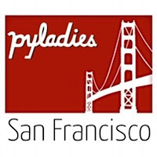

PyLadies is an international mentorship community for women that use Python. Started with a grant in 2011, PyLadies has continued to bring women into the Python community through a variety of methods, including hosting events in local PyLadies chapters as well as offering a grant opportunity to attend PyCon. One woman in particular has contributed to PyLadies' success, for which the PSF recognized her as a Community Service Award recipient for the 2nd Quarter of 2017:  

> *RESOLVED, that the Python Software Foundation Q2 2017 Community Service Award to* *Lynn Root for her work as the founder of the San Francisco Chapter of PyLadies, a member* *of the Django Software Foundation, and as a tireless volunteer at PyCon.*

PyLadies in the early days, the Start of the San Francisco Chapter

  

If you can name one person associated with PyLadies, it is Lynn Root. Lynn’s relentless support, organizing, and evangelizing on behalf of PyLadies is known by many. “Lynn’s enthusiasm and passion for bringing more women into tech are well complemented by her organizational skills, which were especially needed at pivotal moment in early PyLadies history. Lynn helped grow PyLadies into, what is now, a global organization that’s had a huge impact on the Python community,” PyLady Esther Nam, one of the founders of the PyLadies Los Angeles chapter, explains.   

In late 2011, Lynn began learning to program, as some of graduate programs she was considering required her to have some programming expertise. “I reached out to San Francisco’s Women Who Code to organize a Python study group,” Lynn recalls, trying to find like-minded women to join. She had used Python in a weekend hackathon and found it to be a beginner friendly language. The following year, in 2012, PyCon was held in Santa Clara. “Lynn reached out and organized a carpool of Bay Area Pythonistas to attend the conference”, Esther remembers. PyLadies from the first chapter in Los Angeles attended, where Lynn met with them to learn more about PyLadies. The next month, she founded the San Francisco chapter. Lynn continued to act as a principal organizer for PyLadies San Francisco for the next four years.  

Growing PyLadies in the Global Community  

Overlapping with her time as PyLadies San Francisco lead organizer, Lynn championed other significant projects including the creation of \`[pip install pyladies](http://www.pyladies.com/blog/pip-install-pyladies/)\`, the PyLadies open source kit for new organizers. The development of open source tools for PyLadies has been instrumental in getting the word out about PyLadies. Lynn was able to use these tools to help start international PyLadies communities in Stockholm, Zagreb, and Brno.

  

Lynn also took an active role in bringing PyLadies content to PyCon. During Lynn’s first term on the Python Software Foundation Board of Directors in 2013 to 2014, Lynn helped plan and run the first [PyLadies Charity Auction](http://www.pyladies.com/blog/PyLadies--PyCon---Join-Us/PyLadies-at-PyCon-2013/) at PyCon. Months of work go into organizing the charity auction; it requires donations to be procured beforehand, besides auctioneering on-site. The inaugural PyLadies Charity Auction raised $10,000.00 USD for PyLadies. Commenting in a [2013 press release about the auction](http://www.marketwired.com/press-release/-1771597.htm), Atlanta PyLadies founder Laura Cassell explains, “we're all so resourceful already that I suspect this money is going to go a long way towards helping women who want to get into the industry. I'm still a little misty-eyed at the whole thing, to be honest."  
  

Besides her PyLadies work, Lynn has been a speaker at PyCon [four times](http://pyvideo.org/speaker/lynn-root.html), PyCon [Lightning Talk Chair](https://us.pycon.org/2018/about/staff/) since 2014, frequent session runner, and recurring PyCon volunteer.  

PyLadies Benevolent Dictator for Life?

I asked Lynn if she has ever been called the PyLadies Benevolent Dictator for Life ([BDFL](https://en.wikipedia.org/wiki/Benevolent_dictator_for_life)). Lynn shook her head, she does not see herself in that fashion. But it is hard to refute the strong footprint she has left on the PyLadies community. Lynn has written several Python open source tutorials, like the [web scraping with scrapy and postgres](http://newcoder.io/scrape/), that are often used in PyLadies workshops and are highly visited (over 65,000 times to date this year!), and has spoken at PyCons around the world: EuroPython, PyCon Finland, and PyCon Brasil. Lynn was the original PyLady I consulted with when starting the PyLadies Chicago chapter in 2014. 

From founding her local PyLadies chapter, to volunteering at PyCon, to catalyzing other initiatives like the Django Software Foundation, Lynn has been an unwavering advocate for women in the Python community and for the broader Python community itself. The thing that Lynn says has been most satisfying for her as a Python community organizer and advocate has been the rise of women in Python. “In 2012 only 8% of speakers at PyCon were women now in 2017 we have approximately 33%”.

With the rise of PyLadies at PyCon and throughout the world, it’ll be exciting to see what comes next for the PyLadies community and for those that have helped make PyLadies such a tremendous success.
