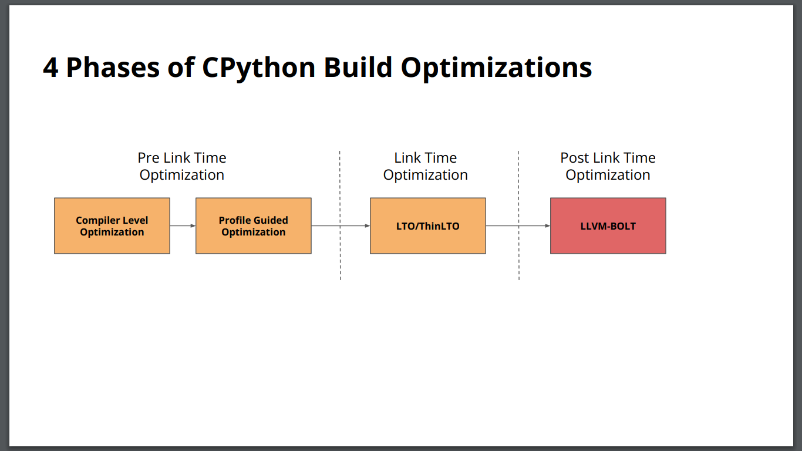
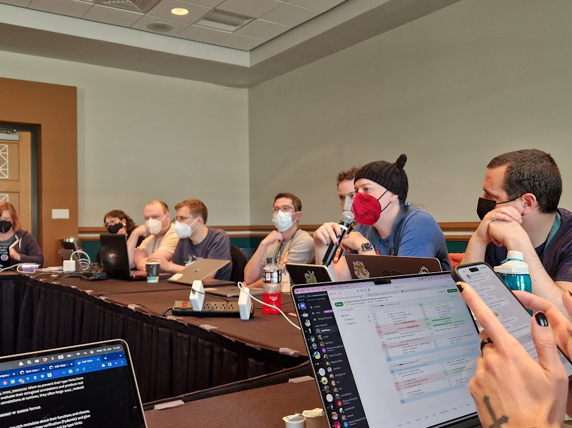

The [Python Language Summit 2023](https://pyfound.blogspot.com/2023/05/the-python-language-summit-2023_29.html) closed off with a trio of lightning talks from Dong-hee Na, Carl Meyer and Amethyst Reese.

  

  

* * *

  

## Dong-hee Na: Let’s support LLVM-BOLT as an official feature

CPython Core Developer Dong-hee Na gave a short presentation on the LLVM-BOLT optimiser, arguing that we should support it as a standard feature of CPython.

LLVM-BOLT is a “post link time binary optimiser” that was adopted by [the Pyston project](https://github.com/pyston), a performance-oriented fork of CPython 3.8. The Pyston team had reported that use of the optimiser resulted in performance gains of 2-4% on their benchmarks, although the [Faster CPython team](https://devblogs.microsoft.com/python/python-311-faster-cpython-team/) and Dong-hee Na [had reported smaller returns](https://github.com/faster-cpython/ideas/issues/224) when they had applied the optimiser to Python 3.11.

Dong-hee Na showed benchmark results that showed significant speedups in some areas with LLVM-BOLT applied to Python 3.12, but noted that LLVM-BOLT also caused regressions in some other areas due to overly aggressive optimisations. He announced that he had added support for LLVM-BOLT to CPython as an optional compile-time flag, `--enable-bolt`, to allow experimentation with the feature.

  

<table align="center" cellpadding="0" cellspacing="0"><tbody><tr><td><a href="https://blogger.googleusercontent.com/img/a/AVvXsEi0d1JAcXu962gjfuEKscZMczSxI7IAnt7EvD_MLu7BoMClEYxIl1fzdlnSbnYa0XzvfM-gOLOia2dIUewL6JFgbyjeBtYUUKR9Mpshg_7U0fwqXhY9Mkeg-uV3D5Ru-uKyUOswg2hySU6kGflLpBWY-kJ3gC3960SODPRsmASkuiavjbU"></a></td></tr><tr><td>A slide from Dong-hee Na's talk on LLVM-Bolt</td></tr></tbody></table>

* * *

  

## Carl Meyer: Lazy Imports – the sequel

Carl Meyer instigated a short discussion on proposals to introduce a mechanism enabling lazy imports in Python. Following [Meyer’s lightning talk on the same subject last year](https://pyfound.blogspot.com/2022/05/the-2022-python-language-summit.html), Meyer – along with his colleague, Germán Méndez Bravo (who, according to Meyer, deserves “most of the credit”) – had written [PEP 690](https://peps.python.org/pep-0690/), proposing a compile-time flag that would make imports in Python lazy by default. The PEP, however, was [rejected by the Steering Council](https://discuss.python.org/t/pep-690-lazy-imports-again/19661/26) in December 2022, due to concern that the new flag would have created a split in the community between programmers who used Python with lazy imports enabled, and those who used Python with eager imports.

Meyer’s question to the audience was: where next for lazy imports? Was it worth modifying the proposal and trying again, or was the whole idea doomed? Meyer noted that the team at Instagram, where he worked, had seen start-up time improvements of 50-80%, and 40-90% reductions in memory usage, by adopting lazy imports in the [fork of CPython](https://github.com/facebookincubator/cinder) they used for the Instagram web server.

Meyer floated a series of possible changes (some mutually exclusive) that could be made to the PEP. For each possible change, he asked if the change would make attendees more or less likely to support adding support for lazy imports to Python:

1.  Explicit opt-in syntax marking a specific import as lazy (e.g. `lazy import inspect`).
2.  A clear roadmap detailed in the PEP, outlining the timeframe in which it was expected that lazy-import behaviour would become the default in Python.
3.  A promise that the implementation of lazy imports would not lead to any changes being made to the `dict` data structure.
4.  Generalised support of “lazy names”, rather than just support for lazy *imports* specifically.

The room unanimously agreed that change (3) would make them more likely to support the PEP, and largely agreed that change (4) would make them less likely to support it. The room was (frustratingly, for Meyer) split on whether proposals (1) and (2) would make them more or less likely to give the PEP their support.

On the bright side, only one attendee said they thought they could never support a proposal for lazy imports in Python. *Unfortunately* for Meyer, the attendee in question was Thomas Wouters, currently serving on the Steering Council.

  

## 

* * *

##   

## Amethyst Reese: Can we `__call__` modules?

Amethyst Reese presented on an idea that has since become [PEP 713](https://peps.python.org/pep-0713/): a proposal to add a mechanism allowing developers to easily create callable modules.

  

<table align="center" cellpadding="0" cellspacing="0"><tbody><tr><td><a href="https://blogger.googleusercontent.com/img/a/AVvXsEiY5RbnRYMXpHo5AYTKNrKuRGJH9uwQ8158ypEk9tb09F7AK_XpST-9SfY9Prn6Rw8fd1syzEqVRTCzuPVrTAjYn8VGJmJbIjhaxwWjG8STo6SU9m4ais2PKwQPlHJ_ByqK20J9uWbojLt2ojf3LgSeFVy7RG1L4UjCF7Ol1i3hGYZ7Wyw"></a></td></tr><tr><td>Amethyst Reese at the Python Language Summit<br>(Photo by Hugo van Kemenade)</td></tr></tbody></table>

Strictly speaking, it’s *possible* to create a callable module today, but it’s not exactly easy. The example given in the PEP looks something like the following:

```

import sys
import types

def fancy(...):
    ...

class FancyModule(types.ModuleType):
    def __call__(self, ...):
        return fancy(...)

sys.modules[__name__].__class__ = FancyModule

```

Reese proposes that we provide a simpler mechanism to create callable modules: simply provide special recognition for module-level `__call__` functions, similar to the way that [PEP 562](https://peps.python.org/pep-0562/) added special recognition of module-level `__getattr__` and `__dir__` functions. With the semantics specified in [PEP 713](https://peps.python.org/pep-0713/), `fancy.py` could be rewritten as follows:

```

def fancy(...):
    ...

__call__ = fancy

```

With a module, `fancy.py`, defined like the above, users would simply be able to do the following:

```

import fancy
fancy()

```

This would allow users of Python to avoid constructs which often feel unnecessarily verbose and involve frustrating amounts of boilerplate, such as:

```

import datetime
import pprint
import dis

d = datetime.datetime()
pprint.pprint(...)
dis.dis(...)

```

It would also allow users to create callable modules in a way that would be easier for type checkers to support, as dynamically inserting custom objects into `sys.modules` can cause issues for these tools.

The proposal was met with curiosity by attendees of the Language Summit. Thomas Wouters said that he had originally opposed the addition of module-level `__getattr__` and `__dir__`, introduced by PEP 562. However, now they had been introduced to Python, he was of the opinion that it might make sense to add support for module-level dunder methods including `__call__`, but also others such as `__setattr__`.
