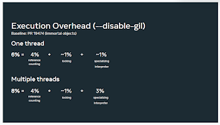

The Global Interpreter Lock (“GIL”), is one of the most fundamental parts of how Python works today. It’s also one of the most controversial parts, as it prevents true concurrency between threads – another way of saying that it’s difficult to run two functions simultaneously while writing pure-Python code.

If there’s one blog that really “took off” after I wrote last year’s coverage on the Python Language Summit, it was [my blog on Sam Gross’s proposal to make Python’s Global Interpreter Lock (the “GIL”) optional](https://pyfound.blogspot.com/2022/05/the-2022-python-language-summit-python_11.html). One week following the publication of my articles, the blog had been viewed nearly 38,000 times; the blog in “second place” had only been viewed 5,300 times.

Interest in removing the GIL is clear, therefore – and this year, Gross returned to the [Python Language Summit](https://pyfound.blogspot.com/2023/05/the-python-language-summit-2023_29.html) to discuss the development of his plans.

## Dare to dream of a GIL-free world

Gross started off by giving an update on how work on `nogil` – Gross’s fork of CPython with the GIL removed – had progressed over the past year. Gross had been spending the last few months rebasing his fork onto CPython 3.12. As a result, he was now able to give an accurate estimate of how bad the performance costs to single-threaded code would be, if the GIL were removed.

Over the past year, Gross had also written a PEP – [PEP 703](https://peps.python.org/pep-0703/) – which, following the Language Summit, was [submitted to the Steering Council for their consideration](https://github.com/python/steering-council/issues/188) on May 12. If the PEP is accepted by the Steering Council, a version of Python with the GIL disabled could be available as soon as Python 3.13. (To discuss the ideas in the PEP, head to [the thread on discuss.python.org](https://discuss.python.org/t/pep-703-making-the-global-interpreter-lock-optional-3-12-updates/26503/1).)

Gross reported that the latest version of `nogil` was around 6% slower on single-threaded code than the CPython `main` branch, and that he was confident that the performance overhead could be reduced even further, possibly to nearly 0%. Most of the overhead was due to reference counting and changes that had been required to the operation of CPython’s new-in-3.11 [specialising adaptive interpreter](https://pyfound.blogspot.com/2022/05/the-2022-python-language-summit_2.html). With multiple threads, the performance overhead was around 8%.

  

<table align="center" cellpadding="0" cellspacing="0"><tbody><tr><td></td></tr><tr><td>A slide from Gross's talk (numbers indicate the per-thread overhead)</td></tr></tbody></table>

  

Having rebased onto Python 3.12, Gross was also able to give an estimate on the extent of the code changes that would be required to CPython, were `nogil` to be accepted. Excluding generated files, Gross reported that around 15,000 lines of code would need to be changed. There would also need to be some alterations to [mimalloc](https://github.com/microsoft/mimalloc), which `nogil` depends on – but Gross was hopeful that these would be accepted to mimalloc itself, reducing the need for CPython to maintain mimalloc patches in its codebase.

Some audience members expressed concern about the prospect of “`#ifdef` hell” across the code base, to account for the two possible CPython build options. However, Gross countered that most of the changes required could be made unconditionally without resorting to `#ifdef`s, since the changes were simply no-ops with the GIL enabled.

The plan for `nogil` remains that it would be enabled via a compile-time flag, named `--disable-gil`. Third-party C extensions would need to provide separate wheels for GIL-disabled Python.

## GIL gotta go

Last year, it felt as though Gross’s proposal was met with a certain degree of excitement, but also a certain degree of scepticism. It was thrilling to see how far `nogil` had come, but there was a certain amount of frustration in the room at the lack of a concrete plan for where to go next.

This year, it felt like the proposal was greeted much more warmly. Gross had come to the summit with a far more clearly defined roadmap for how we might get to `nogil`, and had taken the time to put together detailed estimates of the performance impact and the extent of the code changes.

> “Thank you for doing this… now we have something we can actually consider!”

> \-- *Brandt Bucher, CPython Core Developer*

Attendees at the Language Summit were also impressed at how low the performance overhead of `nogil` was, although Mark Shannon commented that he thought the numbers might be “a slight underestimate”. Gross explained that he had managed to achieve a 2-3% speedup by optimising for the case where only a single thread was active. Even in multithreaded programs, he explained, this provided a performance boost, since even in multithreaded code, it was often the case that only a single thread would be attempting to access an object at any given point in time.

Larry Hastings expressed concern that `nogil` might make debugging code harder; Gross responded that there was some impact on debuggability, but that it wasn’t too bad, in his opinion. Pablo Galindo Salgado, release manager for Python 3.10 and 3.11, expressed concern that `nogil` could also make implementing debuggers trickier – but commented that “it might be worth the price” anyway.

Another point of discussion was the changes Gross had made to [the specialising adaptive interpreter](https://peps.python.org/pep-0659/) in the `nogil` fork. In order for the specialisations to work with the GIL disabled, Gross had had to guard the adaptive specialisations to the bytecode behind a lock. As well as this, each thread had been limited to a single specialisation of any given bytecode; with the GIL enabled, the adaptive interpreter can respecialise bytecode multiple times. Gross commented that he thought it would probably be possible to allow multiple specialisations of bytecode in multithreaded code, but that this would require further investigation. His current solution was the simplest one he had found, for now.
