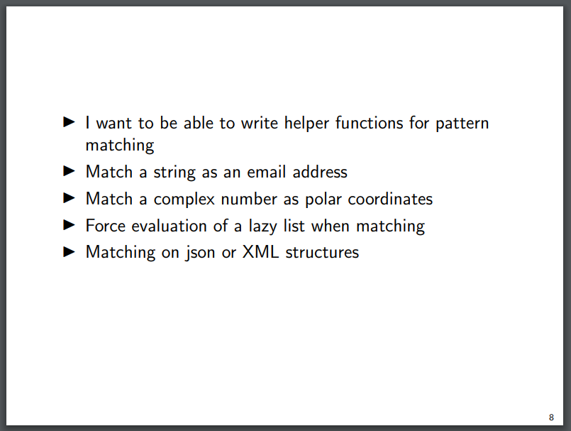
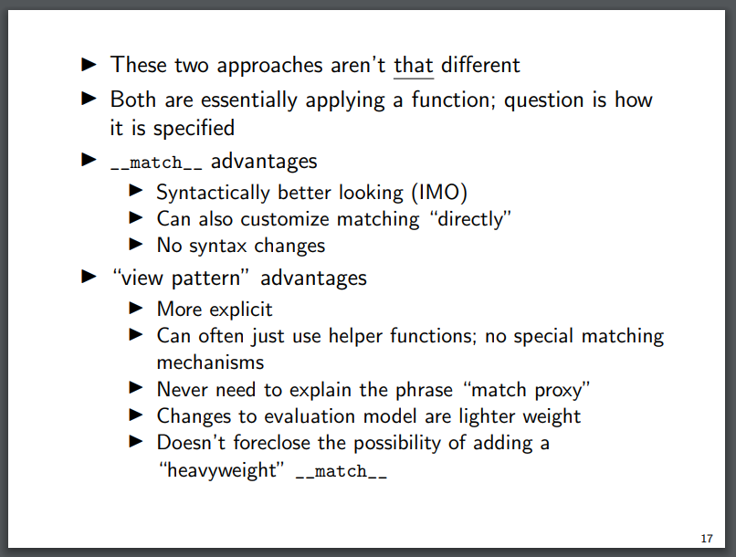

One of the most exciting new features in Python 3.10 was [the introduction of pattern matching](https://docs.python.org/3/whatsnew/3.10.html#pep-634-structural-pattern-matching) (introduced in PEPs [634](https://peps.python.org/pep-0634/), [635](https://peps.python.org/pep-0635/) and [636](https://peps.python.org/pep-0636/)). Pattern matching has a wide variety of uses, but really shines in situations where you need to undergo complex destructurings of tree-like datastructures.

That’s a lot of words which may or may not mean very much to you – but consider, for example, using [the `ast` module](https://docs.python.org/3/library/ast.html) to parse Python source code. If you’re unfamiliar with the `ast` module: the module provides tools that enable you to compile Python source code into an “abstract syntax tree” (AST) representing the code’s structure. The Python interpreter itself converts Python source code into an AST in order to understand how to run that code – but parsing Python source code using ASTs is also a common task for linters, such as plugins for [flake8](https://flake8.pycqa.org/en/latest/) or [pylint](https://www.pylint.org). In the following example, `ast.parse()` is used to parse the source code `x = 42` into an `ast.Module` node, and `ast.dump()` is then used to reveal the tree-like structure of that node in a human-readable form:

  

\>>> import ast
>>> source = "x = 42"
>>> node = ast.parse(source)
>>> node
<ast.Module object at 0x000002A70F928D80>
>>> print(ast.dump(node, indent=2))
Module(
  body=\[
    Assign(
      targets=\[
        Name(id='x', ctx=Store())\],
      value=Constant(value=42))\],
  type\_ignores=\[\])

pre { line-height: 125%; } td.linenos .normal { color: inherit; background-color: transparent; padding-left: 5px; padding-right: 5px; } span.linenos { color: inherit; background-color: transparent; padding-left: 5px; padding-right: 5px; } td.linenos .special { color: #000000; background-color: #ffffc0; padding-left: 5px; padding-right: 5px; } span.linenos.special { color: #000000; background-color: #ffffc0; padding-left: 5px; padding-right: 5px; } .demo-highlight .hll { background-color: #ffffcc } .demo-highlight { background: #ffffff; } .demo-highlight .c { color: #008800; font-style: italic } /\* Comment \*/ .demo-highlight .err { color: #a61717; background-color: #e3d2d2 } /\* Error \*/ .demo-highlight .g { color: #2c2cff } /\* Generic \*/ .demo-highlight .k { color: #2c2cff } /\* Keyword \*/ .demo-highlight .x { background-color: #ffffe0 } /\* Other \*/ .demo-highlight .ch { color: #008800; font-style: italic } /\* Comment.Hashbang \*/ .demo-highlight .cm { color: #008800; font-style: italic } /\* Comment.Multiline \*/ .demo-highlight .cp { color: #008800; font-style: italic } /\* Comment.Preproc \*/ .demo-highlight .cpf { color: #008800; font-style: italic } /\* Comment.PreprocFile \*/ .demo-highlight .c1 { color: #008800; font-style: italic } /\* Comment.Single \*/ .demo-highlight .cs { color: #008800; font-style: italic } /\* Comment.Special \*/ .demo-highlight .gd { color: #2c2cff } /\* Generic.Deleted \*/ .demo-highlight .ge { color: #008800 } /\* Generic.Emph \*/ .demo-highlight .ges { color: #2c2cff } /\* Generic.EmphStrong \*/ .demo-highlight .gr { color: #d30202 } /\* Generic.Error \*/ .demo-highlight .gh { color: #2c2cff } /\* Generic.Heading \*/ .demo-highlight .gi { color: #2c2cff } /\* Generic.Inserted \*/ .demo-highlight .go { color: #2c2cff } /\* Generic.Output \*/ .demo-highlight .gp { color: #2c2cff } /\* Generic.Prompt \*/ .demo-highlight .gs { color: #2c2cff } /\* Generic.Strong \*/ .demo-highlight .gu { color: #2c2cff } /\* Generic.Subheading \*/ .demo-highlight .gt { color: #2c2cff } /\* Generic.Traceback \*/ .demo-highlight .kc { color: #2c2cff; font-weight: bold } /\* Keyword.Constant \*/ .demo-highlight .kd { color: #2c2cff } /\* Keyword.Declaration \*/ .demo-highlight .kn { color: #2c2cff } /\* Keyword.Namespace \*/ .demo-highlight .kp { color: #2c2cff } /\* Keyword.Pseudo \*/ .demo-highlight .kr { color: #353580; font-weight: bold } /\* Keyword.Reserved \*/ .demo-highlight .kt { color: #2c2cff } /\* Keyword.Type \*/ .demo-highlight .m { color: #2c8553; font-weight: bold } /\* Literal.Number \*/ .demo-highlight .s { color: #800080 } /\* Literal.String \*/ .demo-highlight .nb { color: #2c2cff } /\* Name.Builtin \*/ .demo-highlight .nf { font-weight: bold; font-style: italic } /\* Name.Function \*/ .demo-highlight .nv { color: #2c2cff; font-weight: bold } /\* Name.Variable \*/ .demo-highlight .w { color: #bbbbbb } /\* Text.Whitespace \*/ .demo-highlight .mb { color: #2c8553; font-weight: bold } /\* Literal.Number.Bin \*/ .demo-highlight .mf { color: #2c8553; font-weight: bold } /\* Literal.Number.Float \*/ .demo-highlight .mh { color: #2c8553; font-weight: bold } /\* Literal.Number.Hex \*/ .demo-highlight .mi { color: #2c8553; font-weight: bold } /\* Literal.Number.Integer \*/ .demo-highlight .mo { color: #2c8553; font-weight: bold } /\* Literal.Number.Oct \*/ .demo-highlight .sa { color: #800080 } /\* Literal.String.Affix \*/ .demo-highlight .sb { color: #800080 } /\* Literal.String.Backtick \*/ .demo-highlight .sc { color: #800080 } /\* Literal.String.Char \*/ .demo-highlight .dl { color: #800080 } /\* Literal.String.Delimiter \*/ .demo-highlight .sd { color: #800080 } /\* Literal.String.Doc \*/ .demo-highlight .s2 { color: #800080 } /\* Literal.String.Double \*/ .demo-highlight .se { color: #800080 } /\* Literal.String.Escape \*/ .demo-highlight .sh { color: #800080 } /\* Literal.String.Heredoc \*/ .demo-highlight .si { color: #800080 } /\* Literal.String.Interpol \*/ .demo-highlight .sx { color: #800080 } /\* Literal.String.Other \*/ .demo-highlight .sr { color: #800080 } /\* Literal.String.Regex \*/ .demo-highlight .s1 { color: #800080 } /\* Literal.String.Single \*/ .demo-highlight .ss { color: #800080 } /\* Literal.String.Symbol \*/ .demo-highlight .bp { color: #2c2cff } /\* Name.Builtin.Pseudo \*/ .demo-highlight .fm { font-weight: bold; font-style: italic } /\* Name.Function.Magic \*/ .demo-highlight .vc { color: #2c2cff; font-weight: bold } /\* Name.Variable.Class \*/ .demo-highlight .vg { color: #2c2cff; font-weight: bold } /\* Name.Variable.Global \*/ .demo-highlight .vi { color: #2c2cff; font-weight: bold } /\* Name.Variable.Instance \*/ .demo-highlight .vm { color: #2c2cff; font-weight: bold } /\* Name.Variable.Magic \*/ .demo-highlight .il { color: #2c8553; font-weight: bold } /\* Literal.Number.Integer.Long \*/

How does working with ASTs relate to pattern-matching? Well, a function to determine whether (to a reasonable approximation) an arbitrary AST node represents the symbol `collections.deque` might have looked something like this, before pattern matching…

  

import ast

# This obviously won't work if the symbol is imported with an alias
# in the source code we're inspecting
# (e.g. "from collections import deque as d").
# But let's not worry about that here :-)

def node\_represents\_collections\_dot\_deque(node: ast.AST) -> bool:
    """Determine if \*node\* represents 'deque' or 'collections.deque'"""
    return (
        isinstance(node, ast.Name) and node.id == "deque"
    ) or (
        isinstance(node, ast.Attribute)
        and isinstance(node.value, ast.Name)
        and node.value.id == "collections"
        and node.value.attr == "deque"
    )

pre { line-height: 125%; } td.linenos .normal { color: inherit; background-color: transparent; padding-left: 5px; padding-right: 5px; } span.linenos { color: inherit; background-color: transparent; padding-left: 5px; padding-right: 5px; } td.linenos .special { color: #000000; background-color: #ffffc0; padding-left: 5px; padding-right: 5px; } span.linenos.special { color: #000000; background-color: #ffffc0; padding-left: 5px; padding-right: 5px; } .demo-highlight .hll { background-color: #ffffcc } .demo-highlight { background: #ffffff; } .demo-highlight .c { color: #008800; font-style: italic } /\* Comment \*/ .demo-highlight .err { color: #a61717; background-color: #e3d2d2 } /\* Error \*/ .demo-highlight .g { color: #2c2cff } /\* Generic \*/ .demo-highlight .k { color: #2c2cff } /\* Keyword \*/ .demo-highlight .x { background-color: #ffffe0 } /\* Other \*/ .demo-highlight .ch { color: #008800; font-style: italic } /\* Comment.Hashbang \*/ .demo-highlight .cm { color: #008800; font-style: italic } /\* Comment.Multiline \*/ .demo-highlight .cp { color: #008800; font-style: italic } /\* Comment.Preproc \*/ .demo-highlight .cpf { color: #008800; font-style: italic } /\* Comment.PreprocFile \*/ .demo-highlight .c1 { color: #008800; font-style: italic } /\* Comment.Single \*/ .demo-highlight .cs { color: #008800; font-style: italic } /\* Comment.Special \*/ .demo-highlight .gd { color: #2c2cff } /\* Generic.Deleted \*/ .demo-highlight .ge { color: #008800 } /\* Generic.Emph \*/ .demo-highlight .ges { color: #2c2cff } /\* Generic.EmphStrong \*/ .demo-highlight .gr { color: #d30202 } /\* Generic.Error \*/ .demo-highlight .gh { color: #2c2cff } /\* Generic.Heading \*/ .demo-highlight .gi { color: #2c2cff } /\* Generic.Inserted \*/ .demo-highlight .go { color: #2c2cff } /\* Generic.Output \*/ .demo-highlight .gp { color: #2c2cff } /\* Generic.Prompt \*/ .demo-highlight .gs { color: #2c2cff } /\* Generic.Strong \*/ .demo-highlight .gu { color: #2c2cff } /\* Generic.Subheading \*/ .demo-highlight .gt { color: #2c2cff } /\* Generic.Traceback \*/ .demo-highlight .kc { color: #2c2cff; font-weight: bold } /\* Keyword.Constant \*/ .demo-highlight .kd { color: #2c2cff } /\* Keyword.Declaration \*/ .demo-highlight .kn { color: #2c2cff } /\* Keyword.Namespace \*/ .demo-highlight .kp { color: #2c2cff } /\* Keyword.Pseudo \*/ .demo-highlight .kr { color: #353580; font-weight: bold } /\* Keyword.Reserved \*/ .demo-highlight .kt { color: #2c2cff } /\* Keyword.Type \*/ .demo-highlight .m { color: #2c8553; font-weight: bold } /\* Literal.Number \*/ .demo-highlight .s { color: #800080 } /\* Literal.String \*/ .demo-highlight .nb { color: #2c2cff } /\* Name.Builtin \*/ .demo-highlight .nf { font-weight: bold; font-style: italic } /\* Name.Function \*/ .demo-highlight .nv { color: #2c2cff; font-weight: bold } /\* Name.Variable \*/ .demo-highlight .w { color: #bbbbbb } /\* Text.Whitespace \*/ .demo-highlight .mb { color: #2c8553; font-weight: bold } /\* Literal.Number.Bin \*/ .demo-highlight .mf { color: #2c8553; font-weight: bold } /\* Literal.Number.Float \*/ .demo-highlight .mh { color: #2c8553; font-weight: bold } /\* Literal.Number.Hex \*/ .demo-highlight .mi { color: #2c8553; font-weight: bold } /\* Literal.Number.Integer \*/ .demo-highlight .mo { color: #2c8553; font-weight: bold } /\* Literal.Number.Oct \*/ .demo-highlight .sa { color: #800080 } /\* Literal.String.Affix \*/ .demo-highlight .sb { color: #800080 } /\* Literal.String.Backtick \*/ .demo-highlight .sc { color: #800080 } /\* Literal.String.Char \*/ .demo-highlight .dl { color: #800080 } /\* Literal.String.Delimiter \*/ .demo-highlight .sd { color: #800080 } /\* Literal.String.Doc \*/ .demo-highlight .s2 { color: #800080 } /\* Literal.String.Double \*/ .demo-highlight .se { color: #800080 } /\* Literal.String.Escape \*/ .demo-highlight .sh { color: #800080 } /\* Literal.String.Heredoc \*/ .demo-highlight .si { color: #800080 } /\* Literal.String.Interpol \*/ .demo-highlight .sx { color: #800080 } /\* Literal.String.Other \*/ .demo-highlight .sr { color: #800080 } /\* Literal.String.Regex \*/ .demo-highlight .s1 { color: #800080 } /\* Literal.String.Single \*/ .demo-highlight .ss { color: #800080 } /\* Literal.String.Symbol \*/ .demo-highlight .bp { color: #2c2cff } /\* Name.Builtin.Pseudo \*/ .demo-highlight .fm { font-weight: bold; font-style: italic } /\* Name.Function.Magic \*/ .demo-highlight .vc { color: #2c2cff; font-weight: bold } /\* Name.Variable.Class \*/ .demo-highlight .vg { color: #2c2cff; font-weight: bold } /\* Name.Variable.Global \*/ .demo-highlight .vi { color: #2c2cff; font-weight: bold } /\* Name.Variable.Instance \*/ .demo-highlight .vm { color: #2c2cff; font-weight: bold } /\* Name.Variable.Magic \*/ .demo-highlight .il { color: #2c8553; font-weight: bold } /\* Literal.Number.Integer.Long \*/

But in Python 3.10, pattern matching allows an elegant destructuring syntax:

  

import ast

def node\_represents\_collections\_dot\_deque(node: ast.AST) -> bool:
    """Determine if \*node\* represents 'deque' or 'collections.deque'"""
    match node:
        case ast.Name("deque"):
            return True
        case ast.Attribute(ast.Name("collections"), "deque"):
            return True
        case \_:
            return False

pre { line-height: 125%; } td.linenos .normal { color: inherit; background-color: transparent; padding-left: 5px; padding-right: 5px; } span.linenos { color: inherit; background-color: transparent; padding-left: 5px; padding-right: 5px; } td.linenos .special { color: #000000; background-color: #ffffc0; padding-left: 5px; padding-right: 5px; } span.linenos.special { color: #000000; background-color: #ffffc0; padding-left: 5px; padding-right: 5px; } .demo-highlight .hll { background-color: #ffffcc } .demo-highlight { background: #ffffff; } .demo-highlight .c { color: #008800; font-style: italic } /\* Comment \*/ .demo-highlight .err { color: #a61717; background-color: #e3d2d2 } /\* Error \*/ .demo-highlight .g { color: #2c2cff } /\* Generic \*/ .demo-highlight .k { color: #2c2cff } /\* Keyword \*/ .demo-highlight .x { background-color: #ffffe0 } /\* Other \*/ .demo-highlight .ch { color: #008800; font-style: italic } /\* Comment.Hashbang \*/ .demo-highlight .cm { color: #008800; font-style: italic } /\* Comment.Multiline \*/ .demo-highlight .cp { color: #008800; font-style: italic } /\* Comment.Preproc \*/ .demo-highlight .cpf { color: #008800; font-style: italic } /\* Comment.PreprocFile \*/ .demo-highlight .c1 { color: #008800; font-style: italic } /\* Comment.Single \*/ .demo-highlight .cs { color: #008800; font-style: italic } /\* Comment.Special \*/ .demo-highlight .gd { color: #2c2cff } /\* Generic.Deleted \*/ .demo-highlight .ge { color: #008800 } /\* Generic.Emph \*/ .demo-highlight .ges { color: #2c2cff } /\* Generic.EmphStrong \*/ .demo-highlight .gr { color: #d30202 } /\* Generic.Error \*/ .demo-highlight .gh { color: #2c2cff } /\* Generic.Heading \*/ .demo-highlight .gi { color: #2c2cff } /\* Generic.Inserted \*/ .demo-highlight .go { color: #2c2cff } /\* Generic.Output \*/ .demo-highlight .gp { color: #2c2cff } /\* Generic.Prompt \*/ .demo-highlight .gs { color: #2c2cff } /\* Generic.Strong \*/ .demo-highlight .gu { color: #2c2cff } /\* Generic.Subheading \*/ .demo-highlight .gt { color: #2c2cff } /\* Generic.Traceback \*/ .demo-highlight .kc { color: #2c2cff; font-weight: bold } /\* Keyword.Constant \*/ .demo-highlight .kd { color: #2c2cff } /\* Keyword.Declaration \*/ .demo-highlight .kn { color: #2c2cff } /\* Keyword.Namespace \*/ .demo-highlight .kp { color: #2c2cff } /\* Keyword.Pseudo \*/ .demo-highlight .kr { color: #353580; font-weight: bold } /\* Keyword.Reserved \*/ .demo-highlight .kt { color: #2c2cff } /\* Keyword.Type \*/ .demo-highlight .m { color: #2c8553; font-weight: bold } /\* Literal.Number \*/ .demo-highlight .s { color: #800080 } /\* Literal.String \*/ .demo-highlight .nb { color: #2c2cff } /\* Name.Builtin \*/ .demo-highlight .nf { font-weight: bold; font-style: italic } /\* Name.Function \*/ .demo-highlight .nv { color: #2c2cff; font-weight: bold } /\* Name.Variable \*/ .demo-highlight .w { color: #bbbbbb } /\* Text.Whitespace \*/ .demo-highlight .mb { color: #2c8553; font-weight: bold } /\* Literal.Number.Bin \*/ .demo-highlight .mf { color: #2c8553; font-weight: bold } /\* Literal.Number.Float \*/ .demo-highlight .mh { color: #2c8553; font-weight: bold } /\* Literal.Number.Hex \*/ .demo-highlight .mi { color: #2c8553; font-weight: bold } /\* Literal.Number.Integer \*/ .demo-highlight .mo { color: #2c8553; font-weight: bold } /\* Literal.Number.Oct \*/ .demo-highlight .sa { color: #800080 } /\* Literal.String.Affix \*/ .demo-highlight .sb { color: #800080 } /\* Literal.String.Backtick \*/ .demo-highlight .sc { color: #800080 } /\* Literal.String.Char \*/ .demo-highlight .dl { color: #800080 } /\* Literal.String.Delimiter \*/ .demo-highlight .sd { color: #800080 } /\* Literal.String.Doc \*/ .demo-highlight .s2 { color: #800080 } /\* Literal.String.Double \*/ .demo-highlight .se { color: #800080 } /\* Literal.String.Escape \*/ .demo-highlight .sh { color: #800080 } /\* Literal.String.Heredoc \*/ .demo-highlight .si { color: #800080 } /\* Literal.String.Interpol \*/ .demo-highlight .sx { color: #800080 } /\* Literal.String.Other \*/ .demo-highlight .sr { color: #800080 } /\* Literal.String.Regex \*/ .demo-highlight .s1 { color: #800080 } /\* Literal.String.Single \*/ .demo-highlight .ss { color: #800080 } /\* Literal.String.Symbol \*/ .demo-highlight .bp { color: #2c2cff } /\* Name.Builtin.Pseudo \*/ .demo-highlight .fm { font-weight: bold; font-style: italic } /\* Name.Function.Magic \*/ .demo-highlight .vc { color: #2c2cff; font-weight: bold } /\* Name.Variable.Class \*/ .demo-highlight .vg { color: #2c2cff; font-weight: bold } /\* Name.Variable.Global \*/ .demo-highlight .vi { color: #2c2cff; font-weight: bold } /\* Name.Variable.Instance \*/ .demo-highlight .vm { color: #2c2cff; font-weight: bold } /\* Name.Variable.Magic \*/ .demo-highlight .il { color: #2c8553; font-weight: bold } /\* Literal.Number.Integer.Long \*/

I know which one *I* prefer.

For some, though, this still isn’t enough – and Michael “Sully” Sullivan is one of them. At the [Python Language Summit 2023](https://pyfound.blogspot.com/2023/05/the-python-language-summit-2023_29.html), Sullivan shared ideas for where pattern matching could go next.

  

* * *

## Playing with matches ([without getting burned](https://www.youtube.com/watch?v=DJeMfTdvVo8))

Sullivan’s contention is that, while pattern matching provides elegant syntactic sugar in simple cases such as the one above, our ability to chain destructurings using pattern matching is currently fairly limited. For example, say we want to write a function inspecting Python AST that takes an `ast.FunctionDef` node and identifies whether the node represents a synchronous function with exactly two parameters, both of them annotated as accepting integers. The function would behave so that the following holds true:

  

\>>> import ast
>>> source = "def add\_2(number1: int, number2: int): pass"
>>> node = ast.parse(source).body\[0\]
>>> type(node)
<class 'ast.FunctionDef'>
>>> is\_function\_taking\_two\_ints(node)
True

pre { line-height: 125%; } td.linenos .normal { color: inherit; background-color: transparent; padding-left: 5px; padding-right: 5px; } span.linenos { color: inherit; background-color: transparent; padding-left: 5px; padding-right: 5px; } td.linenos .special { color: #000000; background-color: #ffffc0; padding-left: 5px; padding-right: 5px; } span.linenos.special { color: #000000; background-color: #ffffc0; padding-left: 5px; padding-right: 5px; } .demo-highlight .hll { background-color: #ffffcc } .demo-highlight { background: #ffffff; } .demo-highlight .c { color: #008800; font-style: italic } /\* Comment \*/ .demo-highlight .err { color: #a61717; background-color: #e3d2d2 } /\* Error \*/ .demo-highlight .g { color: #2c2cff } /\* Generic \*/ .demo-highlight .k { color: #2c2cff } /\* Keyword \*/ .demo-highlight .x { background-color: #ffffe0 } /\* Other \*/ .demo-highlight .ch { color: #008800; font-style: italic } /\* Comment.Hashbang \*/ .demo-highlight .cm { color: #008800; font-style: italic } /\* Comment.Multiline \*/ .demo-highlight .cp { color: #008800; font-style: italic } /\* Comment.Preproc \*/ .demo-highlight .cpf { color: #008800; font-style: italic } /\* Comment.PreprocFile \*/ .demo-highlight .c1 { color: #008800; font-style: italic } /\* Comment.Single \*/ .demo-highlight .cs { color: #008800; font-style: italic } /\* Comment.Special \*/ .demo-highlight .gd { color: #2c2cff } /\* Generic.Deleted \*/ .demo-highlight .ge { color: #008800 } /\* Generic.Emph \*/ .demo-highlight .ges { color: #2c2cff } /\* Generic.EmphStrong \*/ .demo-highlight .gr { color: #d30202 } /\* Generic.Error \*/ .demo-highlight .gh { color: #2c2cff } /\* Generic.Heading \*/ .demo-highlight .gi { color: #2c2cff } /\* Generic.Inserted \*/ .demo-highlight .go { color: #2c2cff } /\* Generic.Output \*/ .demo-highlight .gp { color: #2c2cff } /\* Generic.Prompt \*/ .demo-highlight .gs { color: #2c2cff } /\* Generic.Strong \*/ .demo-highlight .gu { color: #2c2cff } /\* Generic.Subheading \*/ .demo-highlight .gt { color: #2c2cff } /\* Generic.Traceback \*/ .demo-highlight .kc { color: #2c2cff; font-weight: bold } /\* Keyword.Constant \*/ .demo-highlight .kd { color: #2c2cff } /\* Keyword.Declaration \*/ .demo-highlight .kn { color: #2c2cff } /\* Keyword.Namespace \*/ .demo-highlight .kp { color: #2c2cff } /\* Keyword.Pseudo \*/ .demo-highlight .kr { color: #353580; font-weight: bold } /\* Keyword.Reserved \*/ .demo-highlight .kt { color: #2c2cff } /\* Keyword.Type \*/ .demo-highlight .m { color: #2c8553; font-weight: bold } /\* Literal.Number \*/ .demo-highlight .s { color: #800080 } /\* Literal.String \*/ .demo-highlight .nb { color: #2c2cff } /\* Name.Builtin \*/ .demo-highlight .nf { font-weight: bold; font-style: italic } /\* Name.Function \*/ .demo-highlight .nv { color: #2c2cff; font-weight: bold } /\* Name.Variable \*/ .demo-highlight .w { color: #bbbbbb } /\* Text.Whitespace \*/ .demo-highlight .mb { color: #2c8553; font-weight: bold } /\* Literal.Number.Bin \*/ .demo-highlight .mf { color: #2c8553; font-weight: bold } /\* Literal.Number.Float \*/ .demo-highlight .mh { color: #2c8553; font-weight: bold } /\* Literal.Number.Hex \*/ .demo-highlight .mi { color: #2c8553; font-weight: bold } /\* Literal.Number.Integer \*/ .demo-highlight .mo { color: #2c8553; font-weight: bold } /\* Literal.Number.Oct \*/ .demo-highlight .sa { color: #800080 } /\* Literal.String.Affix \*/ .demo-highlight .sb { color: #800080 } /\* Literal.String.Backtick \*/ .demo-highlight .sc { color: #800080 } /\* Literal.String.Char \*/ .demo-highlight .dl { color: #800080 } /\* Literal.String.Delimiter \*/ .demo-highlight .sd { color: #800080 } /\* Literal.String.Doc \*/ .demo-highlight .s2 { color: #800080 } /\* Literal.String.Double \*/ .demo-highlight .se { color: #800080 } /\* Literal.String.Escape \*/ .demo-highlight .sh { color: #800080 } /\* Literal.String.Heredoc \*/ .demo-highlight .si { color: #800080 } /\* Literal.String.Interpol \*/ .demo-highlight .sx { color: #800080 } /\* Literal.String.Other \*/ .demo-highlight .sr { color: #800080 } /\* Literal.String.Regex \*/ .demo-highlight .s1 { color: #800080 } /\* Literal.String.Single \*/ .demo-highlight .ss { color: #800080 } /\* Literal.String.Symbol \*/ .demo-highlight .bp { color: #2c2cff } /\* Name.Builtin.Pseudo \*/ .demo-highlight .fm { font-weight: bold; font-style: italic } /\* Name.Function.Magic \*/ .demo-highlight .vc { color: #2c2cff; font-weight: bold } /\* Name.Variable.Class \*/ .demo-highlight .vg { color: #2c2cff; font-weight: bold } /\* Name.Variable.Global \*/ .demo-highlight .vi { color: #2c2cff; font-weight: bold } /\* Name.Variable.Instance \*/ .demo-highlight .vm { color: #2c2cff; font-weight: bold } /\* Name.Variable.Magic \*/ .demo-highlight .il { color: #2c8553; font-weight: bold } /\* Literal.Number.Integer.Long \*/

With pre-pattern-matching syntax, we might have written such a function like this:

  

def is\_int(node: ast.AST | None) -> bool:
    """Determine if \*node\* represents 'int' or 'builtins.int'"""
    return (
        isinstance(node, ast.Name) and node.id == "int"
    ) or (
        isinstance(node, ast.Attribute)
        and isinstance(node.value, ast.Name)
        and node.value.id == "builtins"
        and node.attr == "int"
    )

def is\_function\_taking\_two\_ints(node: ast.FunctionDef) -> bool:
    """Determine if \*node\* represents a function that accepts two ints"""
    args = node.args.posonlyargs + node.args.args
    return len(args) == 2 and all(is\_int(node.annotation) for node in args)

pre { line-height: 125%; } td.linenos .normal { color: inherit; background-color: transparent; padding-left: 5px; padding-right: 5px; } span.linenos { color: inherit; background-color: transparent; padding-left: 5px; padding-right: 5px; } td.linenos .special { color: #000000; background-color: #ffffc0; padding-left: 5px; padding-right: 5px; } span.linenos.special { color: #000000; background-color: #ffffc0; padding-left: 5px; padding-right: 5px; } .demo-highlight .hll { background-color: #ffffcc } .demo-highlight { background: #ffffff; } .demo-highlight .c { color: #008800; font-style: italic } /\* Comment \*/ .demo-highlight .err { color: #a61717; background-color: #e3d2d2 } /\* Error \*/ .demo-highlight .g { color: #2c2cff } /\* Generic \*/ .demo-highlight .k { color: #2c2cff } /\* Keyword \*/ .demo-highlight .x { background-color: #ffffe0 } /\* Other \*/ .demo-highlight .ch { color: #008800; font-style: italic } /\* Comment.Hashbang \*/ .demo-highlight .cm { color: #008800; font-style: italic } /\* Comment.Multiline \*/ .demo-highlight .cp { color: #008800; font-style: italic } /\* Comment.Preproc \*/ .demo-highlight .cpf { color: #008800; font-style: italic } /\* Comment.PreprocFile \*/ .demo-highlight .c1 { color: #008800; font-style: italic } /\* Comment.Single \*/ .demo-highlight .cs { color: #008800; font-style: italic } /\* Comment.Special \*/ .demo-highlight .gd { color: #2c2cff } /\* Generic.Deleted \*/ .demo-highlight .ge { color: #008800 } /\* Generic.Emph \*/ .demo-highlight .ges { color: #2c2cff } /\* Generic.EmphStrong \*/ .demo-highlight .gr { color: #d30202 } /\* Generic.Error \*/ .demo-highlight .gh { color: #2c2cff } /\* Generic.Heading \*/ .demo-highlight .gi { color: #2c2cff } /\* Generic.Inserted \*/ .demo-highlight .go { color: #2c2cff } /\* Generic.Output \*/ .demo-highlight .gp { color: #2c2cff } /\* Generic.Prompt \*/ .demo-highlight .gs { color: #2c2cff } /\* Generic.Strong \*/ .demo-highlight .gu { color: #2c2cff } /\* Generic.Subheading \*/ .demo-highlight .gt { color: #2c2cff } /\* Generic.Traceback \*/ .demo-highlight .kc { color: #2c2cff; font-weight: bold } /\* Keyword.Constant \*/ .demo-highlight .kd { color: #2c2cff } /\* Keyword.Declaration \*/ .demo-highlight .kn { color: #2c2cff } /\* Keyword.Namespace \*/ .demo-highlight .kp { color: #2c2cff } /\* Keyword.Pseudo \*/ .demo-highlight .kr { color: #353580; font-weight: bold } /\* Keyword.Reserved \*/ .demo-highlight .kt { color: #2c2cff } /\* Keyword.Type \*/ .demo-highlight .m { color: #2c8553; font-weight: bold } /\* Literal.Number \*/ .demo-highlight .s { color: #800080 } /\* Literal.String \*/ .demo-highlight .nb { color: #2c2cff } /\* Name.Builtin \*/ .demo-highlight .nf { font-weight: bold; font-style: italic } /\* Name.Function \*/ .demo-highlight .nv { color: #2c2cff; font-weight: bold } /\* Name.Variable \*/ .demo-highlight .w { color: #bbbbbb } /\* Text.Whitespace \*/ .demo-highlight .mb { color: #2c8553; font-weight: bold } /\* Literal.Number.Bin \*/ .demo-highlight .mf { color: #2c8553; font-weight: bold } /\* Literal.Number.Float \*/ .demo-highlight .mh { color: #2c8553; font-weight: bold } /\* Literal.Number.Hex \*/ .demo-highlight .mi { color: #2c8553; font-weight: bold } /\* Literal.Number.Integer \*/ .demo-highlight .mo { color: #2c8553; font-weight: bold } /\* Literal.Number.Oct \*/ .demo-highlight .sa { color: #800080 } /\* Literal.String.Affix \*/ .demo-highlight .sb { color: #800080 } /\* Literal.String.Backtick \*/ .demo-highlight .sc { color: #800080 } /\* Literal.String.Char \*/ .demo-highlight .dl { color: #800080 } /\* Literal.String.Delimiter \*/ .demo-highlight .sd { color: #800080 } /\* Literal.String.Doc \*/ .demo-highlight .s2 { color: #800080 } /\* Literal.String.Double \*/ .demo-highlight .se { color: #800080 } /\* Literal.String.Escape \*/ .demo-highlight .sh { color: #800080 } /\* Literal.String.Heredoc \*/ .demo-highlight .si { color: #800080 } /\* Literal.String.Interpol \*/ .demo-highlight .sx { color: #800080 } /\* Literal.String.Other \*/ .demo-highlight .sr { color: #800080 } /\* Literal.String.Regex \*/ .demo-highlight .s1 { color: #800080 } /\* Literal.String.Single \*/ .demo-highlight .ss { color: #800080 } /\* Literal.String.Symbol \*/ .demo-highlight .bp { color: #2c2cff } /\* Name.Builtin.Pseudo \*/ .demo-highlight .fm { font-weight: bold; font-style: italic } /\* Name.Function.Magic \*/ .demo-highlight .vc { color: #2c2cff; font-weight: bold } /\* Name.Variable.Class \*/ .demo-highlight .vg { color: #2c2cff; font-weight: bold } /\* Name.Variable.Global \*/ .demo-highlight .vi { color: #2c2cff; font-weight: bold } /\* Name.Variable.Instance \*/ .demo-highlight .vm { color: #2c2cff; font-weight: bold } /\* Name.Variable.Magic \*/ .demo-highlight .il { color: #2c8553; font-weight: bold } /\* Literal.Number.Integer.Long \*/ If we wanted to rewrite this using pattern matching, we could possibly do something like this:

  

def is\_int(node: ast.AST | None) -> bool:
    """Determine if \*node\* represents 'int' or 'builtins.int'"""
    match node:
        case ast.Name("int"):
            return True
        case ast.Attribute(ast.Name("builtins"), "int"):
            return True
        case \_:
            return False

def is\_function\_taking\_two\_ints(node: ast.FunctionDef) -> bool:
    """Determine if \*node\* represents a function that accepts two ints"""
    match node.args.posonlyargs + node.args.args:
        case \[ast.arg(), ast.arg()\] as arglist:
            return all(is\_int(arg.annotation) for arg in arglist)
        case \_:
            return False

pre { line-height: 125%; } td.linenos .normal { color: inherit; background-color: transparent; padding-left: 5px; padding-right: 5px; } span.linenos { color: inherit; background-color: transparent; padding-left: 5px; padding-right: 5px; } td.linenos .special { color: #000000; background-color: #ffffc0; padding-left: 5px; padding-right: 5px; } span.linenos.special { color: #000000; background-color: #ffffc0; padding-left: 5px; padding-right: 5px; } .demo-highlight .hll { background-color: #ffffcc } .demo-highlight { background: #ffffff; } .demo-highlight .c { color: #008800; font-style: italic } /\* Comment \*/ .demo-highlight .err { color: #a61717; background-color: #e3d2d2 } /\* Error \*/ .demo-highlight .g { color: #2c2cff } /\* Generic \*/ .demo-highlight .k { color: #2c2cff } /\* Keyword \*/ .demo-highlight .x { background-color: #ffffe0 } /\* Other \*/ .demo-highlight .ch { color: #008800; font-style: italic } /\* Comment.Hashbang \*/ .demo-highlight .cm { color: #008800; font-style: italic } /\* Comment.Multiline \*/ .demo-highlight .cp { color: #008800; font-style: italic } /\* Comment.Preproc \*/ .demo-highlight .cpf { color: #008800; font-style: italic } /\* Comment.PreprocFile \*/ .demo-highlight .c1 { color: #008800; font-style: italic } /\* Comment.Single \*/ .demo-highlight .cs { color: #008800; font-style: italic } /\* Comment.Special \*/ .demo-highlight .gd { color: #2c2cff } /\* Generic.Deleted \*/ .demo-highlight .ge { color: #008800 } /\* Generic.Emph \*/ .demo-highlight .ges { color: #2c2cff } /\* Generic.EmphStrong \*/ .demo-highlight .gr { color: #d30202 } /\* Generic.Error \*/ .demo-highlight .gh { color: #2c2cff } /\* Generic.Heading \*/ .demo-highlight .gi { color: #2c2cff } /\* Generic.Inserted \*/ .demo-highlight .go { color: #2c2cff } /\* Generic.Output \*/ .demo-highlight .gp { color: #2c2cff } /\* Generic.Prompt \*/ .demo-highlight .gs { color: #2c2cff } /\* Generic.Strong \*/ .demo-highlight .gu { color: #2c2cff } /\* Generic.Subheading \*/ .demo-highlight .gt { color: #2c2cff } /\* Generic.Traceback \*/ .demo-highlight .kc { color: #2c2cff; font-weight: bold } /\* Keyword.Constant \*/ .demo-highlight .kd { color: #2c2cff } /\* Keyword.Declaration \*/ .demo-highlight .kn { color: #2c2cff } /\* Keyword.Namespace \*/ .demo-highlight .kp { color: #2c2cff } /\* Keyword.Pseudo \*/ .demo-highlight .kr { color: #353580; font-weight: bold } /\* Keyword.Reserved \*/ .demo-highlight .kt { color: #2c2cff } /\* Keyword.Type \*/ .demo-highlight .m { color: #2c8553; font-weight: bold } /\* Literal.Number \*/ .demo-highlight .s { color: #800080 } /\* Literal.String \*/ .demo-highlight .nb { color: #2c2cff } /\* Name.Builtin \*/ .demo-highlight .nf { font-weight: bold; font-style: italic } /\* Name.Function \*/ .demo-highlight .nv { color: #2c2cff; font-weight: bold } /\* Name.Variable \*/ .demo-highlight .w { color: #bbbbbb } /\* Text.Whitespace \*/ .demo-highlight .mb { color: #2c8553; font-weight: bold } /\* Literal.Number.Bin \*/ .demo-highlight .mf { color: #2c8553; font-weight: bold } /\* Literal.Number.Float \*/ .demo-highlight .mh { color: #2c8553; font-weight: bold } /\* Literal.Number.Hex \*/ .demo-highlight .mi { color: #2c8553; font-weight: bold } /\* Literal.Number.Integer \*/ .demo-highlight .mo { color: #2c8553; font-weight: bold } /\* Literal.Number.Oct \*/ .demo-highlight .sa { color: #800080 } /\* Literal.String.Affix \*/ .demo-highlight .sb { color: #800080 } /\* Literal.String.Backtick \*/ .demo-highlight .sc { color: #800080 } /\* Literal.String.Char \*/ .demo-highlight .dl { color: #800080 } /\* Literal.String.Delimiter \*/ .demo-highlight .sd { color: #800080 } /\* Literal.String.Doc \*/ .demo-highlight .s2 { color: #800080 } /\* Literal.String.Double \*/ .demo-highlight .se { color: #800080 } /\* Literal.String.Escape \*/ .demo-highlight .sh { color: #800080 } /\* Literal.String.Heredoc \*/ .demo-highlight .si { color: #800080 } /\* Literal.String.Interpol \*/ .demo-highlight .sx { color: #800080 } /\* Literal.String.Other \*/ .demo-highlight .sr { color: #800080 } /\* Literal.String.Regex \*/ .demo-highlight .s1 { color: #800080 } /\* Literal.String.Single \*/ .demo-highlight .ss { color: #800080 } /\* Literal.String.Symbol \*/ .demo-highlight .bp { color: #2c2cff } /\* Name.Builtin.Pseudo \*/ .demo-highlight .fm { font-weight: bold; font-style: italic } /\* Name.Function.Magic \*/ .demo-highlight .vc { color: #2c2cff; font-weight: bold } /\* Name.Variable.Class \*/ .demo-highlight .vg { color: #2c2cff; font-weight: bold } /\* Name.Variable.Global \*/ .demo-highlight .vi { color: #2c2cff; font-weight: bold } /\* Name.Variable.Instance \*/ .demo-highlight .vm { color: #2c2cff; font-weight: bold } /\* Name.Variable.Magic \*/ .demo-highlight .il { color: #2c8553; font-weight: bold } /\* Literal.Number.Integer.Long \*/

That leaves a lot to be desired, however! The `is_int()` helper function can be rewritten in a *much* cleaner way. But integrating it into the `is_function_taking_two_ints()` is… somewhat icky! The code feels *harder* to understand than before, whereas the goal of pattern matching is to improve readability.

Something like this, (ab)using metaclasses, gets us a lot closer to what it feels pattern matching *should* be like. By using one of Python’s hooks for customising `isinstance()` logic, it’s possible to rewrite our `is_int()` helper function as a class, meaning we can seamlessly integrate it into our `is_function_taking_two_ints()` function in a very expressive way:

  

import abc
import ast

class PatternMeta(abc.ABCMeta):
    def \_\_instancecheck\_\_(cls, inst: object) -> bool:
        return cls.match(inst)

class Pattern(metaclass=PatternMeta):
    """Abstract base class for types representing 'abstract patterns'"""
    @staticmethod
    @abc.abstractmethod
    def match(node) -> bool:
        """Subclasses must override this method"""
        raise NotImplementedError

class int\_node(Pattern):
    """Class representing AST patterns signifying \`int\` or \`builtins.int\`"""
    @staticmethod
    def match(node) -> bool:
        match node:
            case ast.Name("int"):
                return True
            case ast.Attribute(ast.Name("builtins"), "int"):
                return True
            case \_:
                return False

def is\_function\_taking\_two\_ints(node: ast.FunctionDef) -> bool:
    """Determine if \*node\* represents a function that accepts two ints"""
    match node.args.posonlyargs + node.args.args:
        case \[
            ast.arg(annotation=int\_node()), 
            ast.arg(annotation=int\_node()),
        \]:
            return True
        case \_:
            return False

pre { line-height: 125%; } td.linenos .normal { color: inherit; background-color: transparent; padding-left: 5px; padding-right: 5px; } span.linenos { color: inherit; background-color: transparent; padding-left: 5px; padding-right: 5px; } td.linenos .special { color: #000000; background-color: #ffffc0; padding-left: 5px; padding-right: 5px; } span.linenos.special { color: #000000; background-color: #ffffc0; padding-left: 5px; padding-right: 5px; } .demo-highlight .hll { background-color: #ffffcc } .demo-highlight { background: #ffffff; } .demo-highlight .c { color: #008800; font-style: italic } /\* Comment \*/ .demo-highlight .err { color: #a61717; background-color: #e3d2d2 } /\* Error \*/ .demo-highlight .g { color: #2c2cff } /\* Generic \*/ .demo-highlight .k { color: #2c2cff } /\* Keyword \*/ .demo-highlight .x { background-color: #ffffe0 } /\* Other \*/ .demo-highlight .ch { color: #008800; font-style: italic } /\* Comment.Hashbang \*/ .demo-highlight .cm { color: #008800; font-style: italic } /\* Comment.Multiline \*/ .demo-highlight .cp { color: #008800; font-style: italic } /\* Comment.Preproc \*/ .demo-highlight .cpf { color: #008800; font-style: italic } /\* Comment.PreprocFile \*/ .demo-highlight .c1 { color: #008800; font-style: italic } /\* Comment.Single \*/ .demo-highlight .cs { color: #008800; font-style: italic } /\* Comment.Special \*/ .demo-highlight .gd { color: #2c2cff } /\* Generic.Deleted \*/ .demo-highlight .ge { color: #008800 } /\* Generic.Emph \*/ .demo-highlight .ges { color: #2c2cff } /\* Generic.EmphStrong \*/ .demo-highlight .gr { color: #d30202 } /\* Generic.Error \*/ .demo-highlight .gh { color: #2c2cff } /\* Generic.Heading \*/ .demo-highlight .gi { color: #2c2cff } /\* Generic.Inserted \*/ .demo-highlight .go { color: #2c2cff } /\* Generic.Output \*/ .demo-highlight .gp { color: #2c2cff } /\* Generic.Prompt \*/ .demo-highlight .gs { color: #2c2cff } /\* Generic.Strong \*/ .demo-highlight .gu { color: #2c2cff } /\* Generic.Subheading \*/ .demo-highlight .gt { color: #2c2cff } /\* Generic.Traceback \*/ .demo-highlight .kc { color: #2c2cff; font-weight: bold } /\* Keyword.Constant \*/ .demo-highlight .kd { color: #2c2cff } /\* Keyword.Declaration \*/ .demo-highlight .kn { color: #2c2cff } /\* Keyword.Namespace \*/ .demo-highlight .kp { color: #2c2cff } /\* Keyword.Pseudo \*/ .demo-highlight .kr { color: #353580; font-weight: bold } /\* Keyword.Reserved \*/ .demo-highlight .kt { color: #2c2cff } /\* Keyword.Type \*/ .demo-highlight .m { color: #2c8553; font-weight: bold } /\* Literal.Number \*/ .demo-highlight .s { color: #800080 } /\* Literal.String \*/ .demo-highlight .nb { color: #2c2cff } /\* Name.Builtin \*/ .demo-highlight .nf { font-weight: bold; font-style: italic } /\* Name.Function \*/ .demo-highlight .nv { color: #2c2cff; font-weight: bold } /\* Name.Variable \*/ .demo-highlight .w { color: #bbbbbb } /\* Text.Whitespace \*/ .demo-highlight .mb { color: #2c8553; font-weight: bold } /\* Literal.Number.Bin \*/ .demo-highlight .mf { color: #2c8553; font-weight: bold } /\* Literal.Number.Float \*/ .demo-highlight .mh { color: #2c8553; font-weight: bold } /\* Literal.Number.Hex \*/ .demo-highlight .mi { color: #2c8553; font-weight: bold } /\* Literal.Number.Integer \*/ .demo-highlight .mo { color: #2c8553; font-weight: bold } /\* Literal.Number.Oct \*/ .demo-highlight .sa { color: #800080 } /\* Literal.String.Affix \*/ .demo-highlight .sb { color: #800080 } /\* Literal.String.Backtick \*/ .demo-highlight .sc { color: #800080 } /\* Literal.String.Char \*/ .demo-highlight .dl { color: #800080 } /\* Literal.String.Delimiter \*/ .demo-highlight .sd { color: #800080 } /\* Literal.String.Doc \*/ .demo-highlight .s2 { color: #800080 } /\* Literal.String.Double \*/ .demo-highlight .se { color: #800080 } /\* Literal.String.Escape \*/ .demo-highlight .sh { color: #800080 } /\* Literal.String.Heredoc \*/ .demo-highlight .si { color: #800080 } /\* Literal.String.Interpol \*/ .demo-highlight .sx { color: #800080 } /\* Literal.String.Other \*/ .demo-highlight .sr { color: #800080 } /\* Literal.String.Regex \*/ .demo-highlight .s1 { color: #800080 } /\* Literal.String.Single \*/ .demo-highlight .ss { color: #800080 } /\* Literal.String.Symbol \*/ .demo-highlight .bp { color: #2c2cff } /\* Name.Builtin.Pseudo \*/ .demo-highlight .fm { font-weight: bold; font-style: italic } /\* Name.Function.Magic \*/ .demo-highlight .vc { color: #2c2cff; font-weight: bold } /\* Name.Variable.Class \*/ .demo-highlight .vg { color: #2c2cff; font-weight: bold } /\* Name.Variable.Global \*/ .demo-highlight .vi { color: #2c2cff; font-weight: bold } /\* Name.Variable.Instance \*/ .demo-highlight .vm { color: #2c2cff; font-weight: bold } /\* Name.Variable.Magic \*/ .demo-highlight .il { color: #2c8553; font-weight: bold } /\* Literal.Number.Integer.Long \*/

This is still hardly ideal, however – that’s a lot of boilerplate we’ve had to introduce to our helper function for identifying `int` annotations! And who wants to muck about with metaclasses?

  

<table align="center" cellpadding="0" cellspacing="0"><tbody><tr><td></td></tr><tr><td>A slide from Sullivan's talk</td></tr></tbody></table>

  

* * *

##   

## A `__match__` made in heaven?

Sullivan proposes that we make it easier to write helper functions for pattern matching, such as the example above, without having to resort to custom metaclasses. Two competing approaches were brought for discussion.

The first idea – a `__match__` special method – is perhaps the easier of the two to immediately grasp, and appeared in early drafts of the pattern matching PEPs. (It was eventually removed from the PEPs in order to reduce the scope of the proposed changes to Python.) The proposal is that any class could define a `__match__` method that could be used to customise how match statements apply to the class. Our `is_function_taking_two_ints()` case could be rewritten like so:

  

class int\_node:
    """Class representing AST patterns signifying \`int\` or \`builtins.int\`"""
    # The \_\_match\_\_ method is understood by Python to be a static method,
    # even without the @staticmethod decorator,
    # similar to \_\_new\_\_ and \_\_init\_subclass\_\_
    def \_\_match\_\_(node) -> ast.Name | ast.Attribute:
        match node:
            case ast.Name("int"):
                # Successful matches can return custom objects,
                # that can be bound to new variables by the caller
                return node
            case ast.Attribute(ast.Name("builtins"), "int"):
                return node
            case \_:
                # Return \`None\` to indicate that there was no match
                return None

def is\_function\_taking\_two\_ints(node: ast.FunctionDef) -> bool:
    """Determine if \*node\* represents a function that accepts two ints"""
    match node.args.posonlyargs + node.args.args:
        case \[
            ast.arg(annotation=int\_node()), 
            ast.arg(annotation=int\_node()),
        \]:
            return True
        case \_:
            return False

pre { line-height: 125%; } td.linenos .normal { color: inherit; background-color: transparent; padding-left: 5px; padding-right: 5px; } span.linenos { color: inherit; background-color: transparent; padding-left: 5px; padding-right: 5px; } td.linenos .special { color: #000000; background-color: #ffffc0; padding-left: 5px; padding-right: 5px; } span.linenos.special { color: #000000; background-color: #ffffc0; padding-left: 5px; padding-right: 5px; } .demo-highlight .hll { background-color: #ffffcc } .demo-highlight { background: #ffffff; } .demo-highlight .c { color: #008800; font-style: italic } /\* Comment \*/ .demo-highlight .err { color: #a61717; background-color: #e3d2d2 } /\* Error \*/ .demo-highlight .g { color: #2c2cff } /\* Generic \*/ .demo-highlight .k { color: #2c2cff } /\* Keyword \*/ .demo-highlight .x { background-color: #ffffe0 } /\* Other \*/ .demo-highlight .ch { color: #008800; font-style: italic } /\* Comment.Hashbang \*/ .demo-highlight .cm { color: #008800; font-style: italic } /\* Comment.Multiline \*/ .demo-highlight .cp { color: #008800; font-style: italic } /\* Comment.Preproc \*/ .demo-highlight .cpf { color: #008800; font-style: italic } /\* Comment.PreprocFile \*/ .demo-highlight .c1 { color: #008800; font-style: italic } /\* Comment.Single \*/ .demo-highlight .cs { color: #008800; font-style: italic } /\* Comment.Special \*/ .demo-highlight .gd { color: #2c2cff } /\* Generic.Deleted \*/ .demo-highlight .ge { color: #008800 } /\* Generic.Emph \*/ .demo-highlight .ges { color: #2c2cff } /\* Generic.EmphStrong \*/ .demo-highlight .gr { color: #d30202 } /\* Generic.Error \*/ .demo-highlight .gh { color: #2c2cff } /\* Generic.Heading \*/ .demo-highlight .gi { color: #2c2cff } /\* Generic.Inserted \*/ .demo-highlight .go { color: #2c2cff } /\* Generic.Output \*/ .demo-highlight .gp { color: #2c2cff } /\* Generic.Prompt \*/ .demo-highlight .gs { color: #2c2cff } /\* Generic.Strong \*/ .demo-highlight .gu { color: #2c2cff } /\* Generic.Subheading \*/ .demo-highlight .gt { color: #2c2cff } /\* Generic.Traceback \*/ .demo-highlight .kc { color: #2c2cff; font-weight: bold } /\* Keyword.Constant \*/ .demo-highlight .kd { color: #2c2cff } /\* Keyword.Declaration \*/ .demo-highlight .kn { color: #2c2cff } /\* Keyword.Namespace \*/ .demo-highlight .kp { color: #2c2cff } /\* Keyword.Pseudo \*/ .demo-highlight .kr { color: #353580; font-weight: bold } /\* Keyword.Reserved \*/ .demo-highlight .kt { color: #2c2cff } /\* Keyword.Type \*/ .demo-highlight .m { color: #2c8553; font-weight: bold } /\* Literal.Number \*/ .demo-highlight .s { color: #800080 } /\* Literal.String \*/ .demo-highlight .nb { color: #2c2cff } /\* Name.Builtin \*/ .demo-highlight .nf { font-weight: bold; font-style: italic } /\* Name.Function \*/ .demo-highlight .nv { color: #2c2cff; font-weight: bold } /\* Name.Variable \*/ .demo-highlight .w { color: #bbbbbb } /\* Text.Whitespace \*/ .demo-highlight .mb { color: #2c8553; font-weight: bold } /\* Literal.Number.Bin \*/ .demo-highlight .mf { color: #2c8553; font-weight: bold } /\* Literal.Number.Float \*/ .demo-highlight .mh { color: #2c8553; font-weight: bold } /\* Literal.Number.Hex \*/ .demo-highlight .mi { color: #2c8553; font-weight: bold } /\* Literal.Number.Integer \*/ .demo-highlight .mo { color: #2c8553; font-weight: bold } /\* Literal.Number.Oct \*/ .demo-highlight .sa { color: #800080 } /\* Literal.String.Affix \*/ .demo-highlight .sb { color: #800080 } /\* Literal.String.Backtick \*/ .demo-highlight .sc { color: #800080 } /\* Literal.String.Char \*/ .demo-highlight .dl { color: #800080 } /\* Literal.String.Delimiter \*/ .demo-highlight .sd { color: #800080 } /\* Literal.String.Doc \*/ .demo-highlight .s2 { color: #800080 } /\* Literal.String.Double \*/ .demo-highlight .se { color: #800080 } /\* Literal.String.Escape \*/ .demo-highlight .sh { color: #800080 } /\* Literal.String.Heredoc \*/ .demo-highlight .si { color: #800080 } /\* Literal.String.Interpol \*/ .demo-highlight .sx { color: #800080 } /\* Literal.String.Other \*/ .demo-highlight .sr { color: #800080 } /\* Literal.String.Regex \*/ .demo-highlight .s1 { color: #800080 } /\* Literal.String.Single \*/ .demo-highlight .ss { color: #800080 } /\* Literal.String.Symbol \*/ .demo-highlight .bp { color: #2c2cff } /\* Name.Builtin.Pseudo \*/ .demo-highlight .fm { font-weight: bold; font-style: italic } /\* Name.Function.Magic \*/ .demo-highlight .vc { color: #2c2cff; font-weight: bold } /\* Name.Variable.Class \*/ .demo-highlight .vg { color: #2c2cff; font-weight: bold } /\* Name.Variable.Global \*/ .demo-highlight .vi { color: #2c2cff; font-weight: bold } /\* Name.Variable.Instance \*/ .demo-highlight .vm { color: #2c2cff; font-weight: bold } /\* Name.Variable.Magic \*/ .demo-highlight .il { color: #2c8553; font-weight: bold } /\* Literal.Number.Integer.Long \*/

The second idea is more radical: the introduction of some kind of new syntax (perhaps reusing Python’s `->` operator) that would allow Python coders to “apply” functions during pattern matching. With this proposal, we could rewrite `is_function_taking_two_ints()` like so:

  

def is\_int(node: ast.AST | None) -> bool:
    """Determine if \*node\* represents 'int' or 'builtins.int'"""
    match node:
        case ast.Name("int"):
            return True
        case ast.Attribute(ast.Name("builtins"), "int"):
            return True
        case \_:
            return False

def is\_function\_taking\_two\_ints(node: ast.FunctionDef) -> bool:
    """Determine if \*node\* represents a function that accepts two ints"""
    match node.args.posonlyargs + node.args.args:
        case \[
            ast.arg(annotation=is\_int -> True),
            ast.arg(annotation=is\_int -> True),
        \]
        case \_:
            return False

pre { line-height: 125%; } td.linenos .normal { color: inherit; background-color: transparent; padding-left: 5px; padding-right: 5px; } span.linenos { color: inherit; background-color: transparent; padding-left: 5px; padding-right: 5px; } td.linenos .special { color: #000000; background-color: #ffffc0; padding-left: 5px; padding-right: 5px; } span.linenos.special { color: #000000; background-color: #ffffc0; padding-left: 5px; padding-right: 5px; } .demo-highlight .hll { background-color: #ffffcc } .demo-highlight { background: #ffffff; } .demo-highlight .c { color: #008800; font-style: italic } /\* Comment \*/ .demo-highlight .err { color: #a61717; background-color: #e3d2d2 } /\* Error \*/ .demo-highlight .g { color: #2c2cff } /\* Generic \*/ .demo-highlight .k { color: #2c2cff } /\* Keyword \*/ .demo-highlight .x { background-color: #ffffe0 } /\* Other \*/ .demo-highlight .ch { color: #008800; font-style: italic } /\* Comment.Hashbang \*/ .demo-highlight .cm { color: #008800; font-style: italic } /\* Comment.Multiline \*/ .demo-highlight .cp { color: #008800; font-style: italic } /\* Comment.Preproc \*/ .demo-highlight .cpf { color: #008800; font-style: italic } /\* Comment.PreprocFile \*/ .demo-highlight .c1 { color: #008800; font-style: italic } /\* Comment.Single \*/ .demo-highlight .cs { color: #008800; font-style: italic } /\* Comment.Special \*/ .demo-highlight .gd { color: #2c2cff } /\* Generic.Deleted \*/ .demo-highlight .ge { color: #008800 } /\* Generic.Emph \*/ .demo-highlight .ges { color: #2c2cff } /\* Generic.EmphStrong \*/ .demo-highlight .gr { color: #d30202 } /\* Generic.Error \*/ .demo-highlight .gh { color: #2c2cff } /\* Generic.Heading \*/ .demo-highlight .gi { color: #2c2cff } /\* Generic.Inserted \*/ .demo-highlight .go { color: #2c2cff } /\* Generic.Output \*/ .demo-highlight .gp { color: #2c2cff } /\* Generic.Prompt \*/ .demo-highlight .gs { color: #2c2cff } /\* Generic.Strong \*/ .demo-highlight .gu { color: #2c2cff } /\* Generic.Subheading \*/ .demo-highlight .gt { color: #2c2cff } /\* Generic.Traceback \*/ .demo-highlight .kc { color: #2c2cff; font-weight: bold } /\* Keyword.Constant \*/ .demo-highlight .kd { color: #2c2cff } /\* Keyword.Declaration \*/ .demo-highlight .kn { color: #2c2cff } /\* Keyword.Namespace \*/ .demo-highlight .kp { color: #2c2cff } /\* Keyword.Pseudo \*/ .demo-highlight .kr { color: #353580; font-weight: bold } /\* Keyword.Reserved \*/ .demo-highlight .kt { color: #2c2cff } /\* Keyword.Type \*/ .demo-highlight .m { color: #2c8553; font-weight: bold } /\* Literal.Number \*/ .demo-highlight .s { color: #800080 } /\* Literal.String \*/ .demo-highlight .nb { color: #2c2cff } /\* Name.Builtin \*/ .demo-highlight .nf { font-weight: bold; font-style: italic } /\* Name.Function \*/ .demo-highlight .nv { color: #2c2cff; font-weight: bold } /\* Name.Variable \*/ .demo-highlight .w { color: #bbbbbb } /\* Text.Whitespace \*/ .demo-highlight .mb { color: #2c8553; font-weight: bold } /\* Literal.Number.Bin \*/ .demo-highlight .mf { color: #2c8553; font-weight: bold } /\* Literal.Number.Float \*/ .demo-highlight .mh { color: #2c8553; font-weight: bold } /\* Literal.Number.Hex \*/ .demo-highlight .mi { color: #2c8553; font-weight: bold } /\* Literal.Number.Integer \*/ .demo-highlight .mo { color: #2c8553; font-weight: bold } /\* Literal.Number.Oct \*/ .demo-highlight .sa { color: #800080 } /\* Literal.String.Affix \*/ .demo-highlight .sb { color: #800080 } /\* Literal.String.Backtick \*/ .demo-highlight .sc { color: #800080 } /\* Literal.String.Char \*/ .demo-highlight .dl { color: #800080 } /\* Literal.String.Delimiter \*/ .demo-highlight .sd { color: #800080 } /\* Literal.String.Doc \*/ .demo-highlight .s2 { color: #800080 } /\* Literal.String.Double \*/ .demo-highlight .se { color: #800080 } /\* Literal.String.Escape \*/ .demo-highlight .sh { color: #800080 } /\* Literal.String.Heredoc \*/ .demo-highlight .si { color: #800080 } /\* Literal.String.Interpol \*/ .demo-highlight .sx { color: #800080 } /\* Literal.String.Other \*/ .demo-highlight .sr { color: #800080 } /\* Literal.String.Regex \*/ .demo-highlight .s1 { color: #800080 } /\* Literal.String.Single \*/ .demo-highlight .ss { color: #800080 } /\* Literal.String.Symbol \*/ .demo-highlight .bp { color: #2c2cff } /\* Name.Builtin.Pseudo \*/ .demo-highlight .fm { font-weight: bold; font-style: italic } /\* Name.Function.Magic \*/ .demo-highlight .vc { color: #2c2cff; font-weight: bold } /\* Name.Variable.Class \*/ .demo-highlight .vg { color: #2c2cff; font-weight: bold } /\* Name.Variable.Global \*/ .demo-highlight .vi { color: #2c2cff; font-weight: bold } /\* Name.Variable.Instance \*/ .demo-highlight .vm { color: #2c2cff; font-weight: bold } /\* Name.Variable.Magic \*/ .demo-highlight .il { color: #2c8553; font-weight: bold } /\* Literal.Number.Integer.Long \*/

* * *

##   

## Match-maker, match-maker, [make me a `__match__`](https://www.youtube.com/watch?v=59Hj7bp38f8)…

<table align="center" cellpadding="0" cellspacing="0"><tbody><tr><td></td></tr><tr><td>A slide from Sullivan's talk</td></tr></tbody></table>

The reception in the room to Sullivan’s ideas was positive; the consensus seemed to be that there was clearly room for improvement in this area. Brandt Bucher, [author of the original pattern matching implementation in Python 3.10](https://www.youtube.com/watch?v=XpxTrDDcpPE), concurred that this kind of enhancement was needed. Łukasz Langa, meanwhile, said he’d received many queries from users of other programming languages such as C#, asking how to tackle this kind of problem.

The proposal for a `__match__` special method follows a pattern common in Python’s data model, where double-underscore “dunder” methods are overridden to provide a class with special behaviour. As such, it will likely be less jarring, at first glance, to those new to the idea. Attendees of Sullivan’s talk seemed, broadly, to slightly prefer the `__match__` proposal, and Sullivan himself said he thought it “looked prettier”.

Jelle Zijlstra argued that the `__match__` dunder would provide an elegant symmetry between the construction and destruction of objects. Brandt Bucher, meanwhile, said he thought the usability improvements weren’t significant enough to merit new syntax.

Nonetheless, the alternative proposal for new syntax also has much to recommend it. Sullivan argued that having dedicated syntax to express the idea of “applying” a function during pattern matching was more explicit. Mark Shannon agreed, noting the similarity between this idea and features in the Haskell programming language. “This is functional programming,” Shannon argued. “It feels weird to apply [OOP](https://en.wikipedia.org/wiki/Object-oriented_programming) models to this.”

  

* * *

##   

## Addendum: pattern-matching resources and recipes

In the meantime, while we wait for a PEP, there are plenty of innovative uses of pattern matching springing up in the ecosystem. For further reading/watching/listening, I recommend:

-   [“A perfect `match`: The history, design and future of Python’s structural pattern matching”](https://www.youtube.com/watch?v=XpxTrDDcpPE) – A talk by Brandt Bucher at PyCon 2022
-   [“Structural Pattern Matching in the Real World”](https://www.youtube.com/watch?v=ZTvwxXL37XI) – A talk by Raymond Hettinger at Pycon Italia 2022
-   [`RegexMatcher`](https://github.com/nedbat/adventofcode2022/blob/main/day07.py): a class integrating pattern matching with Python’s `re` module. A 2022 Advent of Code solution by Ned Batchelder.
-   [`approximately`](https://stackoverflow.com/questions/72596436/how-to-perform-approximate-structural-pattern-matching-for-floats-and-complex): A way to compare `float` and `complex` numbers using pattern matching, while avoiding the [perils of floating-point arithmetic](https://docs.python.org/3/tutorial/floatingpoint.html). A StackOverflow Q&A by Raymond Hettinger.
-   [“A few related schemes for implementing view patterns in Python”](https://gist.github.com/msullivan/7f533f927a4ba3fffd856cb0c9527106): A gist by Michael Sullivan (from February 2023)
