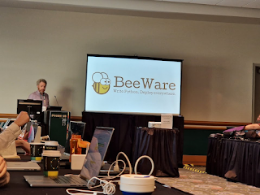

At the [Python Language Summit 2023](https://pyfound.blogspot.com/2023/05/the-python-language-summit-2023_29.html), Russell Keith-Magee presented on the ongoing efforts of [BeeWare](https://beeware.org), a project that aims to make it easier to run Python on mobile platforms such as Android and iOS.

  

<table align="center" cellpadding="0" cellspacing="0"><tbody><tr><td><a href="https://blogger.googleusercontent.com/img/a/AVvXsEhKd0EQEStk2AWmSAjsGgsESDcswdm1vnDv77ZrTgwbJdOD6Om0nyFfH6gxIT1fvBo6Tt9bykJuS1pIkPD1qNFnLiINcLdtiebwaDA4CvfOCyNkoq5nRNKZ9K0_7FPWhsYhLJXGxbv7BCL2XEMHZNQxfl61szs8q0yAX56kyk_PKSXXG4A"></a></td></tr><tr><td>The BeeWare logo</td></tr></tbody></table>

  

## Russell Keith-Magee is one busy bee

Improving Python’s story for running on mobile has been a labour of love for Keith-Magee for eight years at this point. Keith-Magee [last presented at the Python Language Summit in 2020](https://pyfound.blogspot.com/2020/05/cpython-on-mobile-platforms.html) (a year when the summit was conducted entirely virtually due to the Covid-19 pandemic). Since then, however, great progress has been made.

The biggest change since his last update, Keith-Magee reported, wasn’t technical – it was financial. For the last year, BeeWare has no longer been a hobby project for Keith-Magee. He is now paid by [Anaconda](https://www.anaconda.com) to [work on the project full time](https://beeware.org/news/buzz/exciting-news-for-the-future-of-beeware/), along with a colleague, Malcolm Smith. “I now have the resources to do the work” required to make this happen, he announced.

Keith-Magee came to the Language Summit this year with a proposal: to add Android and iOS as platforms with “tier-3” support from CPython in Python 3.13.

What does “tier-3 support” mean? Tier-3 support, as defined by [PEP 11](https://peps.python.org/pep-0011/#tier-3), describes a level of support that the CPython core developers commit to giving a specific platform. The CPython test suite is run constantly on popular platforms such as Ubuntu, Windows and MacOS, and test failures on these platforms can block releases until they are fixed. More esoteric platforms, meanwhile, are tested in CI less frequently. Test failures on those platforms will not necessarily block a release of CPython.

Tier-3 support is the current level of support Python provides to the [emscripten](https://emscripten.org), [WASI](https://wasi.dev) and [FreeBSD](https://www.freebsd.org) platforms, among others. If a platform has tier-3 support, the test suite will be run on the platform on a regular basis, but not on every pull request. Tier-3 support indicates that at least one core developer has committed to supporting CPython on that platform as best they can. However, test failures on that platform will not block a release of CPython.

## The path to tier-3 support

Historically, a significant barrier standing in the way of mobile-platform support from CPython has been the difficulties associated with running tests on mobile platforms in [CI](https://en.wikipedia.org/wiki/Continuous_integration). Keith-Magee announced, however, that it was now possible to run the CPython test suite on mobile platforms via [Briefcase](https://beeware.org/project/projects/tools/briefcase/), BeeWare’s packaging and development tool. (Getting the test suite to *pass* is another issue – But Keith-Magee felt confident that it would be easy to make progress on that front.) As such, Keith-Magee reported, it should be feasible for CPython to integrate running tests on these platforms into the project’s testing infrastructure on GitHub.

One remaining issue is a fairly specific question, but an important one nonetheless: on a mobile platform, what should [`sys.platform`](https://docs.python.org/3/library/sys.html#sys.platform) be? The two major mobile platforms are currently inconsistent about this: on iOS, `sys.platform == "ios"`, whereas on Android, `sys.platform == "linux"`.

The advantage of the first approach is that it is easy for user code to detect whether the code is being run on iOS or not. The advantage of the second approach, meanwhile, is that most existing Python code won’t necessarily account for the possibility that it might be run on Android or iOS, so will run into difficulties with idioms such as the following:

```

if sys.platform == "linux":
    do_fancy_linux_only_feature()

```

The Android platform, Keith-Magee noted, is very similar to Linux, so by setting `sys.platform` to “linux”, a lot of code “just works” on Android even though the code hasn’t explicitly accounted for the possibility that it might be run on that platform.

## Abuzz with excitement

<table align="center" cellpadding="0" cellspacing="0"><tbody><tr><td><a href="https://blogger.googleusercontent.com/img/b/R29vZ2xl/AVvXsEjMf7wl_3NSqzHPBtLs31nHWssIZ1rIY3Wd5AmZKsrmQJnxvn0AQT0yF-cbuP6oldqPjC3L75USN9wYhENRXMmLoPgfEvVx6bUiu7RMNHpkWeexNYmKKRIetyQkdAFlloeZt1KAS9tP9OCu4F9QXY7mF2L11TasEGT2MTrKODgJRDqqkj8/s959/image_2023-05-27_221125338.png"></a></td></tr><tr><td>Keith-Magee in flight (photo by Hugo van Kemenade)</td></tr></tbody></table>

  

Keith-Magee’s talk was greeted enthusiastically by the core developers in the room; there was strong consensus that Python needed a better story on mobile platforms. Carol Willing expressed excitement about the ways in which support for mobile platforms could help Python spread globally, to countries where large numbers of people had no access to desktop computers (but had easy access to phones). Łukasz Langa agreed, noting that he had received many enquiries about Python on mobile after giving a talk on the subject about a year ago. “It’s interesting to a *lot* of people,” Langa commented. “We need it.”

> “Wooooo!”

> \-- *Carol Willing, CPython Core Developer*

On the `sys.platform` question, Core Developer Filipe Laíns said that he was working on a new API for the [`sysconfig`](https://docs.python.org/3/library/sysconfig.html) standard-library module, which will provide a more granular way of distinguishing between platforms from user code. In the meantime, Brett Cannon wondered if BeeWare could use the same approach as CPython builds for WebAssembly: on WebAssembly builds, unusually, `sys.platform` has a different value to `os.name` (`sys.platform` is either "wasi" or "emscripten", but `os.name` is "linux").

Another outstanding question, however, is what the release process would look like for these new platforms. There was appreciation of the work Keith-Magee had already put into BeeWare, and nobody doubted that he would continue to be committed to the project. However, Keith-Magee is not currently a core developer, leading to a concern that CPython might be supporting a platform that nobody on the core team had expertise in.

Ned Deily, release manager for Python 3.6 and 3.7, worried that distributing CPython binaries for these platforms might not be feasible, as it would make the release process “even more arduous”. Keith-Magee responded that it could be possible to automate the build process for these platforms. If it wasn’t, he said, it also wouldn’t necessarily be essential for CPython to distribute official binaries for these platforms, at least at first.

## Where next for BeeWare?

Keith-Magee’s next steps are to work towards upstreaming the patches to CPython that the BeeWare project has made, so that CPython on mobile platforms can “just work” without any changes being made. The alterations that have already been made to support [CPython on WebAssembly](https://pyfound.blogspot.com/2022/05/the-2022-python-language-summit-python.html) have made this task much easier, Keith-Magee noted.
