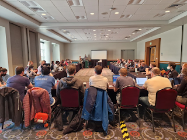
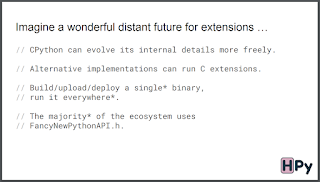
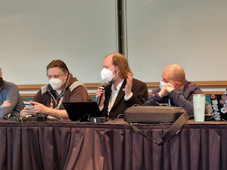
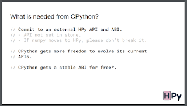

The [Python Language Summit 2023](https://pyfound.blogspot.com/2023/05/the-python-language-summit-2023_29.html) began with an extended discussion of Python’s [C API](https://docs.python.org/3/c-api/index.html) – the interface through which it is possible to communicate between code written in Python and code written in low-level languages, like C. The fullness of this interface is a significant factor behind the vibrancy of Python’s ecosystem, enabling libraries such as [NumPy](https://github.com/numpy/numpy) and [pandas](https://github.com/pandas-dev/pandas) that are foundational to Python’s widespread use in data science.

Three speakers had booked slots to discuss the C API this year: Mark Shannon, Guido van Rossum, and Antonio Cuni. The conversation evolved naturally from one talk to the next, so in this blog post, I’ll be discussing the three talks together.

## All at sea on the C API

<table align="center" cellpadding="0" cellspacing="0"><tbody><tr><td></td></tr><tr><td>The C API at sea (illustration by DALL-E)</td></tr></tbody></table>

  

> “I still don’t know what the C-API is, and I’ve been trying for years!”

> \-- *Mark Shannon, CPython Core Developer*

Mark Shannon spoke on the problems (as he saw them) with Python’s C API. Shannon lamented that with every minor Python version, a slew of third-party C extensions seemed to break. He argued that the root cause was that the needs of C extensions were not adequately met by the formal C API, which had evolved in a haphazard and often-unplanned way over the past three decades of Python’s existence.

As a result of the C API’s flaws, Shannon said, extension authors were forced to reach beyond the formal API and into implementation details that had emerged as a kind of “implicit API”. The implementation details that constituted the new “implicit API” had become so widely depended upon that it was now impossible for CPython to change some parts of its code without breaking large parts of the Python ecosystem.

Shannon believes that the new “implicit API” should be formalised in Python 3.13. This, he argues, would put an end to the cycle of CPython releases inevitably leading to widespread breakages in C extensions.

Sam Gross, who (among [other things](https://peps.python.org/pep-0703/)) has contributed to [pytorch](https://github.com/pytorch/pytorch), agreed with Shannon that the C API was lacking in many areas. Gross argued that there was a great deal of important functionality that wasn’t exposed to extension authors. “Projects just end up copying-and-pasting CPython C code,” Gross said, meaning the extensions broke with each new release of CPython.

Pablo Galindo Salgado, release manager for Python 3.10 and 3.11, said that the release process for those versions had felt like a “game of whackamole” when it came to third-party C extensions breaking. Salgado argued that CPython needed to reach out to the authors of extensions such as pytorch to gather detailed feedback on what core functionality was missing from the API. Several attendees expressed frustration with a perceived tendency among C extension authors to immediately reach into CPython implementation details when something they needed was missing from the API. The result of this was that CPython core developers were often in the dark about which things the C API *should* be providing, but currently wasn’t. “We might not be able to give you a solution,” Salgado said, “But please come to us and tell us what your problem is, if you have a problem!”

Gross proposed that CPython should run third-party test suites with new versions of CPython as they were being developed, so that the Core Dev team would be able to spot third-party breakages early and gauge the impact of their changes. Pytorch operated a similar programme, Gross said, and it had been successful in helping to limit breakages of third-party pytorch models as the core pytorch team evolved their API.

Brandt Bucher noted, however, that the problem often wasn’t so much that CPython was unaware when they were breaking third-party code – the benchmarks run in [the pyperformance suite](https://github.com/python/pyperformance) often served as an early warning signal for breakages in C extensions. The problem was often that CPython would offer to help affected projects, only to have their help rejected. Several core developers had previously sent pull requests to help third-party projects become compatible with an upcoming version of CPython, only for their pull requests to remain unmerged for several months due to burned-out maintainers of these projects.

## Let’s get specific

<table align="center" cellpadding="0" cellspacing="0"><tbody><tr><td></td></tr><tr><td>Guido van Rossum speaks to the Language Summit on the C API (photo by Hugo van Kemenade)</td></tr></tbody></table>

Shannon was clear about what he thought the problem with the C API was. The problem was that the C API was insufficient for the authors of C extensions, leading these authors to reach into CPython implementation details, leading to an unending cycle of projects breaking with each new release of CPython. Others, however, argued that this wasn’t so much a specific problem but a genre of problems. Each specific project might have a different notion about which things were imperfect with the C API, and which things were missing from the C API. Each imperfection or absence could be considered a concrete problem in its own way. “Things break for everybody, but things break in different ways for different people,” Carol Willing argued. “We need more granularity in our understanding of that.”

As Mark Shannon’s slot drew to an end, Guido van Rossum opted to continue the discussion that Shannon had started, but sought to draw attention to a more precise enumeration of the difficulties C API users were facing.

> “There’s lots of ideas here, but I don’t know what the problem is!”

> \-- *Carol Willing, CPython Core Developer*

Simon Cross, a contributor to [the HPy project](https://github.com/hpyproject/hpy), reported that the HPy project had, in the early stages of the project, put together a long list of the problems, as they saw them, with the CPython C API. Cross offered to share the list with the Core Dev team. Thomas Wouters, a Google employee, also offered to provide a list of difficulties Google had experienced when upgrading to recent Python releases, something the company keeps detailed records of. There was agreement that putting together a comprehensive list of problems with the existing API was an important first step, before CPython could consider drawing up plans to fix the problem.

The C API discussions ended with an agreement that further discussion was required. Interested parties can follow the ongoing conversation at [https://github.com/capi-workgroup/problems/issues](https://github.com/capi-workgroup/problems/issues). The plan is to work towards an informational PEP, with input from an array of stakeholders, outlining a consensus around the problems and pitfalls in the current C API. Once the problems with the status quo have been enumerated in detail, the community might be in a position to consider possible solutions.

## HPy: A possible solution?

<table align="center" cellpadding="0" cellspacing="0"><tbody><tr><td></td></tr><tr><td>A slide from Antonio Cuni's talk on HPy</td></tr></tbody></table>

While the C API discussions ended with a detailed discussion of the problems in the current C API, the first talk of the day was in fact by Antonio Cuni, a core developer with [the HPy project](https://github.com/hpyproject/hpy). HPy is an alternative C API for Python – an API that seeks to avoid many of the pitfalls of the current API. The contention of the HPy developers is that the current C API is bad for CPython, bad for alternative implementations of Python such as [PyPy](https://www.pypy.org) or [GraalPython](https://github.com/oracle/graalpython), and, ultimately, bad for end users.

> HPy is a specification of a new API and ABI for extending Python that is Python implementation agnostic and designed to hide and abstract internal details

> \-- [*The HPy GitHub README*](https://github.com/hpyproject/hpy)

Cuni began by describing the key goals of the HPy project:

-   An API that doesn’t leak CPython-specific implementation details
-   A 0% (or close to 0%) performance overhead when compared with CPython’s current C API
-   A “Universal ABI” that allows compiled extension modules to use the same interface to communicate with PyPy (for example) as they would do to communicate with CPython
-   An API that is garbage-collection friendly.

Cuni argued that if the Python ecosystem as a whole moved to using HPy, instead of the “official” C API, there would be dramatically fewer breakages of C extensions with each new Python release. Cuni’s proposal was that CPython should “officially bless” HPy as the recommended C API for Python.

## HPy Hpy Hooray?

<table align="center" cellpadding="0" cellspacing="0"><tbody><tr><td></td></tr><tr><td>Simon Cross, HPy Core Developer (photo by Hugo van Kemenade)</td></tr></tbody></table>

  

Cuni’s talk was exuberant, but it was at times somewhat unclear what exactly he was asking for from the room. “The investment from CPython,” Cuni argued “would be a political investment rather than a technical one”. Thomas Wouters, however, argued that the CPython team didn’t have the “moral authority” to coerce extension authors into using HPy. Hynek Schlawack agreed, arguing that it was perhaps unrealistic to migrate the entire Python ecosystem towards HPy.

Many were uncertain about what it would even mean to “officially bless” HPy – would CPython host HPy’s documentation on [docs.python.org](http://docs.python.org)? Or would CPython simply add a note to the documentation of the C API that the “official” C API was no longer the *recommended* way to write a C extension? Guido van Rossum emphasised that a top-down approach from the Core Dev team to extension authors wouldn’t work: nobody wanted a repeat of the decade-long transition from Python 2 to Python 3. Carol Willing agreed that pushing C extension authors to use HPy could be counterproductive, arguing that it was important to remember the impact of our decisions on end users of Python.

Other core developers were sceptical about the fundamentals of HPy itself. HPy’s origin story lies in [difficulties PyPy encountered when it trying to use CPython’s existing C API](https://www.pypy.org/posts/2018/09/inside-cpyext-why-emulating-cpython-c-8083064623681286567.html). These difficulties led to attempts to create an API that could be easily used on either Python implementation. Larry Hastings argued that blessing an API that was friendlier to PyPy had clear benefits to PyPy (and other implementations), but that it was less clear where CPython stood to gain from this change.

Cuni’s response was that if the ecosystem migrated to an API that exposed fewer implementation details directly, CPython would be able to refactor its internal implementation far more seamlessly, as CPython would no longer have to worry about breaking a multitude of third-party C extensions with every internal reorganisation of code. Cuni mentioned [efforts to run CPython using WebAssembly](https://pyfound.blogspot.com/2022/05/the-2022-python-language-summit-python.html) as a specific area where CPython could stand to gain, as the HPy API could interact far more easily with the Javascript garbage collector. And Cuni also noted that HPy made it easy for extension authors to test whether they were sticking to the API or not, something which is famously hard to know with the current C API. “We don’t know all the experimentation that this might enable,” Cuni exclaimed, however, “Because we haven’t implemented this change yet!”

Mark Shannon was another core developer expressing scepticism about HPy. Shannon argued that while HPy had strengths over the “official” C API, it was far from perfect. “We should try to fix CPython’s API” before CPython recommended users switch to HPy, Shannon argued. Simon Cross, also of the HPy project, said that the team welcomed feedback about where they could improve. It was still easy for HPy to make changes, Cross argued, given they had not yet achieved widespread adoption.

## Further Reading on HPy

1.  [HPy’s overview of changes needed to the C API](https://github.com/hpyproject/hpy/wiki/c-api-next-level-manifesto).
2.  [HPy’s explanation of why the changes are needed](https://github.com/hpyproject/hpy/wiki/c-api-next-level-changes).
