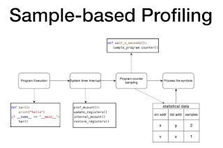

Joannah Nanjekye came to the [Python Language Summit 2023](https://pyfound.blogspot.com/2023/05/the-python-language-summit-2023_29.html) to discuss innovations by [Scalene](https://github.com/plasma-umass/scalene), a sampling-based Python profiler that can distinguish between native code and Python code in its reports. After its initial release in late 2019, Scalene has become one of the most popular Python profiling tools. It has now been downloaded 500,000 times from PyPI.

  

  

  

<table align="center" cellpadding="0" cellspacing="0"><tbody><tr><td></td></tr><tr><td>The Scalene project logo</td></tr></tbody></table>

  

A profiler is a tool that can monitor a program as it is running. Once the program has run, the profiler can provide a report analysing which lines of code were visited most often, which were the most expensive in terms of time spent, and which were the most expensive in terms of memory usage. Profilers can therefore be hugely useful tools for addressing performance issues in code. If you’re unsure where your program is spending most of its time, it can be hard to optimise it.

Profilers can be split into two broad categories: trace-based profilers and sampling-based profilers. Trace-based profilers work by intercepting each function call as your program is running and logging information about the time spent, memory usage, etc. Sampling-based profilers, meanwhile, take snapshots of your program at periodic intervals to monitor these things. A trace-based profiler has the advantage that it can provide a granular and precise level of detail about which lines of code were executed and when each function call finishes; this makes it ideal for use as a tool to monitor test coverage, for example. However, injecting tracing hooks into each function call can sometimes slow down a program and distort the analysis of where most time was spent. As a result, sampling-based profilers are sometimes preferred for profiling performance.

Scalene is a sampling-based profiler, and aims to address the shortcomings of previous sampling-based profilers for Python. One of the key challenges sampling-based profilers have faced in the past has been accurately measuring the time Python programs spend in “native code”.

  

<table align="center" cellpadding="0" cellspacing="0"><tbody><tr><td></td></tr><tr><td>Slide from Nanjekye’s talk, illustrating sampling-based profiling</td></tr></tbody></table>

  

## Handling the problem of native code

“Native code”, also sometimes referred to as “machine code”, refers to code consisting of low-level instructions that can be interpreted directly by the hardware processor. Using extensions to Python written in [C](https://en.wikipedia.org/wiki/C_\(programming_language\)), [C++](https://en.wikipedia.org/wiki/C%2B%2B) or [Rust](https://www.rust-lang.org) that will compile to native code – such as [NumPy](https://numpy.org), [scikit-learn](https://scikit-learn.org/stable/), and [TensorFlow](https://www.tensorflow.org) – can lead to dramatic speedups for a program written in Python.

It also, however, makes life difficult for sampling-based profilers. Samplers often use Python’s [`signal`](https://docs.python.org/3/library/signal.html) module as a way of knowing when to take a periodic snapshot of a program as it is running. However, due to the way the `signal` module works, no signalling events will be delivered while a Python program is spending time in a function that has been compiled to native code via an extension module. The upshot of this is that sample-based profilers are often “flying blind” for Python code that makes extensive use of C extensions, and will sometimes erroneously report that no time at all was spent executing native code, even if the program in fact spent the majority of its time there.

Scalene’s solution to this problem is to monitor delays in signal delivery. It uses this information to deduce the amount of time that the program spent outside CPython’s main interpreter loop (due to the use of native, compiled code from an extension module). Further details on Scalene’s methods, and comparisons with other leading Python profilers, can be found in a recent paper by Emery D. Berger, Sam Stern and Juan Altmayer Pizzorno, [“Triangulating Python Performance Issues with Scalene”](https://arxiv.org/pdf/2212.07597.pdf).

Nanjekye also detailed Scalene’s sophisticated approach to measuring performance in child threads. Signal-based profilers often struggle with multi-threaded code, as signals can only be delivered and received from the main thread in Python. Scalene’s solution is to monkey-patch functions that might block the main thread, and add timeouts to these functions. This allows signals to be delivered even in multithreaded code.

## Discussion

Nanjekye asked attendees at the Language Summit if they would be interested in integrating Scalene's ideas into the standard library's `[cProfile](https://docs.python.org/3/library/profile.html)` module, which was met with a somewhat muted response.

Pablo Galindo Salgado, a leading contributor to the [Memray](https://github.com/bloomberg/memray) profiler, criticised Scalene’s signal-based approach, arguing it relied on inherently brittle monkey-patching of the standard library. It also reported unreliable timings, Salgado said: for example, if code in a C extension checks for signals to support CTRL-C, the resulting delays measured by Scalene will be distorted.

Salgado argued that integration with [the `perf` profiler](https://docs.python.org/3.12/howto/perf_profiling.html#perf-profiling), which Python is introducing support for in Python 3.12, would be a better option for users. Mark Shannon, however, argued that `perf` distorted the execution time of Python programs; Salgado responded that Scalene did as well, as the use of signals came with its own overhead.

Nanjekye argued that the huge popularity of Scalene in the Python ecosystem was evidence that it had proved its worth. Carol Willing concurred, noting that Scalene was an especially useful tool with code that made heavy use of libraries such as NumPy, Scikit-Learn and PyTorch.
