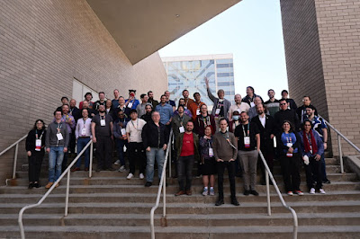

Every year, just before the start of PyCon US, core developers, triagers, and special guests gather for the Python Language Summit: an all-day event of talks where the future direction of Python is discussed. The Language Summit 2023 included three back-to-back talks on the C API, an update on work towards making the Global Interpreter Lock optional, and a discussion on how to tackle burnout in the community. This year's summit received around 45 attendees, and the summit was covered by Alex Waygood.

<table align="center" cellpadding="0" cellspacing="0"><tbody><tr><td></td></tr><tr><td>Attendees of the Python Language Summit </td></tr></tbody></table>

* * *

  

-   [Three Talks on the C API](https://pyfound.blogspot.com/2023/05/the-python-language-summit-2023-three.html): Talks by Antonio Cuni, Mark Shannon and Guido van Rossum
-   [Making the Global Interpreter Lock Optional](https://pyfound.blogspot.com/2023/05/the-python-language-summit-2023-making.html): A talk by Sam Gross
-   [Towards Native Profiling for Python](https://pyfound.blogspot.com/2023/05/the-python-language-summit-2023-towards.html): A talk by Joannah Nanjekye
-   [What is the stdlib for?](https://pyfound.blogspot.com/2023/05/the-python-language-summit-2023-what-is.html) A talk by Brett Cannon
-   [Pattern Matching, \_\_match\_\_, and View Patterns](https://pyfound.blogspot.com/2023/05/the-python-language-summit-2023-pattern.html): A talk by Michael Sullivan
-   [Python on Mobile: State of the Union](https://pyfound.blogspot.com/2023/05/the-python-language-summit-2023-python.html). A talk by Russell Keith-Magee
-   [Burnout is Real](https://pyfound.blogspot.com/2023/05/the-python-language-summit-2023-burnout.html): A talk by Guido van Rossum
-   [Lightning Talks](https://pyfound.blogspot.com/2023/05/the-python-language-summit-2023.html), featuring short presentations by Dong-hee Na, Carl Meyer and Amethyst Reese
