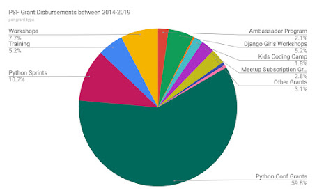

The Python Software Foundation is excited to announce the re-opening of its Grants Program!

The pandemic negatively affected the PSF’s finances with the cancellation of PyCon 2020’s in-person conference and lower donations. Thanks to PyCon 2020 Online sponsors, donors, and our financial reserve, we are able to continue to support the Python community!

## Historical Impact

The PSF’s Grants Program has supported the growth of Python in many regions and fostered the training for many individuals. Between 2014 and 2019, the PSF disbursed **$1,637,000** in financial support to organizers and developers all over the world.

<table align="center" cellpadding="0" cellspacing="0"><tbody><tr><td></td></tr><tr><td>Grant disbursements from 2014 through 2019 by grant type <a href="https://docs.google.com/spreadsheets/d/1ESum2veqGgMSK-nJZgi5nzfljzbgSFmhKn2WmhNltpQ/edit#gid=0" target="_blank">To see a high resolution version, click here!</a></td></tr></tbody></table>

## Updated criteria & requirements

For the immediate future, the PSF’s Grants Program will focus on virtual sprints, virtual events, and Python core development support. We are not currently accepting applications for in-person events. When that changes, we will update the community.

Here's an abbreviated overview of what the PSF Grants Work Group requires:

-   **For all applications**: at least 6 weeks to review the application; so if your virtual sprint begins November 1st, submit your application no later than September 21. We also require a code of conduct.
-   **For virtual workshops & training**: a detailed curriculum, a budget overview, and mentor information
-   **For virtual conferences**: a schedule, a budget overview, sponsor information, and registration procedures
-   **For dev projects/sprints**: milestone breakdowns with a timeline, and a budget overview

Be sure to read through the Grants Program information page and FAQ page before submitting your grant application to capture all the requirements and changes:

[https://www.python.org/psf/grants/](https://www.python.org/psf/grants/)

[https://www.python.org/psf/grants/faq/](https://www.python.org/psf/grants/faq/)

The PSF has put together a [free resource list for virtual events](https://www.python.org/psf/grants/free-resources/). Some of these may help reduce the cost of your virtual event. We recommend that you read this page before submitting a grant application.

Information on how to submit a grant application can be found on our [website](https://www.python.org/psf/grants/).
